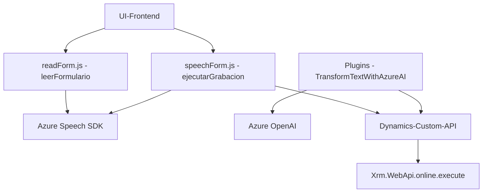

### Breve resumen técnico
El repositorio contiene tres secciones principales: una **interfaz frontend en JavaScript** para manejar formularios y síntesis de voz, una **integración de plugins de Dynamics CRM** que utilizan Azure OpenAI, y una arquitectura orientada a servicios para conectar datos entre la interfaz web y Dynamics CRM. La solución trabaja con datos visibles del formulario, sintetiza texto a voz, transcribe voz a texto y transforma el texto en formatos JSON mediante inteligencia artificial.

---

### Descripción de arquitectura
La arquitectura propuesta tiene un enfoque **cliente-servidor combinado**:
1. **Frontend (JavaScript)**: Manejo local de la interacción con formularios (leer campos y sintetizar/interpretar voz). Utiliza servicios externos como el SDK de Azure Speech en conjunto con Dynamics CRM, optimizando la experiencia de usuario.
2. **Plugin en Dynamics CRM**: Implementa lógica empresarial específica utilizando Azure OpenAI para transformar datos textuales enviados por el cliente en estructuras más complejas como un JSON. Usa el patrón de **plugin basado en la interfaz IPlugin**.
3. **Servicios distribuidos**: Los servicios en Azure (Speech SDK y OpenAI) funcionan como microservicios externos para el procesamiento de voz y datos.

---

### Tecnologías usadas
#### **Frontend**
1. **JavaScript**: Lenguaje de programación principal para el frontend.
2. **Azure Speech SDK**: Sintetización y reconocimiento de voz mediante APIs en tiempo real.
3. **Dynamics CRM SDK (Xrm.WebApi)**: Uso en el cliente para interactuar con APIs internas de sistemas CRM.

#### **Backend / Plugin**
1. **C# .NET Framework (Dynamics CRM)**: Base para el plugin de CRM.
2. **Newtonsoft.Json.Linq**: Manipulación avanzada de JSON.
3. **Azure OpenAI (GPT API)**: Uso de la inteligencia artificial para procesamiento y transformación de datos.

#### **Patrones arquitectónicos**
1. **Callback y Promesas (Frontend)**: Resuelven operaciones asincrónicas relacionadas con carga dinámica del SDK y comunicación con APIs externas.
2. **Integración de servicios distribuidos**:
   - Azure Speech SDK y OpenAI.
   - Dynamics CRM sirve como el núcleo del sistema mediante plugins y funciones de API.
3. **Modularidad**: Cada función o clase tiene un propósito específico bien definido, lo que facilita la escalabilidad y mantenimiento.
4. **Factory Pattern**: En el backend, para instanciar servicios organizacionales de Dynamics CRM.

---

### Diagrama Mermaid

---

### Conclusión Final
Este repositorio representa una **solución híbrida** orientada a sistemas CRM modernos como Dynamics 365, con una integración robusta de servicios en la nube (Azure Speech y OpenAI). La capacidad para manejar entrada de voz y transformar texto en JSON conforma una experiencia de usuario interactiva, optimizando la relación entre los usuarios y los datos estructurados. La arquitectura general combina un **frontend modular en JavaScript** con una **backend extensible en C#** para garantizar interoperabilidad entre servicios.