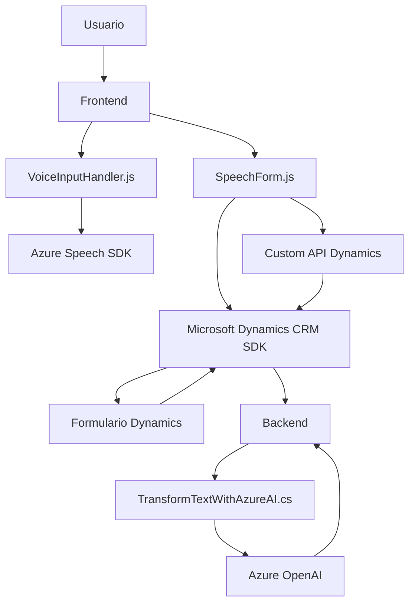

### Breve Resumen Técnico:
Este repositorio implementa una solución híbrida orientada a Microsoft Dynamics CRM, que integra procesamiento de voz y texto utilizando Azure Speech SDK, Azure OpenAI y diversas tecnologías. Distribuye la lógica entre frontend (JavaScript) y backend (.NET), con patrones de interacción entre la UI y los servicios en la nube.

---

### Descripción de Arquitectura:
La arquitectura predominante es **n-capas**, dividida en:
1. **Frontend (JavaScript)**: Gestión de interacción de formularios en Dynamics CRM, donde la lógica se ejecuta en el navegador, incluyendo procesamiento de datos y transcripción de voz.
2. **Backend (C#)**: Un plugin que trata datos textuales proporcionados por el CRM y los transforma utilizando Azure OpenAI antes de actualizar registros.
3. **Servicios Externos**: Explotación de Azure Speech SDK y Azure OpenAI como servicios adicionales para funcionalidades de voz y procesamiento de lenguaje natural.

La solución conecta diferentes capas y servicios mediante APIs, con integración asincrónica y lógica adaptable a dinamismo de formularios de CRM.

---

### Tecnologías Usadas:
1. **Frontend**:
   - **JavaScript** para manejo de SDKs, DOM y lógica cliente.
   - **Azure Speech SDK**: Para síntesis y transcripción de voz.
   - **Microsoft Dynamics 365 SDK**: Para manipulación del modelo de datos de CRM.

2. **Backend**:
   - **C# (.NET Framework)**: Implementación del plugin como clase `IPlugin`.
   - **Azure OpenAI (GPT-4)**: Procesamiento avanzado de lenguaje natural.
   - **Azure REST API**: Comunicación programática con servicios OpenAI.

3. **Patrones**:
   - **Capa de Servicio**: Uso de APIs (Azure Speech y OpenAI) para funcionalidades específicas.
   - **Integración de Plugins**: El backend encapsula lógica de transformación textual directamente enlazada al ciclo de vida del CRM.
   - **Dynamic Dependency Loading**: Funciones JavaScript cargan Azure Speech SDK según contexto y necesidad.
   - **Callback Design** en JavaScript para interacción asincrónica.
   - **Facade Pattern** en el frontend para simplificar operaciones.

---

### Componentes/Datos Externos:
Los componentes o dependencias externas probablemente presentes incluyen:
1. **Azure Speech SDK**: Sintetización de voz y transcripción.
2. **Azure OpenAI (GPT-4)**: Procesamiento de lenguaje y reformulación textual.
3. **Microsoft Dynamics CRM SDK**: Interacción directa con el modelo de datos de Dynamics.
4. **Custom API**: Comunicación opcional para lógica dinámica conectada al CRM.
5. **Browser Dependencies**: JavaScript dinámico que carga scripts según eventos o contexto del usuario.

---

### Diagrama **Mermaid** válido para **GitHub Markdown**:

---

### Conclusión Final:
Esta solución implementa una arquitectura n-capas con una integración profunda entre UI (JavaScript) y servicios en la nube (Azure Speech y OpenAI). Aprovecha características de Dynamics CRM para actualizar datos en tiempo real mediante voz y texto procesado. Aunque modular y extensible, la seguridad (por ejemplo, manejo de claves API) y gestión asincrónica de los servicios puede mejorarse. Es ideal para escenarios empresariales dinámicos con interacción avanzada de usuarios.