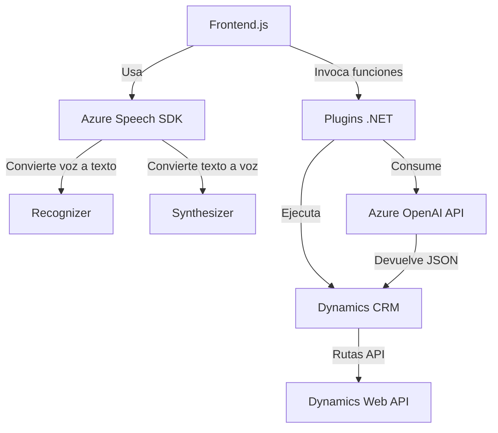

### Breve resumen técnico
El repositorio abarca funcionalidades para la integración de entrada de voz, síntesis de texto, reconocimiento de voz y procesamiento de texto utilizando las APIs de Azure. Sus componentes están diseñados para interactuar con formularios de un CRM, específicamente Microsoft Dynamics. Se utiliza el Azure Speech SDK para las tareas de síntesis de voz y reconocimiento de voz, además de un plugin de Dynamics que integra la API de Azure OpenAI para el procesamiento del texto.

---

### Descripción de arquitectura
El repositorio tiene una **arquitectura de servicios en capas** (Service-Oriented Architecture - SOA) basada en el concepto de "n-capas":
1. **Frontend JS capa:** Gestiona la interacción de usuario (voz a texto y texto a voz) y la comunicación con el formulario.
2. **Capa de integración:** Plugins (.NET) para conectar Dynamics CRM con OpenAI utilizando normas definidas.
3. **Servicios externos:** APIs de Azure Speech SDK y OpenAI para reconocimiento, síntesis y transformación de texto.

Aunque no se expone una arquitectura distribuida completa (microservicios), muestra una clara separación de responsabilidades entre componentes.

---

### Tecnologías usadas
1. **Azure Speech SDK:** Para reconocimiento y síntesis de voz.
2. **Azure OpenAI API:** Para procesamiento avanzado de texto.
3. **Microsoft Dynamics CRM:** CRM destinatario de la integración.
4. **JavaScript:** Manipulación de formularios y lógica de integración con SDKs.
5. **C# (.NET):** Lógica de plugins para invocar APIs externas.
6. **HTTP Requests:** Para comunicación con APIs de Azure.
7. **Estructuras JSON:** Intercambio de datos con la API de Dynamics.

---

### Dependencias o componentes externos presentes
1. **Azure Speech SDK y Azure OpenAI API**: Servicios externos para síntesis, reconocimiento y procesamiento de texto.
2. **Dynamics 365 Web API**: Punto de integración para manipulación de datos en el CRM.
3. **Newtonsoft.Json**: Librería para manipulación de objetos JSON.
4. **HTTP Clients**: En C# (`HttpClient`) para invocar endpoints externos.

---

### Diagrama Mermaid

---

### Conclusión final
El repositorio es una solución **orientada a servicios** que utiliza APIs externas, principalmente de Azure, para habilitar la interacción mediante voz y procesamiento avanzado de texto en un entorno de formularios controlado por Dynamics CRM. La arquitectura está segmentada en capas que separan el frontend y las funciones del backend, asegurando modularidad y escalabilidad. Aunque no se clasifica como microservicios, utiliza un enfoque funcional moderno basado en SDKs y servicios en la nube.