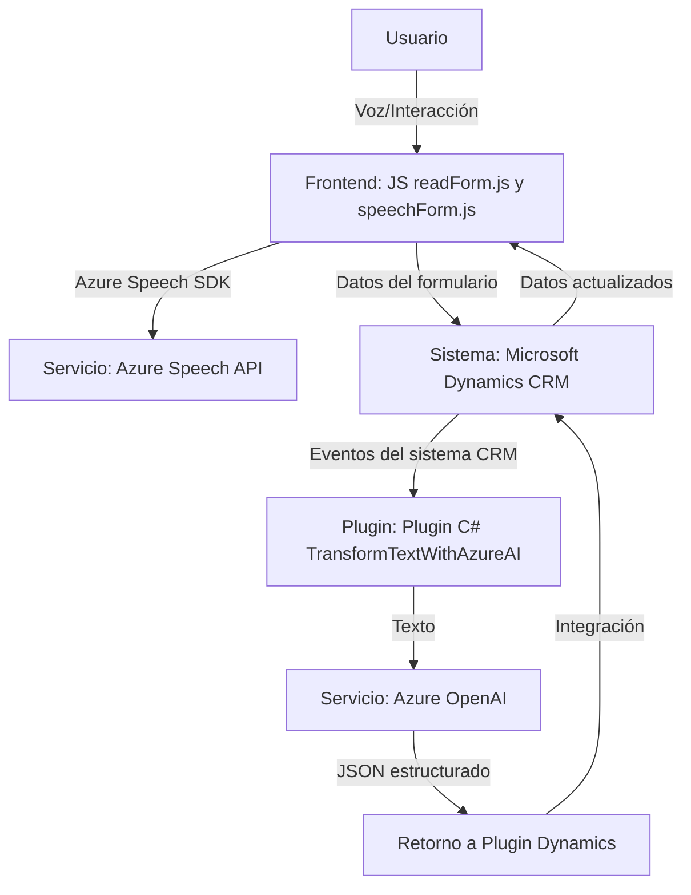

### Breve Resumen Técnico:
El repositorio presentado implementa una solución integral basada en voz para la accesibilidad y procesamiento mejorado de formularios en un sistema dinámico (probablemente Microsoft Dynamics CRM). Combina un frontend en JavaScript con APIs y un plugin en .NET para integrarse con servicios externos como Azure Speech y Azure OpenAI.

---

### Descripción de Arquitectura:
1. **Tipo de Solución:**  
   La estructura del repositorio indica la implementación de un sistema de integración entre capas Frontend y Backend.  
   - El frontend permite la interacción del usuario mediante accesibilidad basada en la voz o datos visuales del formulario.  
   - El backend extiende la integración con el sistema CRM mediante un plugin y también con servicios de inteligencia artificial como Azure.

2. **Arquitectura:**  
   - **Base híbrida de múltiples capas:**  
     Si bien cada elemento tiene responsabilidad modular bien definida, el sistema como tal puede ser considerado como una arquitectura de **n capas**, en donde el frontend, backend y servicios externos interactúan en paralelo.
   - El plugin de Dynamics e integración con Azure Speech/OpenAI se orienta a **arquitectura basada en servicios**.

---

### Tecnologías y Frameworks Usados:
#### **Frontend**:
1. **Lenguaje:** JavaScript ES6.
2. **Framework:**  
   - Azure Speech SDK (cargado dinámicamente).  
   - Métodos del modelo de Dynamics CRM (Xrm.WebApi).
3. **Patrones:**  
   - **Modularización:** Cada función tiene una responsabilidad concreta.  
   - **Adaptador:** El manejo y transformación de datos (`getVisibleFieldData`, `applyValueToField`, etc.) emplea un patrón adaptador.

#### **Backend**:
4. **Lenguaje:** C#.  
5. **Framework:**  
   - Microsoft Dynamics CRM SDK.  
   - Azure OpenAI API con `HttpClient`.
6. **Patrones:**  
   - **Plugin Architecture:** Integración como extensibilidad del evento CRM.  
   - **Encapsulación:** Se separa perfectamente la ejecución del sistema del consumo externo de APIs mediante métodos (`Execute`, `GetOpenAIResponse`).

---

### Dependencias y Componentes Externos:
1. **Azure Speech SDK:** Para síntesis y reconocimiento de voz en frontend.  
2. **Azure OpenAI API:** Para transformación inteligente de texto en el plugin backend.  
3. **Microsoft Dynamics CRM APIs:** Conexión con el sistema CRM mediante Xrm.WebApi y lógica del plugin.  
4. **Newtonsoft.Json.LINQ:** Parseo y manipulación avanzada de JSON.  
5. **DOM API / Browser:** Acceso a elementos DOM para el frontend dinámico (cargar SDK de Azure).

---

### Diagrama Mermaid

---

### Conclusión Final:
El repositorio implementa una solución orientada a la accesibilidad y eficiencia en la interacción con formularios dentro de un sistema CRM. Combina tecnologías modernas como Azure Speech y OpenAI con la extensibilidad de plugins para Microsoft Dynamics CRM, lo cual refuerza su capacidad de trabajar con datos en tiempo real, realizar procesamiento externo avanzado y regresar resultados semánticos al contexto del formulario.

La arquitectura presenta una integración de múltiples capas y servicios, y sigue patrones de modularidad, adaptadores y orientación a eventos. Es una implementación robusta para aplicaciones empresariales con componentes distribuidos y escalables.