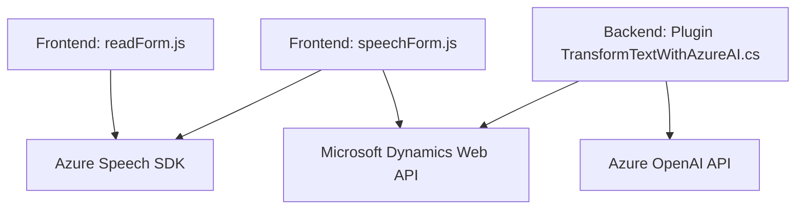

# Análisis Completo del Código y Arquitectura

## **Breve resumen técnico**
- El repositorio integra múltiples componentes que trabajan en conjunto para mejorar la experiencia de usuario en formularios de Microsoft Dynamics 365 a través de voz y procesamiento de texto.
- Incluye múltiples piezas: un frontend basado en JavaScript, backend en C#, integración con Azure Speech SDK y Azure OpenAI API.
- Las funcionalidades soportan síntesis de voz, reconocimiento de comandos hablados y transformación de texto en un formato estructurado JSON.

## **Descripción de la arquitectura**
- **Tipo de Solución:** Ecosistema de software para integrar reconocimiento de voz, interacción basada en formularios y procesamiento de texto con IA en Microsoft Dynamics.
- **Arquitectura:**
    - **Frontend:** Código modular en JavaScript, centrado en la interacción de los usuarios con formularios dinámicos mediante voz.
    - **Backend:** Un plugin en C# implementado como extensibilidad de Dynamics 365, utilizando un patrón **plugin-driven architecture** para interactuar con el sistema CRM.
    - **Patrones:** Modularidad en componentes, arquitectura en capas para comunicación entre frontend, backend y servicios externos (SDKs y APIs).

## **Tecnologías usadas**
1. **Frontend:**
   - **JavaScript**: Para la interacción del cliente.
   - **Azure Speech SDK**: Para síntesis y reconocimiento de voz en el navegador.
   - **Web API Dynamics**: Comunicación con la plataforma Dynamics 365.

2. **Backend:**
   - **C#**: En el desarrollo del plugin de Dynamics CRM.
   - **Azure OpenAI API**: Servicios de transformación de texto.
   - **Newtonsoft.Json.LINQ**, `System.Net.Http` y `System.Text.Json`: Manejo JSON y solicitudes HTTP.

3. **Dependencias adicionales:**
   - **API de Azure Speech** y **Microsoft Dynamics Web API**, que son servicios externos esenciales para cumplir las funcionalidades.

## **Patrones de diseño y estructura**
- **Modularidad:** Código separado en funciones y clases independientes según objetivos específicos, favoreciendo la extensibilidad y mantenimiento.
- **Patrón de plugin:** El backend en C# utiliza el patrón de diseño de plugins específico para Dynamics CRM.
- **Patrón de proveedor externo:** Integración y delegación de funcionalidades a APIs y SDKs de Azure (Speech y OpenAI).
- **Event-Driven Programming:** Uso de callbacks, especialmente en el frontend, para manejar eventos de carga y ejecución (e.g., `ensureSpeechSDKLoaded`).

## **Diagrama Mermaid**

## **Conclusión final**
La solución presentada combina tecnologías modernas como Inteligencia Artificial, procesamiento por voz y extensibilidad de plataformas CRM para habilitar interacciones avanzadas con formularios. Proporciona una experiencia centrada en el usuario con reconocimiento de voz y transformación de texto automatizados. Utiliza una arquitectura **basada en componentes funcionales**, organizada en capas de integración, comunicación con servicios externos y optimización para entornos empresariales dinámica como Dynamics.

Se recomienda:
- Desacoplar claves API (Azure Key, Region) a configuraciones externas por motivos de seguridad.
- Extender soporte multilingüe para una mejor accesibilidad internacional.