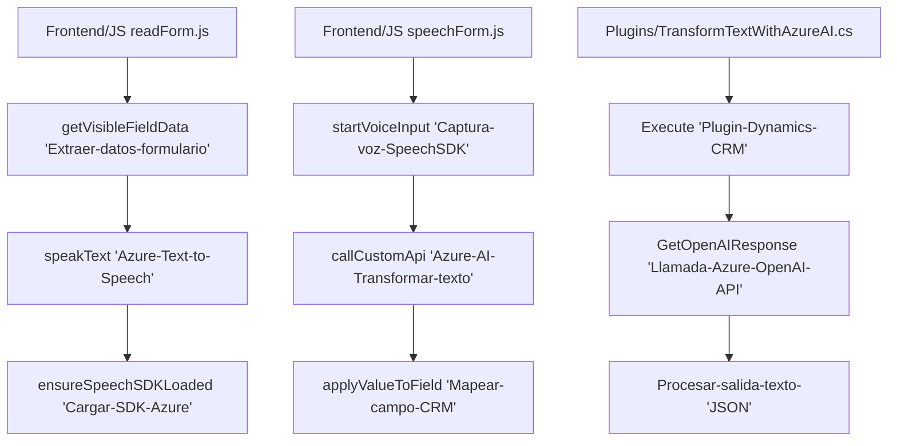

### Breve resumen técnico

El repositorio describe componentes de software orientados a la interacción entre usuarios, sistemas CRM (Microsoft Dynamics), procesamiento de texto con inteligencia artificial (Azure OpenAI API), y reconocimiento de voz (Azure Speech SDK). Los archivos analizados se dividen en dos categorías principales: **Frontend JavaScript** que interactúa con formularios y APIs, y **Backend C# Plugins** que procesan datos utilizando servicios externos.

---

### Descripción de arquitectura

1. **Tipo de solución**: 
   - Solución para integración con Microsoft Dynamics CRM basada en **frontend** (JS) y **plugins backend** (C#).
   - Funcionalidades como reconocimiento de voz, procesamiento dinámico de textos y asignación a campos del CRM.

2. **Arquitectura**: 
   - Utiliza la arquitectura **n capas**, dividiendo la funcionalidad en frontend (presentación, lógica cliente) y backend (procesamiento y reglas del negocio).
   - Adopta un enfoque basado en **patrones de diseño** como el Plugin para Dynamics CRM, el Adapter para traducción de datos entre sistemas y el API Gateway como interfaz de comunicación con Azure APIs.

3. **Principales patrones y componentes utilizados**:
   - **Modularidad**: Funciones especializadas para aumentar mantenibilidad.
   - **SDK externo**: Integración de Azure Speech SDK y Azure OpenAI para funciones de voz y procesamiento de texto.
   - **Adapter Pattern**: Traducción de información entre los entornos de entrada (voz y texto) y los campos del CRM.
   - **API Gateway**: Llamadas hacia Azure APIs para delegar procesamiento de datos complejos.

4. **Negocio y Acoplamiento**:
   - La solución está profundamente acoplada al ecosistema de Microsoft Dynamics (Xrm.SDK, Web API online) y servicios de Azure.
   - Integración directa con Azure Speech SDK y Azure OpenAI para servicios cognitivos.

5. **Componentes externos presentes**:
   - **Azure Speech SDK**: Realización de síntesis y reconocimiento de voz.
   - **Azure OpenAI API**: Procesamiento avanzado de textos por medio de LLMs.
   - **Microsoft Dynamics CRM APIs**: Integración directa con datos y entidades del CRM para procesamiento y almacenamiento dinámico.

---

### Tecnologías usadas

1. **Frontend**:
   - **JavaScript (ES6)**: Para manipulación de DOM y lógica orientada a cliente.
   - **Azure Speech SDK**: Reconocimiento y síntesis de voz. Integrado dinámicamente con `https://aka.ms/csspeech/jsbrowserpackageraw`.
   - **Microsoft Dynamics Web API (Xrm.WebApi.online)**: Manipulación de datos relacionados con el formulario CRM.

2. **Backend**:
   - **C#**: Desarrollo de plugins para Microsoft Dynamics CRM.
   - **Azure OpenAI API**: Interacción con modelos de lenguaje (ej., GPT) para transformación de texto.
   - **HTTP Client Libraries**: `System.Net.Http` y JSON (`System.Text.Json` o `Newtonsoft.Json`).

3. **Frameworks y servicios**:
   - **Microsoft Dynamics CRM SDK**: Extensiones y acceso a entidades CRM.
   - **SDK de Azure**: Procesamiento cognitivo (voz y texto).

---

### Diagrama Mermaid válido para GitHub

---

### Conclusión final

El repositorio combina **frontend dinámica** basada en integración con servicios como Azure Speech SDK y **backend orientado a procesamiento de texto** con inteligencia artificial utilizando Azure OpenAI API. Este diseño está construido bajo el ecosistema de Microsoft Dynamics CRM y su **arquitectura en n capas**, garantizando una interacción eficiente entre usuario, servicios externos y CRM. 

Aunque los componentes están altamente especializados para el entorno Dynamics/Azure, su modularidad y eficaz uso de patrones como **Adapter** y **API Gateway** facilitan la extensión y mantenimiento. El diagrama reflejado comunica las relaciones en el flujo de trabajo, subdividiéndose claramente en capas frontend y backend.