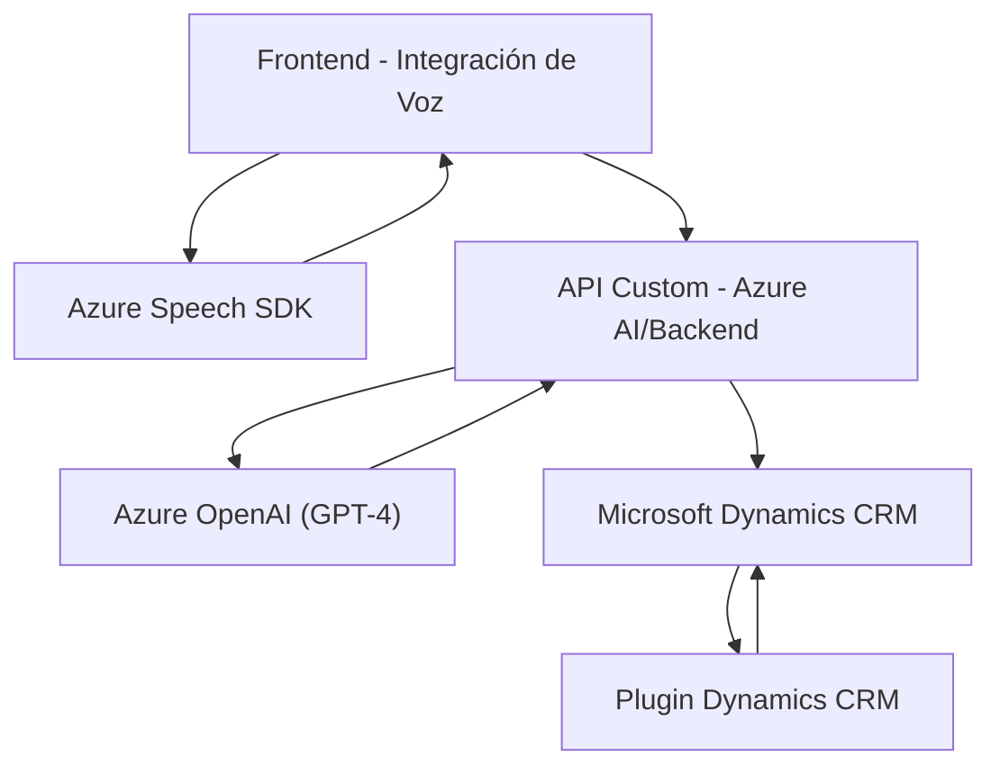

### Breve resumen técnico
Este repositorio pertenece a una solución que integra **Microsoft Dynamics CRM** con el **Azure Cognitive Services SDK** y una **Azure OpenAI API**. Su propósito principal es utilizar tecnologías de voz y procesamiento de lenguaje natural para interactuar con formularios del sistema CRM, permitiendo que los usuarios puedan interactuar con estos mediante comandos de voz o texto. Además, dispone de un plugin que transforma texto utilizando inteligencia artificial, devolviendo datos estructurados para la actualización automatizada de formularios en el sistema.

---

### Descripción de arquitectura
La solución tiene componentes distribuidos que se pueden clasificar en tres capas:
1. **Frontend (JavaScript):**
   - Componente que se encarga de realizar la lógica de interacción con los formularios de Dynamics CRM y usa el SDK de Azure Speech para reconocimiento de voz y síntesis de texto.
   - Interactúa con las APIs externas y las funciones del backend (TransformTextWithAzureAI).

2. **Backend y APIs:**
   - Un plugin de Dynamics CRM escrito en C# integra funcionalidades avanzadas de procesamiento de lenguaje natural mediante Azure OpenAI API.
   - El plugin opera como un middleware, gestionando las peticiones recibidas desde el CRM y realizando la lógica de transformación mediante la API externa.

3. **Servicios Externos:**
   - Azure Cognitive Services: para reconocimiento de voz y síntesis de texto.
   - Azure OpenAI: para procesamiento de texto avanzado mediante GPT.

### Arquitectura:
La estructura general sigue un diseño **Service-Oriented Architecture (SOA)** con integración directa de servicios externos a través de APIs. Aunque existen funciones en el frontend que podrían implementarse como microservicios independientes, actualmente corresponden a un enfoque monolítico cuyo frontend se comunica con APIs y plugins del CRM. Un análisis más detallado conducirá a una posible migración hacia **microservicios**.

---

### Tecnologías usadas
1. **Frontend (JavaScript):**
   - **Azure Speech SDK**: Para reconocimiento de voz y síntesis de voz.
   - **Microsoft Dynamics SDK**: Gestión del contexto de formulario CRM y datos del backend.

2. **Backend (C# Plugin):**
   - **Azure OpenAI**: Procesamiento de lenguaje natural mediante GPT en la API.
   - **Microsoft Dynamics CRM SDK**: Para contexto y gestión de datos del formulario.

3. **Frameworks/Patrones:**
   - **Facade Pattern:** Organización con puntos de entrada únicos para simplificar la interacción con sistemas complejos.
   - **Modularización de código:** Se asegura que cada módulo cumpla una sola responsabilidad, como manejar datos del formulario, realizar síntesis/reconocimiento de voz, delegar peticiones a APIs externas, y realizar transformaciones NLP en el backend.
   - **Service-Oriented Architecture (SOA):** Arquitectura distribuida basada en la interacción de servicios, como el Azure OpenAI API y los plugins del CRM.
   - **Callback Pattern:** Para garantizar la correcta ejecución de procesos asíncronos, como la carga del SDK.

---

### Diagrama Mermaid

---

### Conclusión final
La solución presentada en el repositorio permite interactuar con formularios de Microsoft Dynamics CRM mediante la voz y texto, haciendo uso de tecnologías avanzadas como el **Azure Speech SDK** y la **Azure OpenAI**. Aunque los componentes tienen una estructura modular y siguen buenas prácticas de programación, la arquitectura aún presenta elementos de cohesión propia de sistemas monolíticos adaptados para interactuar con APIs externas. 

Para una mejor escalabilidad, se podría considerar migrar el módulo de procesamiento de texto en el plugin a un microservicio dedicado, y separar completamente las funcionalidades en capas independientes con su propio ciclo de vida, utilizando tecnologías de contenedores como Docker para despliegue. Esto ayudaría a reducir la dependencia mutua entre los componentes y mejorar el mantenimiento y la evolución del sistema.