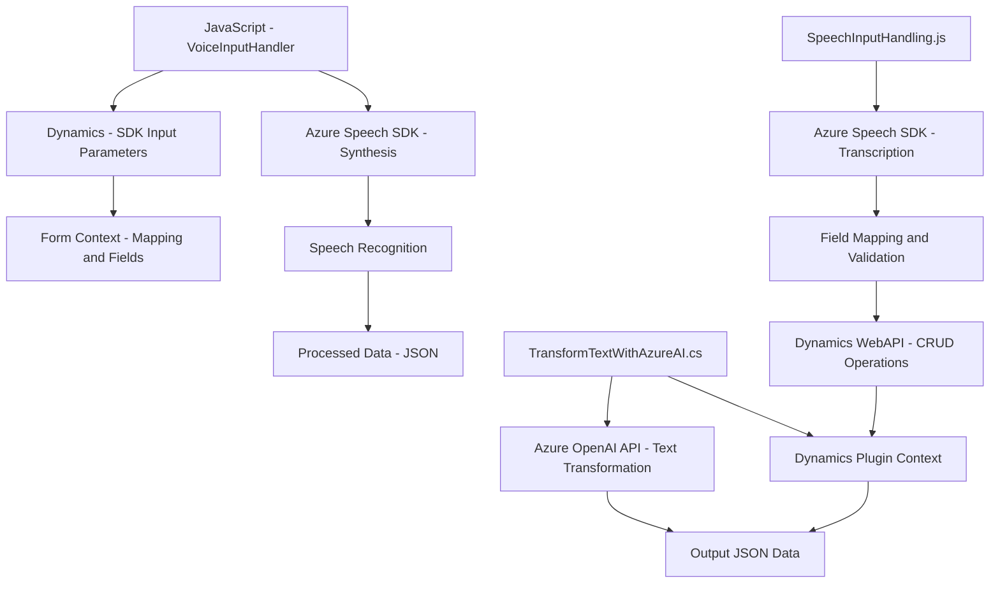

### Breve resumen técnico
El repositorio contiene archivos que implementan funcionalidades relacionadas con integración de voz para formularios en Dynamics 365, servicios externos como Azure Speech SDK, y un plugin de Dynamics CRM para transformar texto mediante Azure OpenAI. Se observa una arquitectura que combina diversas capas y patrones, enfocada en la interacción con APIs externas y manipulaciones basadas en contexto.

---

### Descripción de arquitectura
La solución tiene una arquitectura **n capas** que combina las siguientes elementos:
1. **Frontend/JS**: Módulo JavaScript que interactúa con el SDK de Azure Speech para sintetizar o reconocer datos de voz y sincronizarlos con formularios de Dynamics 365. La lógica está encapsulada en funciones independientes.
2. **Backend/Plugins**: Un plugin de Dynamics CRM que actúa como una capa intermedia entre Dynamics y el OpenAI desplegado en Azure, procesando datos a nivel de servidor.
3. **Integración con servicios externos**: Utilización de Azure Speech SDK y OpenAI para operaciones de síntesis de voz, reconocimiento y transformación de texto controlado.

---

### Tecnologías usadas
1. **Frontend**:
   - **JavaScript**: Lenguaje principal utilizado para integrar funcionalidades con Azure Speech SDK.
   - **Azure Speech SDK**: Librería externa cargada dinámicamente para síntesis y reconocimiento de voz.
   - **Microsoft Dynamics 365 API**: Para capturar el contexto del formulario y realizar operaciones con datos.
   - **Dynamic Script Loading**: Uso de cargado condicional de dependencias (como el SDK de Azure).

2. **Backend**:
   - **Plugin Pattern**: Implementación de una lógica personalizada en un plugin de Dynamics 365.
   - **Azure OpenAI Service**: Uso de GPT para transformar texto según reglas específicas.
   - **Newtonsoft.Json**: Para trabajar fácilmente con JSON en el plugin.
   - **System.Net.Http**: Manejador de solicitudes HTTP.

---

### Dependencias o componentes externos presentes
1. Azure Speech SDK:
   - Utilizado para captura de voz y síntesis en los módulos de frontend.
   - Cargado dinámicamente desde una URL oficial.
2. Azure OpenAI Service:
   - Usado en el plugin para realizar transformaciones de texto.
3. Dynamics 365 Web API:
   - Captura el contexto y manipula los formularios desde Dynamics.
4. JSON Manipulación:
   - Librerías como `Newtonsoft.Json` y `System.Text.Json` integrado en el plugin de backend.
5. HTTP Client:
   - Utilizado en el plugin para enviar solicitudes al servicio OpenAI.

---

### Diagrama Mermaid válido para GitHub

---

### Conclusión final
La solución está diseñada como un sistema híbrido de **n capas** combinando Frontend (JavaScript) y Backend (Plugins para Dynamics CRM). Utiliza **Azure Speech SDK** y **Azure OpenAI** para capturar entrada de voz, sintetizar voz desde etiquetas de formulario, y realizar transformaciones avanzadas de texto en el backend.

Principales ventajas:
1. **Modularidad**: Cada archivo tiene bien definida su responsabilidad.
2. **Integración fluida**: Comunicación robusta con servicios externos mediante HTTP, SDKs y APIs.
3. **Flexibilidad**: Carga dinámica de dependencias como Azure Speech SDK, permitiendo optimización de recursos.

La solución es ideal para optimizar flujos en aplicaciones empresariales con integración de IA y voz, como interfaces de usuario más accesibles o simplificadas en sistemas CRM como Dynamics 365.