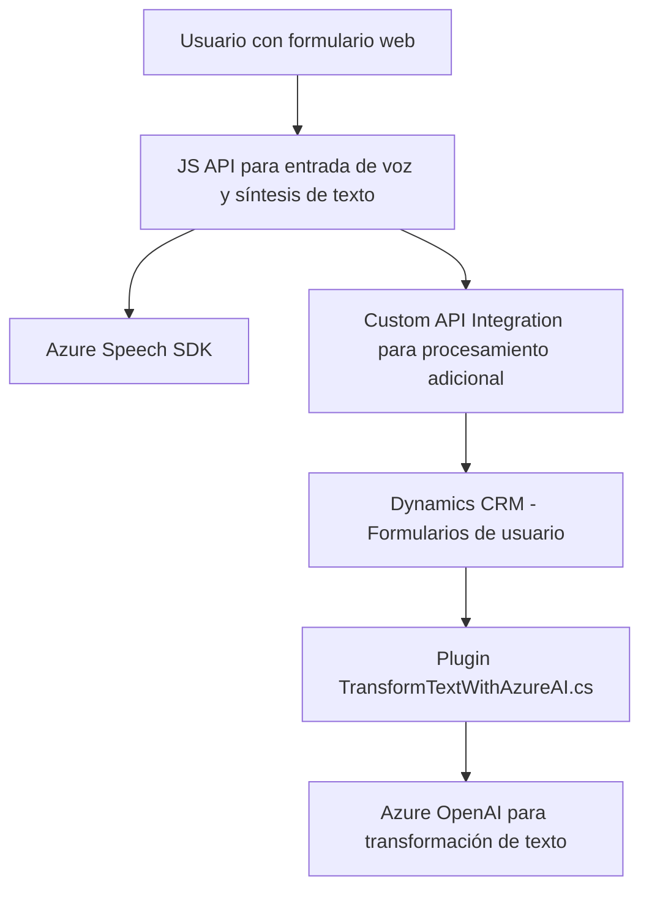

### Resumen Técnico

El repositorio contiene múltiples archivos que interactúan entre sí para implementar funcionalidad avanzada en una aplicación integrada con Dynamics 365 y Azure services. Se utiliza una mezcla de tecnologías de frontend y backend para permitir la entrada de voz (reconocimiento y síntesis) y la interacción con un sistema CRM con capacidades de inteligencia artificial.

---

### Descripción de Arquitectura

1. **Tipo de Solución:**  
   - Una solución híbrida que combina frontend y extensión del backend a través de un plugin para Dynamics CRM.  
   - La finalidad de los archivos de frontend (`readForm.js` y `speechForm.js`) es crear una interfaz basada en voz que se conecta a servicios de Azure y un sistema CRM para procesar entradas del usuario de manera interactiva.  
   - El archivo backend (`TransformTextWithAzureAI.cs`) implementa un plugin de Dynamics CRM que se encarga de procesar información en el servidor (Azure OpenAI).

2. **Tecnologías, Frameworks y Patrones Usados:**  
   - **Frontend:**  
     - JavaScript como lenguaje principal.  
     - Azure Speech SDK para reconocimiento y síntesis de voz.  
     - Dynamics 365 APIs (`Xrm.WebApi`) para interacción con recursos internos del CRM.  
     - Uso de patrones como "Facade" para abstraer el acceso a servicios externos y "Data Processing" para manipulación de datos.  
   - **Backend:**  
     - C# como lenguaje principal.  
     - Microsoft Dynamics CRM SDK (`Microsoft.Xrm.Sdk`).  
     - Azure OpenAI Service para generación de texto estructurado con inteligencia artificial.  
     - HTTP client (`System.Net.Http`) y manejo JSON (`Newtonsoft.Json.Linq` y `System.Text.Json`) para solicitudes al servicio de OpenAI.  
   - **General:** Utilización del patrón de integración, donde servicios backend y frontend interactúan con servicios externos para implementar funcionalidades avanzadas.

3. **Tipo de Arquitectura:**  
   - **Multicapas con integración externa:**  
     - El frontend actúa como capa de presentación altamente modular para admitir la entrada de voz y la interacción con el usuario.  
     - El plugin .NET de Dynamics CRM realiza el procesamiento y las llamadas de alto nivel a OpenAI, operando como una capa de negocio en el backend.  
     - Distintas capas de integración con Azure Speech y Azure OpenAI.  
   - Con capacidades extendidas del sistema CRM, esta solución se puede definir como una arquitectura de **Complemento API con componentes híbridos frontend-backend integrados**.

4. **Dependencias o componentes externos:**  
   - **Azure Speech SDK**: Para síntesis y reconocimiento de voz en el frontend.
   - **Azure OpenAI API**: Para procesamiento avanzado de texto mediante el modelo GPT en el backend.  
   - **Dynamics 365 Web API**: Para interactuar con las entidades y atributos del CRM.  
   - **General-purpose libraries**: Tales como `Newtonsoft.Json` o `System.Net.Http`.  

---

### Diagrama Mermaid válido para GitHub

---

### Conclusión Final:

La solución del repositorio es una integración avanzada entre un frontend basado en JavaScript y un backend de Dynamics 365 mediante un plugin escrito en C#. Utiliza servicios avanzados de Azure como Speech SDK para síntesis y reconocimiento de voz, y OpenAI para procesamiento interactivo de texto basado en inteligencia artificial. La arquitectura se puede clasificar como multicapa con integración externa y el diseño hace un uso eficiente de patrones como "Facade", "Callback Loading", y "Plugin Component". Esta solución está bien diseñada para ofrecer una experiencia interactiva y moderna en un ecosistema empresarial.