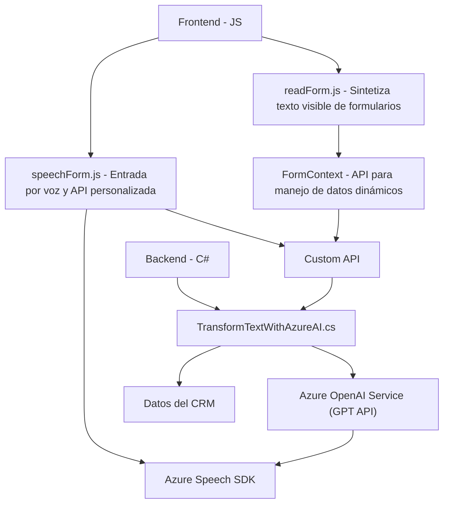

### Breve resumen técnico

El repositorio parece estar diseñado para una solución de integración avanzada entre un sistema CRM, posiblemente Dynamics 365, y el servicio de Azure OpenAI y Azure Speech SDK. La solución implementa varias funcionalidades alrededor de la interpretación de texto y voz dentro de un contexto de formularios dinámicos, ofreciendo tanto un frontend con JavaScript como un backend desarrollado en .NET para interacciones más complejas como la integración con Azure AI.

---

### Descripción de arquitectura

La arquitectura lleva un enfoque modular orientado a servicios externos. No se observan indicios de una arquitectura de microservicios estricta, sino más bien un modelo híbrido entre una arquitectura de capas y un patrón de integración con APIs externas.

- **Frontend:** 
  La parte cliente está implementada en JavaScript y aprovecha un modelo modular basado en funciones. Además, utiliza SDK como Azure Speech y APIs de Dynamics CRM para habilitar interacción con voz y formularios.

- **Backend:** 
  La lógica más compleja y las integraciones con servicios de AI parecen haberse delegado al backend. Incluye un plugin de Dynamics CRM en C# encargado de transformar el texto con Azure OpenAI, utilizando patrones como `Dependency Injection` y `Facade`.

---

### Tecnologías, frameworks y patrones usados

#### **Tecnologías y frameworks:**
1. **Frontend:**
   - **JavaScript:** Es el lenguaje utilizado para implementar la lógica en los archivos existentes.
   - **Azure Speech SDK:** Servicio externo para síntesis de voz y reconocimiento de voz.
   - **Dynamics CRM APIs:** Manejo de datos en formularios y sus atributos.

2. **Backend:**
   - **C#:** Lenguaje utilizado en el plugin de Dynamics CRM.
   - **Dynamics CRM SDK:** Permite acceder al contexto y a las funcionalidades del CRM mediante la interfaz `IPlugin`.
   - **Azure OpenAI:** Modelo GPT para procesamiento de texto.

#### **Patrones de diseño:**
- **Modularidad en el Frontend:** Claramente definido con funciones especializadas para tareas como procesamiento de formularios y gestión de voz.
- **Event-Driven Programming:** Presente en la lógica asíncrona del reconocimiento de voz.
- **Facade Pattern:** En el plugin, encargándose de interactuar con Azure OpenAI en un método estático que abstrae la comunicación HTTP.
- **Dependency Injection:** El plugin utiliza un `service provider` para obtener dinámicamente dependencias necesarias.
- **Dynamic Dependency Management:** El SDK de Azure Speech se carga dinámicamente a través del DOM.

---

### Dependencias o componentes externos

1. **Azure Speech SDK:** Para la síntesis y reconocimiento de voz, cargado desde una URL pública de Microsoft.
2. **Azure OpenAI:** Interacción directa con el modelo GPT mediante API para transformar y procesar texto según reglas específicas.
3. **Dynamics CRM SDK:** Uso extensivo de funcionalidades como `Xrm.WebApi.online.execute` para interactuar con los datos de formularios en el CRM.
4. **System.Text.Json y Newtonsoft.Json:** Para manejar estructura y formato JSON en las transformaciones de información del plugin.

---

### Diagrama **Mermaid** compatible con **GitHub Markdown**

---

### Conclusión final

Este repositorio se presenta como una solución integrada de tecnología avanzada, adecuada para modernizar las capacidades de un CRM como Dynamics 365. Su diseño modular en el frontend, el uso del potente Azure Speech SDK, y la implementación de un plugin para la integración con Azure OpenAI, ofrecen una solución robusta para la síntesis y manipulación de datos por texto y voz. Aunque la arquitectura no es estrictamente de microservicios, sí sigue patrones modernos que garantizan la flexibilidad, reutilización y gestión de dependencias externas de forma dinámica.