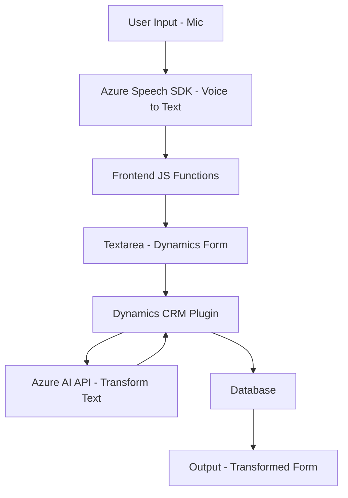

## Breve resumen técnico

El repositorio contiene un sistema integrado que combina funcionalidades basadas en reconocimiento de voz, síntesis de voz y procesamiento avanzado de texto mediante inteligencia artificial. Estas capacidades están ligadas a formularios dinámicos dentro de Microsoft Dynamics CRM, complementándose con plugins personalizados y servicios externos como Azure Speech SDK y Azure OpenAI.

---

## Descripción de arquitectura

### **Tipo de solución**
La solución parece ser un sistema híbrido compuesto por:
- **Frontend**: Porciones de JavaScript para interacción con el usuario y gestión de voz sobre formularios.
- **Backend**: Plugins y servicios que interactúan con Microsoft Dynamics CRM, utilizando APIs y servicios externos como Azure Speech SDK y Azure OpenAI.

### **Tipo de arquitectura**
La arquitectura manifiesta una **n capas**, donde cada capa cumple una responsabilidad específica:
1. **Frontend**: Procesa voz y transcripción, y mapea datos de formularios.
2. **Backend**: Realiza validaciones y transforma textos mediante un plugin con comunicación asincrónica hacia servicios de Azure (OpenAI).
3. **Servicios externos**: Alojados en Azure, consumidos desde el código para funciones específicas como IA y síntesis de voz.

Adicionalmente, el uso de servicios externos y la modularización funcional alinean la solución con prácticas **event-driven** y **service-oriented architecture (SOA)**.

---

## Tecnologías usadas

### **Frontend**
- JavaScript (ES6).
- Azure Speech SDK: Para síntesis y reconocimiento de voz.
- Browser APIs: Manipulación del DOM, eventos, y comunicaciones.
- Microsoft Dynamics Form Execution Context: Integración directa con formularios en Dynamics.

### **Backend**
- **Microsoft Dynamics SDK**: Para acceso y extensión de funcionalidades en Dynamics CRM.
- **C#** y .NET: Lenguaje y framework utilizados para construir plugins interactivos.
- **Newtonsoft.Json**: Manejo avanzado de JSON en C#.
- **Azure OpenAI Services**: IA avanzada para procesar y transformar texto en formatos estructurados.

### **Patrones**
- Modularización funcional.
- Event-driven programming con callbacks.
- Plugin pattern en Dynamics CRM.
- Dependencia directa de servicios externos para operaciones críticas (Speech SDK, OpenAI).
  
---

## Diagrama Mermaid

---

## Conclusión final

Este repositorio implementa una solución orientada a la automatización y transcripción de datos hablados integrados con formularios de Microsoft Dynamics CRM. La arquitectura está diseñada para separar responsabilidades y facilitar la interacción entre distintas capas (frontend, backend y servicios externos).

Puntos clave:
1. **Tecnologías avanzadas**: Uso de servicios de Azure (Speech SDK y OpenAI) para síntesis, reconocimiento y transformaciones de texto, combinados con integraciones nativas de Dynamics CRM.
2. **Arquitectura robusta**: La aplicación utiliza un enfoque de **n capas**, con separación clara entre frontend y backend, integrando tecnologías externas mediante **SOA**.
3. **Escalabilidad**: El diseño modular y desacoplado permite extender funcionalidades, soportar nuevas APIs y añadir casos de uso en el sistema Dynamics CRM.

Este diseño podría mejorar con estrategias de seguridad como manejo robusto de claves y endpoints de Azure, además de optimizaciones en consultas Dynamics si el sistema escala considerablemente.