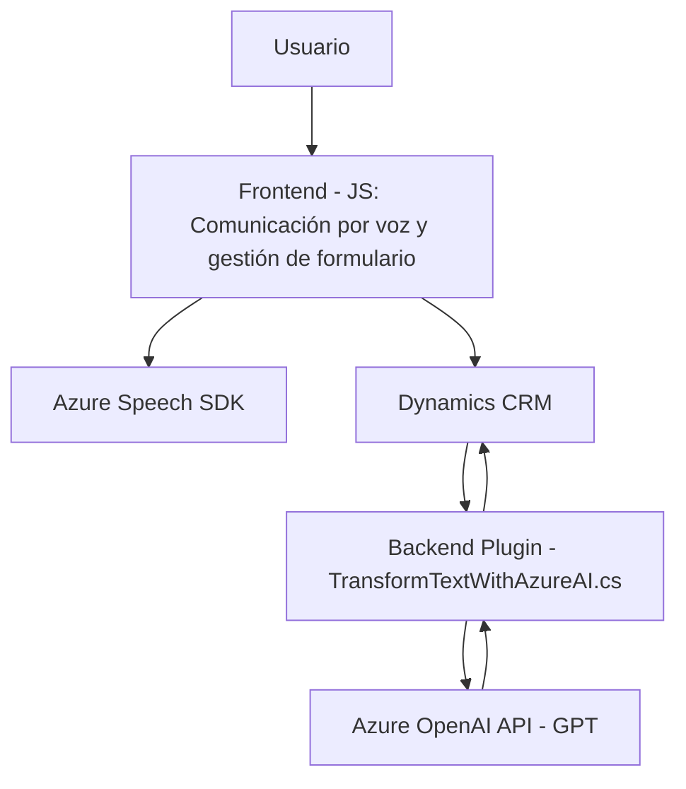

### Breve resumen técnico:
El repositorio alberga una solución basada en la integración de aplicaciones frontend de navegación mediante voz con un CRM (Microsoft Dynamics 365). Mediante el uso del **Azure Speech SDK**, se permite la síntesis y reconocimiento de voz, mientras que el plugin para Dynamics 365 utiliza la **API Azure OpenAI** (GPT) para procesamiento avanzado de texto transformado. Las interacciones están enfocadas en manejar formularios y datos dinámicos.

---

### Descripción de arquitectura:
La solución utiliza **arquitectura de n-capas**:
1. **Presentación (Frontend)**: Dos archivos principales en JavaScript (`readForm.js` y `speechForm.js`) que gestionan la interacción con el usuario mediante síntesis y reconocimiento de voz. El SDK de Azure Speech se usa como un servicio externo para realizar las tareas necesarias de lenguaje.
  
2. **Lógica de Negocio (Plugins)**: El archivo de plugin (`TransformTextWithAzureAI.cs`) opera en el servidor de Dynamics 365, configurado bajo un patrón específico de implementación de Plugins. Procesa datos generados o ingresados en el frontend utilizando la API OpenAI de Azure GPT para obtener una respuesta estructurada.
  
3. **Acceso a datos (Dynamics CRM)**: Comunicación con las entidades del CRM para manejar datos del formulario que se utilizan tanto en el frontend como en los procesos que ejecuta el plugin.

Se sigue una separación clara de responsabilidades: la capa cliente interactúa con el usuario mediante voz, el lado del servidor gestiona la lógica avanzada mediante la integración de servicios como Azure OpenAI y Dynamics CRM. Sin embargo, falta mayor evidencia para confirmar una aproximación completamente **hexagonal** o **microservicios**, ya que no parece haber una descentralización completa ni una base de eventos.

---

### Tecnologías usadas:
1. **Frontend:**
   - **Vanilla JavaScript**.
   - **Azure Speech SDK**: Para síntesis y reconocimiento de voz.
   - **Microsoft Dynamics JScript API (`formContext`)**: Manejo de la interfaz de usuario del CRM.
   - **Funciones asincrónicas (Promises)** para asegurase de que los recursos (e.g., SDKs) sean cargados dinámicamente antes de usarse.

2. **Backend**:
   - **C#** para desarrollar un **Plugin** basado en **Microsoft Dynamics SDK**.
   - **JSON manipulación**: `Newtonsoft.Json.Linq` y `System.Text.Json`.
   - **HTTP Client (`System.Net.Http`)**: Para comunicación con la API Azure OpenAI.

3. **Servicios Externos**:
   - **Azure Speech SDK**: Manejo de voz con generación y transcripción.
   - **Azure OpenAI API (GPT)**: Procesamiento de lenguaje natural (transformación de texto a JSON estructurados).
   - **Dynamics Xrm.WebAPI**: Comunicación entre frontend y CRM.

---

### Diagrama Mermaid:

---

### Conclusión final:
La solución proporcionada representa una arquitectura **n-capas** donde se integran firmemente las **tecnologías de Azure** (Speech SDK y OpenAI API) y **Microsoft Dynamics CRM**. Esta solución está orientada a escenarios de interacción por voz y procesamiento avanzado de texto en aplicaciones empresariales dinámicas centradas en formularios. Aunque es modular en ciertas capas, las dependencias directas hacia servicios externos como Azure Speech y OpenAI limitan la portabilidad y escalabilidad del sistema. Para mejorar su calidad, sería útil trabajar en una estructura más adaptada a la arquitectura hexagonal y desacoplar los servicios externos, integrando medidas de seguridad para credenciales.