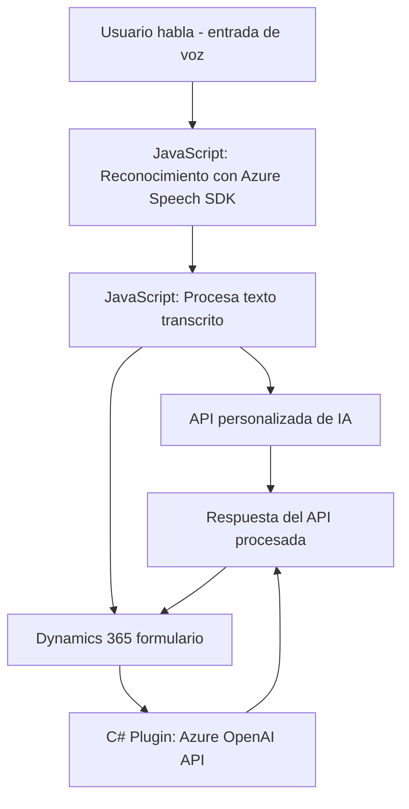

### Breve resumen técnico
El repositorio provee una solución integral para implementar interacciones basadas en voz con formularios de Dynamics 365, utilizando el **Azure Speech SDK** para síntesis y reconocimiento de voz, así como la integración con la **Azure OpenAI API** para procesamiento avanzado de texto. Los archivos abarcan funcionalidades frontend y backend, incluyendo un plugin para extender capacidades de Dynamics 365.

---

### Descripción de la arquitectura
1. **Front-end Scripting (JavaScript):**
   - Las carpetas **FRONTEND/JS/readForm.js** y **FRONTEND/JS/speechForm.js** definen la lógica para reconocimiento de voz, síntesis de voz y procesamiento de datos que interactúan con los formularios de Dynamics 365. Estos archivos implementan patrones de diseño como:
     - **Facade**: Encapsula funcionalidades complejas (e.g., `applyValueToField`) para simplificar su integración.
     - **Adaptador**: Adapta las transcripciones de voz e integra con Dynamics 365, a través de funciones como `processTranscriptIA`.

2. **Back-end Plugin (C#):**
   - **TransformTextWithAzureAI.cs**, desarrollado como un plugin de Dynamics 365, sigue la **Arquitectura de Plugins** típica, consumiendo servicios externos (Azure OpenAI API) para transformar texto mediante reglas personalizadas. El backend utiliza patrones como:
     - **API Consumer**: Hace una integración explícita con Azure usando HTTP Client.
     - **Encapsulación**: El método `GetOpenAIResponse` abstrae la lógica del consumo de servicios externos.

### Arquitectura general:
- La solución aplica una arquitectura **modular**:
  - **Front-end**: Scripts de JavaScript para interactuar con el usuario y procesar voz.
  - **Back-end**: Plugin en C# que proporciona procesamiento avanzado de texto mediante OpenAI.

- **Capas funcionales** (n-capas simplificada):
  1. **Presentación**: Formulario basado en Dynamics 365 que actúa como la interfaz de usuario.
  2. **Lógica empresarial**: Scripts JavaScript que interactúan con los datos y voz del usuario.
  3. **Servicios externos**: Azure Speech SDK para entrada y síntesis de voz; Azure OpenAI API para transformaciones.

---

### Tecnologías usadas
1. **Frontend:**
   - Lenguaje: JavaScript.
   - SDK: Azure Speech SDK.
   - Plataforma: Dynamics 365 Form Context.

2. **Backend:**
   - Lenguaje: C# (Microsoft .NET).
   - Framework: .NET SDK for Dynamics 365.
   - API: Azure OpenAI.

3. **Infraestructura:**
   - Dynamics 365 Web API para entidades de datos y ejecución de plugins.

---

### Dependencias o componentes externos
1. **Azure Speech SDK**: Proporciona capacidades de reconocimiento y síntesis de voz.
2. **Azure OpenAI API**: Realiza transformaciones avanzadas de texto.
3. **Dynamics 365 Web API**: Interactúa con los datos y entidades del CRM.
4. **Browser/scripting dependencies**:
   - HTML (para integrar los scripts que interactúan con el formulario).

---

### Diagrama **Mermaid** válido para GitHub Markdown

---

### Conclusión final
La solución presentada combina capacidades avanzadas de reconocimiento y síntesis de voz con herramientas de procesamiento de lenguaje natural y manejo de datos en formularios de Dynamics 365. La estructura modular brinda alta cohesión y separación de responsabilidades, con un claro enfoque en las necesidades típicas de integración en aplicaciones empresariales modernas.

Gracias a la implementación de patrones como Facade, Adaptador y la arquitectura de Plugins, esta solución se posiciona como una herramienta extensible y escalable, adecuada para escenarios corporativos enfocados en la digitalización, accesibilidad y optimización de procesos.