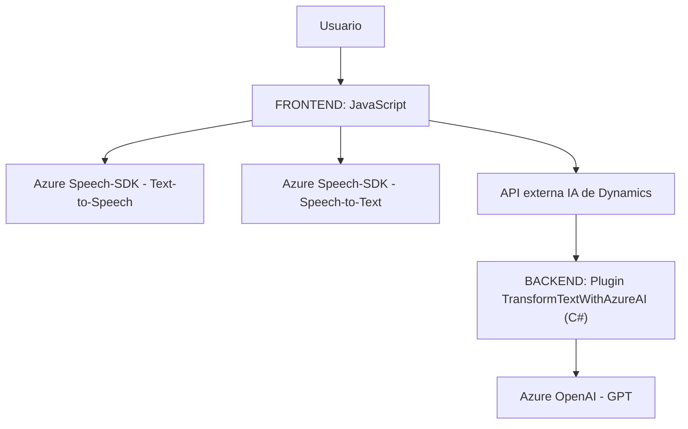

# Análisis técnico de la solución:

## Breve resumen técnico:
La solución parece estar enfocada en la integración de capacidades cognitivas, mediante el Azure OpenAI y el Azure Speech SDK, con Dynamics CRM. Los archivos analizados permiten interactuar con formularios ya sea mediante síntesis de voz, reconocimiento de voz o transformación avanzada de texto utilizando inteligencia artificial. La arquitectura global de la solución combina tecnologías de frontend, Microsoft plugins y servicios externos, potenciando la interacción natural por voz y ofreciendo procesamiento avanzado del lenguaje.

----

## Descripción de la arquitectura:
La arquitectura parece ser una **modular con enfoque de integración en capas**, donde se combinan componentes internos y externos. Está compuesta por un frontend basado en JavaScript para formularios dinámicos, junto con un backend definido por **plugins de Dynamics CRM** altamente integrados con APIs externas como Azure Speech SDK y Azure OpenAI.

- **Frontend (JS):**
  - Maneja interacción directa con los usuarios para formularios utilizando reconocimiento de voz y síntesis de texto.
  - Integración con servicios cognitivos de Azure (Speech SDK) para las funcionalidades de voz.

- **Backend (Plugins):**
  - Define lógica específica para interactuar con Azure OpenAI a través de un plugin en Dynamics CRM.
  - Encapsula operaciones para enviar textos a través de una API y recibir respuestas normalizadas.

Esta combinación sugiere una arquitectura **de n capas** donde:
1. **Capa de presentación:** Responsabilidad del frontend para interacción usuario-sistema.
2. **Capa de lógica:** Representada por los plugins y el procesamiento de datos.
3. **Capa de integración externa:** Interacción con servicios externos como Azure API (Speech y OpenAI).

----

## Tecnologías usadas:
### En Frontend:
- **JavaScript**: Lenguaje base para manipulación de formularios y lógica de cliente.
- **Azure Speech SDK**: Para síntesis y reconocimiento de voz en tiempo real.
- **Promise y callback**: Gestión asincrónica para cargar librerías externas y procesar datos.

### En Backend:
- **C# (.NET)**: Desarrollo de plugins para Dynamics CRM.
- **Microsoft Dynamics SDK**: Manipulación de datos de formularios desde el backend.
- **Azure OpenAI GPT**: Procesamiento y transformación de texto en JSON estructurado.
- **System.Net.Http y Json Libraries**: Consumo de servicios REST y tratamiento de JSON. 

### Patrones utilizados:
1. **Modularidad**: La lógica está segmentada en funciones específicas de propósito único.
2. **Invocación diferida**: SDK dinámico cargado en tiempo de ejecución como en `ensureSpeechSDKLoaded`.
3. **Integración API**: Uso explícito de APIs externas para agregar funcionalidades avanzadas (Azure Speech y Azure OpenAI).
4. **Abstracción de servicios**: Comunicación clara entre frontend, backend y servicios externos.
5. **Event-Driven Architecture**: Uso de callbacks en el frontend y eventos activos dentro de Dynamics CRM Plugins.

----

## Dependencias o componentes externos presentes:
1. **Azure Speech SDK**: Para tecnologías de voz (conversión texto a voz y voz a texto).
2. **Azure OpenAI API**: Para tareas de procesamiento y transformación avanzada de lenguaje natural.
3. **Microsoft Dynamics SDK**: Framework estándar de extensibilidad para plugins en Dynamics CRM.
4. **System.Net.Http y Newtonsoft.Json**: Manejo de solicitudes REST y procesamiento de JSON.
   
Otras dependencias indirectas:
- **URL de CDNs Dinámico para cargar SDK**: JavaScript en frontend incluye carga por URL, lo que requiere conexión estable y manejo de errores en caso de inestabilidad.
- **Microsoft API Key Management**: Necesario para interactuar con servicios externos (Azure).

---

## Diagrama Mermaid 100% compatible con GitHub Markdown:

---

## Conclusión Final:
Esta solución representa una integración avanzada de servicios cognitivos en Dynamics CRM, con una arquitectura de tipo **n capas** que permite distinguir claramente las responsabilidades entre el frontend, donde los usuarios interactúan con los formularios, y el backend, encargado de realizar operaciones más complejas como el procesamiento de lenguaje natural mediante inteligencia artificial. La elección de tecnologías, como Azure Speech SDK y Azure OpenAI API, refuerza el enfoque en la automatización y mejora de la experiencia de usuario.

Puntos destacados:
1. **Eficiencia**: El diseño modular y el uso de servicios externalizados permite un desarrollo más escalable.
2. **Event-driven approach**: Las interacciones asíncronas hacen que la solución sea más reactiva y adaptable a entradas dinámicas.
3. **Integración con servicios externos**: Aprovecha los beneficios del procesamiento cognitivo en la nube (Azure), lo cual reduce la carga del sistema interno.

Sin embargo, es crucial optimizar la gestión de recursos y claves API para garantizar seguridad y estabilidad, y evaluar una posible implementación de **patrón hexagonal** para mayor desacoplamiento de servicios externos.