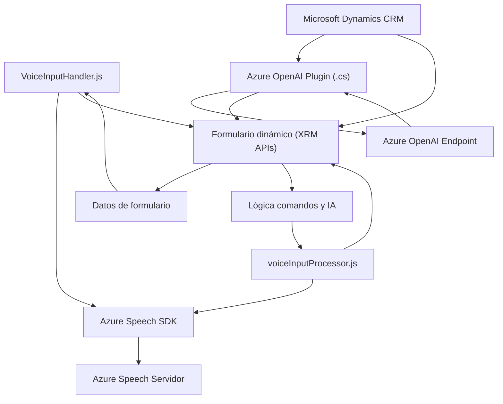

### Breve resumen técnico
El repositorio pertenece a una solución para integrar capacidades de inteligencia artificial y procesamiento de comandos de voz en aplicaciones centradas en formularios dinámicos, específicamente en un entorno de Microsoft Dynamics CRM. Integran formularios, voz y procesamiento de datos con tecnologías como **Azure Speech SDK** y **Azure OpenAI**, utilizando arquitectura modular y basada en eventos.

---

### Descripción de arquitectura
- **Componentes frontend**: Implementan funciones que habilitan comandos de voz para interactuar con formularios en la interfaz de usuario. Estos procesan los datos con Azure Speech SDK y API externas.
- **Backend/plugin**: Plugins para Microsoft Dynamics CRM que procesan texto y transforman datos mediante Azure OpenAI. El backend aprovecha una arquitectura de dependencia de servicios para conectarse con Azure y utilizar funciones predefinidas.
- La arquitectura completa podría clasificarse como una combinación de **n capas** y **hexagonal**, ya que encapsula las conexiones a servicios externos y es modular en distintos niveles (frontend, API y servicios).

---

### Tecnologías usadas
1. **Frontend:**
   - **JavaScript/ES6**: Utilizado para la lógica de reconocimiento y síntesis de voz.
   - **Azure Speech SDK**: Permite funcionalidades como la captura de voz y la síntesis en tiempo real.
   - **APIs CRM (XRM)**: Extiende la lógica hacia formularios dinámicos en Dynamics.
2. **Backend:**
   - **C# (.NET Framework)**: Plugin del sistema Microsoft Dynamics CRM.
   - **Azure OpenAI Service**: Para transformar texto y ejecutar lógica de IA.
   - **Dependencias**: Newtonsoft.Json, System.Net.Http.
3. **Patrones y prácticas:**
   - **Event-driven** para el frontend.
   - **Modular y separación de responsabilidades** para ambos módulos (frontend y backend).
   - **Facade Pattern** para simplificar interacciones entre SDK, formulario dinámico y servicios externos.

---

### Dependencias externas o componentes
1. **Azure Speech SDK** (Web): Reconocimiento y conversión de voz a texto.
2. **Azure OpenAI**: Procesamiento de texto mediante IA.
3. **Microsoft Dynamics CRM APIs**: Para el contexto de ejecución y manejo de formularios (e.g., `Xrm.WebApi`).
4. **Newtonsoft.Json** y **System.Net.Http**: Para manipulación y conexión HTTP en el backend.

---

### Diagrama Mermaid válido para GitHub

---

### Conclusión final
La solución combina una interfaz basada en **JavaScript** que utiliza comandos de voz para interactuar con formularios dinámicos de un sistema CRM, una API externa de Azure Speech SDK para procesamiento de audio, y un plugin backend que utiliza **Azure OpenAI** para procesar texto. La arquitectura inclina hacia **n-capas**, con capas separadas de frontend y backend, un fuerte uso del patrón **Facade** en frontend y **abstracción de servicios externos** en backend. Esto asegura que las distintas capas estén desacopladas y altamente modulares.