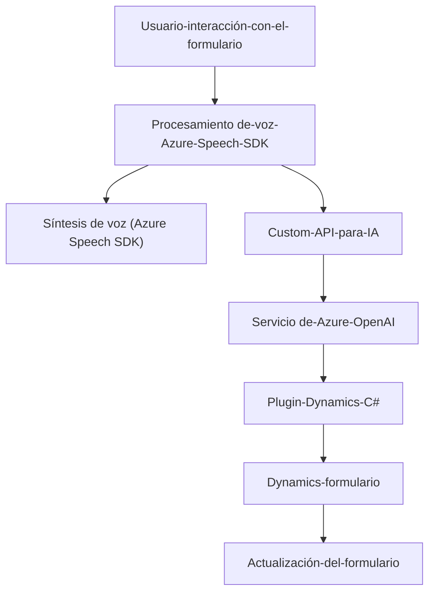

### Breve resumen técnico
La solución presentada se centra en la integración de servicios cognitivos de **Azure** y funcionalidad extendida a través de **Dynamics CRM** (Dynamics 365). Los archivos **Frontend/JS** muestran una lógica centrada en el procesamiento de voz y datos en formularios, mientras que el archivo **Plugins/TransformTextWithAzureAI.cs** opera como un plugin en el backend, utilizando Azure OpenAI para transformar texto.

---

### Descripción de arquitectura
La arquitectura combina elementos de **microfrontend** y **n capas** junto con la integración de **servicios externos**. Su diseño puede dividirse en tres capas principales:

1. **Frontend**:
   - Procesa interacciones de usuario con formularios y voz.
   - Modular, delegando cada tarea a funciones independientes.
   - Utiliza servicios externos, como Azure Speech SDK y API.

2. **Backend**:
   - Implementa un plugin para Dynamics 365 (`TransformTextWithAzureAI.cs`) conectado al servicio Azure OpenAI para procesamiento avanzado.

3. **Servicios Cognitivos**:
   - Utiliza **Azure OpenAI** en conjunto con **Azure Speech SDK** como servicios externos para cognición (transformación de texto y síntesis de voz).

### Tecnologías usadas
1. **Frontend**:
   - **JavaScript**: Base para funcionalidades en el navegador.
   - **Azure Speech SDK**: Texto a voz y reconocimiento de voz.
   - **Promises y HTTP Requests**: Comunicación dinámica con servicios externos y APIs.

2. **Backend**:
   - **C# Plugin** (Dynamics CRM): Extensiones server-side en Dynamics 365.
   - **Newtonsoft.Json y System.Text.Json**: Manipulación JSON.
   - **System.Net.Http**: Comunicación REST con Azure OpenAI API.
   - **Microsoft.Xrm.Sdk**: Interacción directa con Dynamics 365.

3. **Servicios Externos**:
   - **Azure OpenAI API**: Procesamiento de texto utilizando GPT o modelos similares.
   - **Dynamics 365 API**: Gestión de datos en formularios y entidades del entorno CRM.

### Diagrama Mermaid válido para GitHub

---

### Conclusión final
La solución es una integración robusta de servicios frontales y servidores en **Dynamics CRM** usando **Azure** como núcleo de los servicios cognitivos. La arquitectura combina conceptos de **n capas** y **microfrontend** con servicios basados en APIs externas, como el Azure Speech SDK y el OpenAI API. Además, utiliza patrones modulares para garantizar una división lógica de responsabilidades entre frontend y backend.

La implementación destaca por su capacidad de extender la lógica de formularios mediante reconocimiento de voz y transformación avanzada de texto, proporcionando una funcionalidad cognitiva moderna y altamente escalable mediante **Azure** y **Dynamics 365**.