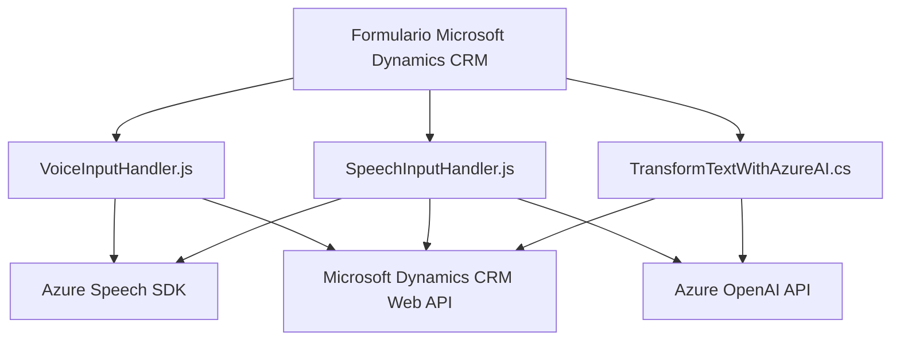

### Breve resumen técnico

El repositorio analiza tres archivos que implementan una solución integrada para la lectura y procesamiento de datos, con interacción de voz y comunicación con Azure AI y Speech SDK. Los dos primeros son scripts de frontend relacionados con Microsoft Dynamics CRM (lectura y entrada de voz en formularios), y el tercero es un plugin backend en .NET que utiliza Azure OpenAI API para procesar texto.

---

### Descripción de arquitectura

La solución es distribuida y estructurada para combinar funcionalidades de frontend y backend. Las interacciones con formularios de Microsoft Dynamics CRM indican que es un sistema orientado a integrar servicios externos mediante una arquitectura de **n capas**:

- **Frontend:** Implementa lógica de entrada y salida (text-to-speech y speech-to-text) usando Azure Speech SDK.
- **Backend:** Extiende las capacidades del CRM con un plugin capaz de interactuar con la API de Azure OpenAI para transformar y estructurar datos.

Este enfoque refuerza un diseño independiente entre las capas, lo que facilita modularidad y escalabilidad.

---

### Tecnologías usadas

1. **Frontend:**
   - **JavaScript:** Implementación de funcionalidades de voz y texto.
   - **Azure Speech SDK:** Para reconocimiento de voz, text-to-speech y entrada de voz.
   - **Microsoft Dynamics CRM Web API (`Xrm.WebApi.online`)**: Comunicación con el backend del CRM.

2. **Backend:**
   - **.NET Framework (C#):** Plugin para Microsoft Dynamics CRM.
   - **Newtonsoft.Json / System.Text.Json:** Procesamiento de datos JSON.
   - **System.Net.Http:** Solicitudes HTTP para comunicación con Azure OpenAI API.
   - **Azure OpenAI API:** Para procesamiento y transformación de texto.

3. **Patrones de diseño:**
   - **Modularidad funcional:** Separación de responsabilidades en funciones específicas.
   - **Callback style / Event-driven programming:** Uso de callbacks para la carga asíncrona de recursos.
   - **Integración con servicios externos:** Proxy para interactuar con Azure Speech SDK y OpenAI API.

---

### Diagrama Mermaid

---

### Conclusión final

Este repositorio implementa una solución basada en **voice interaction** y **AI-driven processing** para formularios en Microsoft Dynamics CRM, combinando un frontend que interactúa directamente con usuarios mediante voz y texto, y un backend que extiende las funcionalidades del CRM con un plugin que utiliza Azure AI para procesamiento avanzado.

La arquitectura es **n capas**, donde las capas del frontend y backend están claramente diferenciadas. Las tecnologías de Azure Speech SDK y Azure OpenAI API juegan papeles importantes en las capacidades de reconocimiento y procesamiento de voz, posicionando esta solución como una moderna herramienta de asistencia operativa.