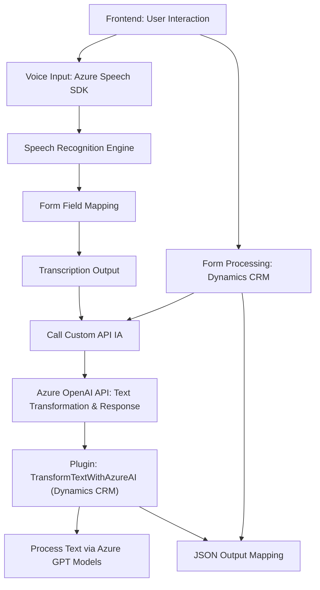

### Breve resumen técnico

La solución presentada se compone de tres elementos principales en un repositorio dividido en frontend y plugins. El frontend incluye dos archivos JavaScript que implementan la interacción con formularios, entrada por voz y procesamiento dinámico (incluyendo Inteligencia Artificial y el servicio de Azure Speech). Por otro lado, el plugin C# actúa como un conector entre Dynamics CRM y el servicio Azure OpenAI API para transformar texto siguiendo normas específicas establecidas. La arquitectura global combina un modelo de capas extendido con integración directa hacia APIs y servicios externos.

---

### Descripción de arquitectura

La solución utiliza un enfoque modular y de **arquitectura en capas orientada a servicios**. Esta se divide en tres áreas principales:
- **Frontend:** Encargado de interactuar con el usuario vía navegador, con dos componentes:
  - Servicios de voz (entrada y síntesis) a través de Azure Speech SDK.
  - Procesamiento dinámico de datos en formularios de Dynamics CRM y transformación de respuesta por IA.
- **Backend:** Plugin desarrollado en C# que interactúa con Dynamics CRM, actúa como intermediario para la integración con Azure OpenAI API y estandariza la transformación de texto para entradas y salidas específicas.

Ambos componentes están acoplados al entorno de Dynamics CRM, lo que sugiere que se basan en la arquitectura de extensibilidad de este sistema y que operan dentro de su modelo orientado a plugins y scripts personalizados.

### Tecnologías usadas

1. **Frontend:**
   - **JavaScript:** Para la creación de scripts relacionados con el procesamiento y síntesis de voz, incluyendo el SDK de Azure Speech.
   - **Azure Speech SDK:** Implementación de reconocimiento y síntesis de voz.
   - **Ajax / Fetch:** Para comunicarse con APIs externas (evidente en promesas y funciones `callCustomApi()`).

2. **Plugin (Backend):**
   - **C#:** Desarrollo de código manejado como un plugin para Dynamics CRM.
   - **Microsoft Dynamics SDK:** Gestión del contexto y entidades dinámicas.
   - **Newtonsoft.Json** y **System.Text.Json:** Serialización y manipulación de datos JSON.
   - **Azure OpenAI API:** Servicio en la nube para procesamiento avanzado de texto.
   - **HTTP Client:** Para solicitudes hacia servicios externos de Azure.

3. **Generales:**
   - **Integración nativa con Dynamics CRM:** Para lectura y manipulación de datos del formulario y entidades personalizadas.
   - **Arquitectura orientada a servicios**: Interactúa con varios servicios externos como Azure Speech y Azure OpenAI.

### Diagrama Mermaid

---

### Conclusión Final

Esta solución parece diseñada para integrar capacidades avanzadas de IA dentro de un sistema CRM con un enfoque modular y extensible. Utiliza tecnologías modernas como Azure Speech SDK y Azure OpenAI API para interactuar con formularios, procesar texto mediante voz, transformarlo con IA y sincronizar los resultados con objetos de un CRM. La elección de lenguajes (JavaScript para la parte cliente y C# para el plugin de servidor) es adecuada para el entorno Dynamics CRM.

Al nivel arquitectural, la solución puede clasificarse como una **arquitectura en capas extendida**, orientada a servicios externos. Logra una separación clara entre frontend y backend, permitiendo escalabilidad y adaptabilidad según las necesidades del sistema.

Este diseño evidencia una integración sólida con los servicios en la nube, especialmente orientada hacia casos de uso que impliquen procesamiento de datos, interacción vía voz y manejo de IA. Sin embargo, sería útil asegurar prácticas sólidas de seguridad (ej. en la transmisión de datos y almacenamiento de claves de Azure).