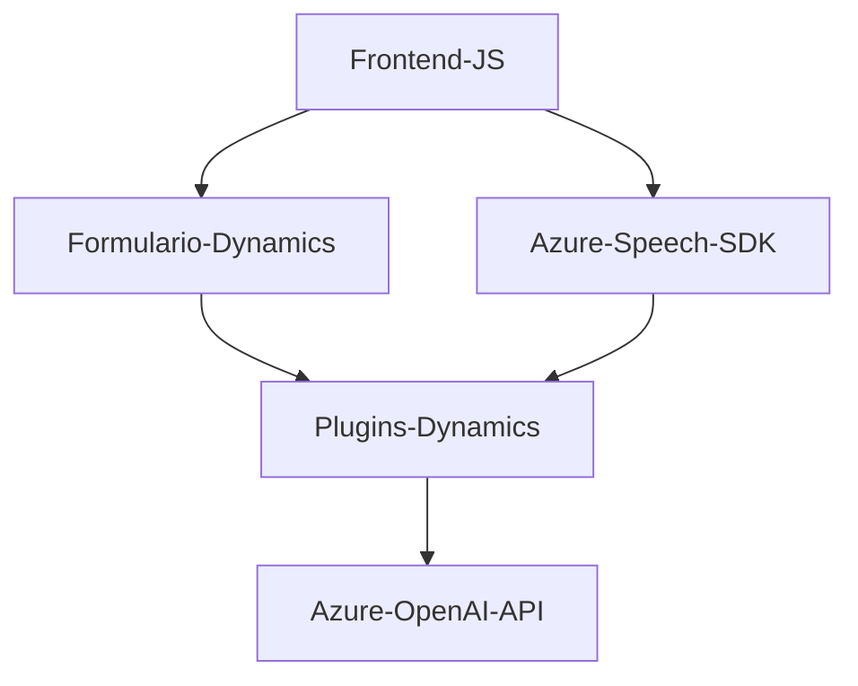

### Breve Resumen Técnico
El repositorio presenta una combinación de componentes sobre **Microsoft Dynamics CRM** que integran servicios de voz, inteligencia artificial y procesamiento de datos utilizando APIs basadas en la nube, como **Azure Speech API** y **Azure OpenAI API**.

### Descripción de Arquitectura
La arquitectura parece ser **n-capas**, con un enfoque híbrido que combina:
1. **Plugins para Dynamics CRM**: Para lógica empresarial y eventos personalizados conectados al CRM.
2. **Frontend Modular en JavaScript**: Manejo de voz, transcripción, interacción con formularios y APIs externas.
3. **Integración de servicios de Azure (IA y voz)** para procesamiento adicional.

Además, aprovecha patrones como:
- **Adaptador**: Transformaciones de datos entre voz-JSON-formulario.
- **Repositorio**: Métodos que interactúan con datos del CRM.
- **Dependencia de servicios externos**: Uso de SDKs para voz (Azure Speech) y procesamiento avanzado de texto (Azure OpenAI).

### Tecnologías Usadas
1. **Frontend JS**:
   - Azure Speech SDK para síntesis y reconocimiento de voz.
   - Interacción con formularios dinámicos en Microsoft Dynamics.
   - Procesamiento de transcripciones asistido por IA.
2. **C# - Back-End Plugins para Dynamics**:
   - Microsoft Dynamics SDK (`IPlugin`).
   - Repositorios JSON (`Newtonsoft.Json`).
   - Peticiones web (`HttpClient`).
3. **Servicios en Azure**:
   - **Azure Speech**: Para voz a texto y síntesis.
   - **Azure OpenAI**: Para estructuración avanzada del texto.
4. **APIs Personalizadas**:
   - Custom APIs desplegadas en Dynamics para procesamiento de transcripciones.

### Dependencias y Componentes Externos
1. **SDK**:
   - Azure Speech SDK para API de voz.
   - Azure OpenAI API para procesamiento de texto asistido por IA.
   - Microsoft.Xrm.Sdk para CRM.
2. **Microsoft Dynamics CRM**:
   - Métodos de gestión de entidades y atributos.
   - Custom APIs en Dynamics para interacción avanzada.
3. **Librerías JSON** (`Newtonsoft.Json`, `System.Text.Json`) para manejo dinámico de datos.
4. **Dependencias del navegador**:
   - Scripts cargados dinámicamente (Azure Speech SDK).

### Diagrama Mermaid

### Conclusión Final
El repositorio describe una solución focalizada en introducir capacidades avanzadas de voz e IA dentro de un entorno **Microsoft Dynamics CRM**. Utiliza servicios integrados con **Azure** para interacción dinámica y procesamiento avanzado, adoptando patrones de arquitectura n-capas con componentes modularizados y microservicios asociados a APIs externas. Es ideal para escenarios empresariales modernos que demandan automatización en la entrada y edición eficaz de datos.