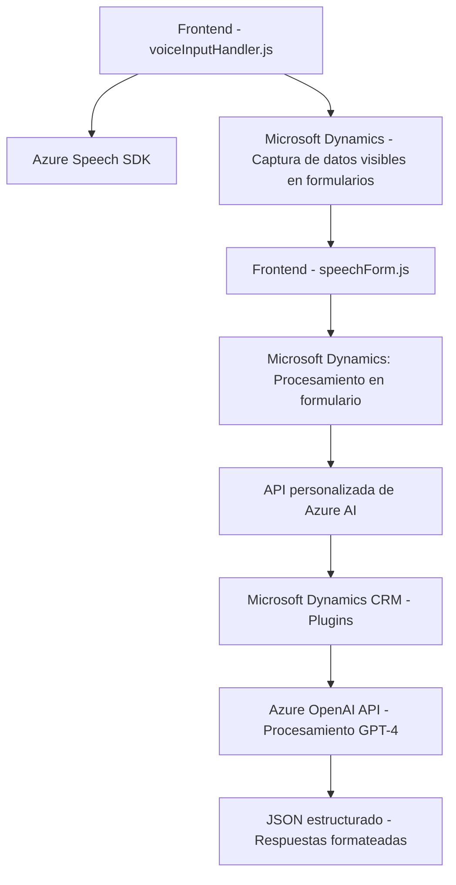

### Breve resumen técnico:
El repositorio representa una solución híbrida orientada a la integración de reconocimiento de voz, procesamiento con inteligencia artificial (mediante Azure OpenAI), y aplicaciones en formularios de Microsoft Dynamics. Combina elementos de frontend con procesamiento en plugins específicos para CRM.

---

### Descripción de arquitectura:
La arquitectura es **n-capas** con características de integración de servicios. Las capas están organizadas en:
1. **Frontend:** Implementa funciones de reconocimiento de voz y síntesis utilizando Azure Speech SDK. Procesa datos en tiempo real para interactuar con formularios de CRM.
2. **Backend - Plugins:** Extiende la funcionalidad de Microsoft Dynamics mediante un plugin basado en eventos, interactuando con Azure OpenAI para procesar texto y proporcionar datos estructurados.
   
Se ve un claro flujo de datos entre la capa de cliente (JavaScript en Dynamics) y la capa backend que conecta a Microsoft Dynamics y Azure.

---

### Tecnologías usadas:
1. **Frontend**:
   - **Azure Speech SDK:** Para reconocimiento de voz y síntesis de texto a voz.
   - **JavaScript:** Utilizando funciones ES6, asincronismo con `async/await`, y métodos modernos de manipulación de DOM.

2. **Backend - Plugin**:
   - **C#**: Para implementar un plugin de Microsoft Dynamics.
   - **Microsoft.Xrm.Sdk:** Manejo de eventos y contexto en Microsoft Dynamics.
   - **Azure OpenAI API:** Consumo de servicios basados en GPT-4.
   - **Newtonsoft.Json:** Procesamiento de estructuras JSON.
   - **HTTP Client (System.Net.Http):** Para la comunicación con Azure OpenAI.

---

### Dependencias externas:
1. **Azure Cognitive Services**:
   - Speech SDK.
   - OpenAI para procesamiento de texto con GPT-4.
   
2. **Microsoft Dynamics API**:
   - Xrm.WebApi.online para interacción con formularios Dynamics y datos online.

3. **Bibliotecas .NET**:
   - Serialización/Deserialización de JSON con Newtonsoft y System.Text.Json.
   - Comunicación HTTP segura.

---

### Diagrama Mermaid:

---

### Conclusión final:
El repositorio implementa una solución híbrida basada en **n-capas**, que combina un frontend dinámico y eventos asincrónicos con un backend extensible en Microsoft Dynamics CRM. Es ideal para escenarios empresariales intensivos en datos donde el reconocimiento por voz y la inteligencia artificial son clave. Sin embargo, podrían optimizarse prácticas como la gestión de claves API y la mejora de tolerancia a fallos en cada capa.