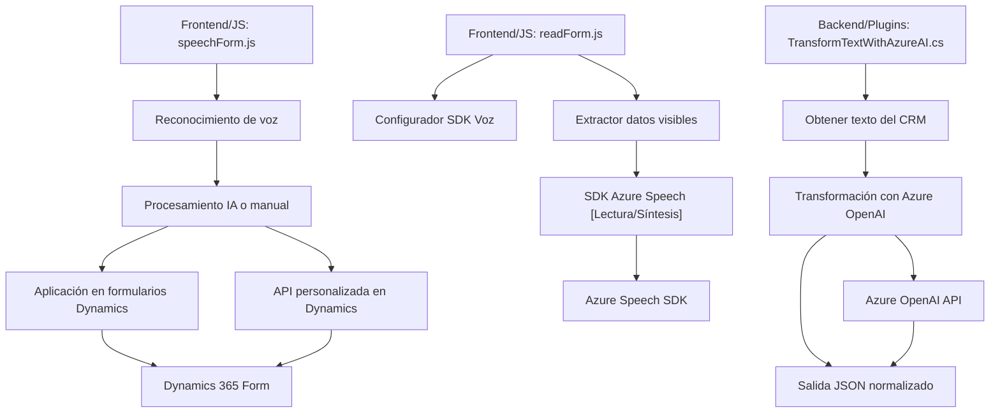

### Resumen técnico
El repositorio presenta una solución que utiliza reconocimiento de voz, procesamiento de texto con IA, y síntesis de audio, integrándose principalmente con Dynamics 365 CRM. La arquitectura es modular y orientada hacia servicios, con dependencias externas como Azure Speech SDK y Azure OpenAI. Integra backend, procesamiento en tiempo real y plugins para enriquecer la experiencia del usuario en un entorno empresarial.

### Descripción de arquitectura
La solución combina múltiples componentes organizados por roles en la arquitectura:
- **Frontend:** Procesamiento de formularios por voz con funciones JavaScript, que interactúan con Dynamics 365 y SDKs externos.
- **Backend:** Plugin en C# para normalizar y transformar textos de entrada utilizando Azure OpenAI.
- **Servicios externos:** Comunicación con Azure Speech SDK para el reconocimiento y síntesis de voz, así como con Azure OpenAI para IA de transformación de texto.

La arquitectura sigue principios de **n capas** y **event-driven programming**, donde diferentes bloques tienen roles bien definidos y delegan operaciones específicas, como carga de SDKs, procesamiento de datos y comunicación con APIs externas.

### Tecnologías usadas
1. **Frontend (JavaScript):**
   - JavaScript ES6+.
   - Azure Speech SDK (importado desde CDN).
   - Dinámica basada en eventos.
   - Uso de tecnologías específicas de Dynamics 365 para interacción con formularios.

2. **Backend (C#):**
   - .NET Framework para soporte de Dynamics CRM SDK.
   - Azure OpenAI para procesamiento de texto.
   - HTTP Client para integraciones RESTful.
   - Serialización/deserialización con Newtonsoft.Json y System.Text.Json.

3. **Servicios externos:**
   - Azure Speech SDK para reconocimiento/síntesis de voz.
   - Azure OpenAI API para transformación de texto.

### Dependencias o componentes externos
1. **Azure Speech SDK:** Procesamiento de voz (reconocimiento y síntesis).
2. **Azure OpenAI API:** Inteligencia artificial para transformación de texto.
3. **Dynamics 365 CRM SDK:** Contexto de formularios y plugins.
4. **Newtonsoft.Json / System.Text.Json:** Manejo de objetos JSON.
5. **HTTP Client:** Comunicación REST con servicios externos.

### Diagrama Mermaid

### Conclusión final
La solución está orientada a mejorar la experiencia de usuarios de Dynamics 365 mediante funciones avanzadas de entrada/salida por voz y procesamiento inteligente de datos. Es una arquitectura definida por responsabilidad en **n capas** con integración de servicios externos. Los patrones destacados incluyen event-driven programming, desacoplamiento modular, y pipelines con IA. Aunque funcional, podría beneficiarse de mejoras en seguridad, como el manejo de claves externas mediante gestores seguros.