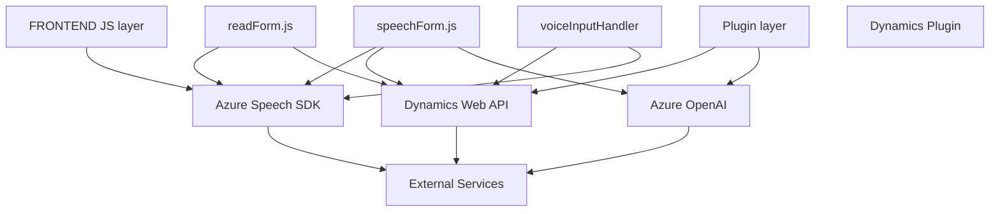

### Breve resumen técnico
El repositorio contiene diferentes archivos organizados por funcionalidades específicas y ha sido diseñado para interactuar con formularios dinámicos (probablemente del entorno Microsoft Dynamics 365), utilizando APIs y servicios relacionados con Azure Speech SDK y Azure OpenAI. Los archivos contienen funciones o clases altamente especializadas en gestionar tanto reconocimiento de voz como entrada y salida relacionadas con formularios.

---

### Descripción de arquitectura
La arquitectura general del repositorio parece seguir un enfoque **modular** con características de capas de servicio. Cada archivo cumple una función única dentro del ecosistema, actuando como capas o controles de presentación, lógica y procesamiento de datos:
1. **FRONTEND/JS**: Implementa el manejo de voz y sintetización en el lado cliente, interactuando directamente con formularios visibles.
2. **Plugins**: Extiende la funcionalidad del sistema mediante integración a nivel backend con servicios de Azure OpenAI, empleando el patrón de **plugin** usado en Dynamics 365.

Si bien tiene elementos que podrían relacionarse con una arquitectura orientada a servicios (SOA), la ausencia de microservicios y el diseño modular con especialización por archivos apunta más a una **arquitectura multicapa híbrida**.

---

### Tecnologías usadas
1. **Azure Speech SDK**: 
   - Manejo de reconocimiento y síntesis de voz.
2. **Microsoft Dynamics 365 API**:
   - Procesamiento de formularios en aplicaciones empresariales.
3. **Azure OpenAI**:
   - Transformación de texto mediante inteligencia artificial.
4. **Librerías Nativas de JavaScript**:
   - Entre ellas, manejo DOM, asincronías, y manipulación de cadenas.
5. **Newtonsoft.Json** y **System.Text.Json**:
   - Ser descripciones de datos JSON en ambos archivos relacionados con el plugin.
6. **System.Net.Http**:
   - Comunicación con APIs externas desde un backend C#.
7. **Microsoft.Xrm.Sdk**:
   - Extensión para que el plugin sea funcional en Dynamics 365.
8. **Promise y Asynchronous Processing**:
   - Utilizado tanto en JS como en C# para la gestión de flujos complejos.

---

### Dependencias o componentes externos presentes
1. **Azure Speech SDK**: Cargado dinámicamente en los scripts de frontend para reconocimiento y síntesis de voz.
2. **Azure OpenAI Service**: Accedido desde el plugin para procesamiento por IA.
3. **Microsoft Dynamics Web API**: Manipula y actualiza los formularios desde los scripts de frontend. También interactúa desde el backend mediante plugins.
4. **Plugins** (Dynamics CRM): Creación de lógica personalizada a través de eventos definidos dentro del sistema.
5. **Librerías estándar del entorno web**: Manejo de datos, objetos, y estructura HTML.
6. **Newtonsoft.Json** para JSON en el backend.

---

### Diagrama Mermaid

---

### Conclusión final
El repositorio se centra en la integración entre Microsoft Dynamics 365 y servicios de Azure para la entrada, procesamiento y respuesta mediante voz y AI. La arquitectura modular combina frontend especializado en procesamiento de voz con plugins que manejan lógica empresarial y procesamiento avanzado de texto desde entornos dinámicos. Las elecciones tecnológicas son coherentes con el enfoque empresarial, priorizando servicios confiables y configuraciones en la nube. El diseño es escalable pero podría beneficiarse de una estructura de microservicios para promover aún mayor desacoplamiento entre los módulos. 💡