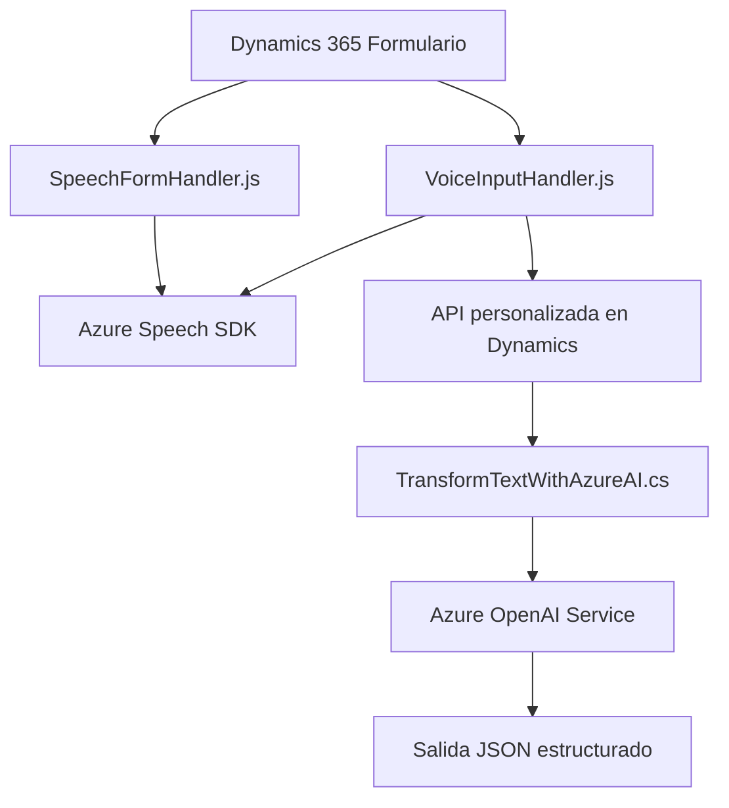

### Breve resumen técnico

El repositorio contiene tres archivos que interactúan con Microsoft Dynamics 365 y Azure Services (Speech SDK y OpenAI) para procesar datos en formularios. Está orientado a facilitar interacción y automatización de procesos mediante voz y transformación de texto.

- **`readForm.js`**: Convierte información visible de un formulario en síntesis de voz.
- **`speechForm.js`**: Permite comandos de voz para interacciones dinámicas con formularios.
- **`TransformTextWithAzureAI.cs`**: Plugin en C# que transforma texto utilizando GPT-3 en Azure OpenAI.

---

### Descripción de arquitectura

La solución utiliza una arquitectura **n-capas** combinada con integración de servicios externos (Azure Speech y OpenAI). Las responsabilidades del diseño están distribuidas así:
1. **Capa de Presentación**: Incluye lógica en archivos JS para captura y síntesis de datos desde formularios.
2. **Capa de Aplicación**: Procesa y organiza datos (como JSON o comandos transcritos) antes de enviarlos a las capas subsiguientes o APIs externas.
3. **Capa de Negocio**: Plugin de Dynamics CRM (archivo `.cs`) interactúa con Azure OpenAI para la transformación de datos clave.
4. **Servicios Externos**: Azure Speech SDK y Azure OpenAI actúan como componentes externos para tareas específicas de síntesis y generación de texto.

---

### Tecnologías usadas

1. **Lenguajes**:
   - JavaScript y su adaptación para web (Frontend/Formularios Dynamics).
   - C# para desarrollo del plugin en Dynamics CRM.

2. **Frameworks y herramientas**:
   - **Dynamics 365 SDK**: API para interacción con formularios/entidades del CRM.
   - **Azure Speech SDK**: Para reconocimiento de voz y síntesis.
   - **Azure OpenAI API**: Para transformación de texto.
   - **Newtonsoft.Json.Linq** y **System.Text.Json**: Para manejar JSON en C#.

3. **Patrones**:
   - **Plugin Pattern**: Implementación del sistema de extensiones en Dynamics CRM.
   - **Event-driven**: Se basa en eventos de carga, transcripción y ejecución en JS.
   - **Service-oriented**: Procesamiento delegado a servicios externos (Azure SDKs).
   - **Pipeline**: Flujo de procesado entre capas, pasando desde input hasta JSON estructurado.

---

### Diagrama Mermaid válido para GitHub

---

### Conclusión final

Esta solución combina tecnologías modernas para automatizar y enriquecer la interacción con formularios en Microsoft Dynamics 365. Utiliza capacidades de inteligencia artificial (Azure OpenAI) y procesamiento de voz (Azure Speech SDK) para mejorar accesibilidad y eficiencia de los usuarios.

#### Fortalezas:
- Arquitectura desacoplada cuyos componentes interactúan mediante servicios externos. 
- Enfoque modular que facilita la responsabilidad clara (síntesis de voz, IA transcriptor, transformación de texto).

#### Áreas de mejora:
- La dependencia de servicios externos podría ser un riesgo en ambientes donde las configuraciones de red sean restrictivas.
- Una arquitectura más avanzada (como hexagonal) podría reducir la dependencia directa entre capas y servicios, mejorando testabilidad y mantenimiento.

Por tanto, esta solución se sitúa como un **componente complementario SOA** orientado a mejorar sistemas CRM dinámicos mediante IA y tecnologías de reconocimiento/síntesis natural.