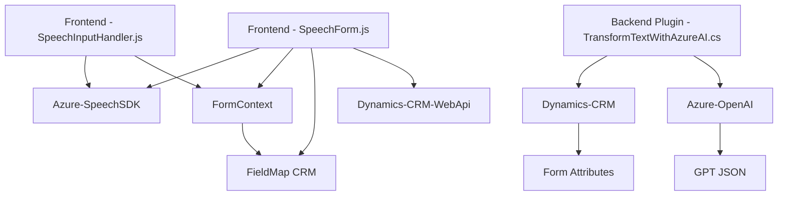

## Breve resumen técnico
El repositorio parece ser parte de una solución que integra capacidad de síntesis y reconocimiento de voz (utilizando Microsoft Azure Speech SDK) con procesamiento de texto por IA (Azure OpenAI Service) y su vinculación con formularios y CRM Dynamics. La solución utiliza archivos JavaScript para frontend funcionalidad interactiva y un plugin en C# para ejecutar llamadas avanzadas a la API de OpenAI en el backend.

---

## Descripción de la arquitectura
La arquitectura combina dos conceptos principales:
1. **N capas**: División entre frontend (JavaScript) y backend (Plugins para Dynamics CRM en C#). El frontend realiza la interacción con el usuario y la entrada por voz, mientras que el backend realiza procesamiento de texto avanzado con Azure OpenAI.
   
2. **Cliente-Servidor con integración de servicios externos**: Conexión con dos servicios importantes:
   - Microsoft Azure Speech SDK: para síntesis y reconocimiento de voz.
   - Azure OpenAI Service: para procesamiento y transformación avanzada del texto.

Adicionalmente, los plugins en C# implementan la arquitectura basada en eventos definidos por Dynamics CRM (con extensiones de comportamiento mediante `IPlugin`). La modularización se alcanza con funciones bien definidas en archivos JavaScript y métodos en el plugin de C#.

---

## Tecnologías utilizadas
1. **Frontend**:
   - **Language**: JavaScript.
   - **API Integrations**:
     - Microsoft Azure Speech SDK (cargado dinámicamente desde un CDN).
     - Microsoft Dynamics CRM SDK (para modificación de formularios).

2. **Backend**:
   - **Language**: C#.
   - **Frameworks/Tools**:
     - ASP.NET (Dynamics CRM plugin).
     - Microsoft.Xrm.Sdk (Dynamics CRM extensions).
     - Newtonsoft.Json.Linq (JSON manipulation).
     - System.Text.Json (Serialization/Deserialization).
     - System.Net.Http (API requests to Azure OpenAI Service).
   - **External Service**:
     - Azure OpenAI Service for AI-powered text transformations.

3. **Architecture patterns**:
   - **N-layer architecture**: Separation of concerns between frontend (user interaction) and backend (business logic and CRM integration).
   - **Event-Driven Programming**: Plugins are triggered by CRM events.
   - **Client-Server architecture**: Requires communication with cloud-based APIs (Azure).

---

## Dependencias o componentes externos
1. **Microsoft Azure Speech SDK**: Provides speech recognition and synthesis features.
2. **Microsoft Azure OpenAI Service**: Provides advanced natural language processing using GPT models.
3. **REST APIs & HTTP Clients**:
   - Used in the backend to communicate with Azure OpenAI Service.
4. **CRM Extensions**:
   - Internal dependencies like `IPluginExecutionContext`, `IOrganizationServiceFactory`, and `IOrganizationService`.
5. **Microsoft Dynamics CRM SDK and WebApi**: Used for manipulating and updating CRM forms from both frontend and backend.

---

## Diagrama Mermaid

---

## Conclusión final
Esta solución representa una aplicación con arquitectura **N capas** que integra servicios de nube avanzados (Microsoft Azure Speech SDK y Azure OpenAI) para la automatización y mejora de la entrada y conversión de datos en formularios vinculados a Microsoft Dynamics CRM. La solución utiliza tecnologías modernas como JavaScript para la capa de interacción del usuario (frontend) y C# para extender la funcionalidad del CRM en el backend, en combinación con servicios basados en IA y API externas.

Aunque funcional, el sistema puede beneficiarse de una mayor separación de responsabilidades mediante diseño orientado a objetos, facilitando la escalabilidad, prueba y mantenimiento. Además, incluir documentación sobre los endpoints e integraciones específicas mejoraría la claridad en cuanto al flujo de datos entre las capas y servicios externos.