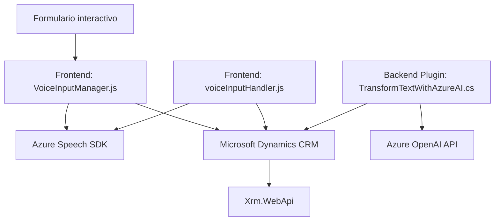

### Breve resumen técnico

La estructura del repositorio sugiere que el proyecto está dividido en dos componentes principales: un **frontend** desarrollado en **JavaScript** que permite la interacción con formularios y síntesis/reconocimiento de voz mediante el **Azure Speech SDK**, y un **backend plugin** desarrollado en **C#** para Dynamics CRM, integrado con **Azure OpenAI API** para procesar texto de manera avanzada. Ambos componentes están interconectados a un sistema backend como **Microsoft Dynamics 365**, lo que apunta hacia una solución de automatización y accesibilidad en gestión empresarial.

---

### Descripción de arquitectura

La solución presentada usa una **arquitectura modular** dividida entre el **frontend web** y los **plugins para el backend de Dynamics CRM**, ambos interactuando con servicios externos como Azure Speech SDK y Azure OpenAI. La estructura general apunta a un modelo híbrido:

1. **Frontend:**
   - Proporciona una interfaz para que los usuarios interactúen con formularios a través de entrada por voz (Voice Input Manager) y salida sintetizada (Voice Output Handler).
   - Usa **Event-driven design** en conjunto con **Dependency Injection** para interactuar con el contexto de los formularios y external services.
   - Implementa lógica asincrónica (`async/await` y callbacks).

2. **Backend Plugin:**
   - Extiende Dynamics CRM usando el patrón **Plugin-based architecture**.
   - Usa **REST APIs** para interactuar con servicios en la nube como Azure OpenAI API.
   - Adopta conceptos como **DTO (Data Transfer Object)** y encapsulación para enviar y recibir datos estructurados en JSON.

La combinación del frontend y el plugin apunta a un **modelo de arquitectura n-capas**, integrando la capa de presentación, lógica de negocio y acceso a datos mediante servicios externos (Azure Speech SDK y OpenAI).

---

### Tecnologías usadas

1. **Frontend:**
   - **JavaScript**
   - **HTML/CSS** (implícito para la interfaz basada en formularios)
   - **Azure Speech SDK** (para síntesis y reconocimiento de voz)
   - **Dynamics 365 context APIs** (`Xrm.WebApi`)
   
2. **Backend plugin:**
   - **Microsoft Dynamics SDK** (`IPlugin`, `IServiceProvider`)
   - **Azure OpenAI** (GPT API para la transformación del texto)
   - **Newtonsoft.Json.Linq** (manejo JSON)
   - **System.Net.Http** (HTTP requests)

3. **Servicios externos:**
   - **Azure Speech SDK** (interacción en frontend)
   - **Azure OpenAI API** (para procesamiento de texto en el backend)

---

### Diagrama Mermaid válido para GitHub

---

### Conclusión Final

La solución en el repositorio tiene dos propósitos principales:
1. **Accesibilidad**: Implementación de interacciones de entrada y salida de voz (con Azure Speech SDK) en un sistema de gestión basado en formularios contextuales.
2. **Procesamiento automático de datos con IA**: Transformar textos en JSON estructurado aplicando reglas mediante Azure OpenAI API en el plugin de Dynamics 365.

La arquitectura modulada y la integración explícita de APIs externas resalta el enfoque hacia mejorar la experiencia del usuario, permitiendo una interacción fluida entre el sistema CRM y las tecnologías modernas de IA y voz. Además, el diagrama ayuda a visualizar claramente los componentes clave y su interacción.