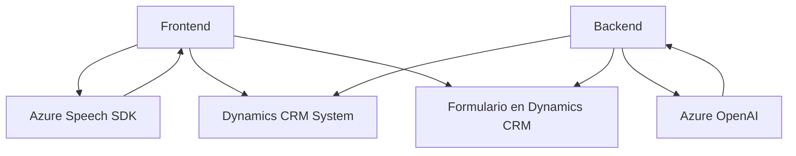

### Breve resumen técnico
El repositorio está diseñado para construir una solución integrada que utiliza reconocimiento y síntesis de voz, procesamiento con inteligencia artificial (IA), y manipulación de formularios en entorno de Dynamics CRM. Incluye dos principales módulos de frontend escritos en JavaScript y un plugin de backend desarrollado en C#, con integración a servicios de Azure como Speech SDK y OpenAI.

---

### Descripción de arquitectura
La solución tiene una arquitectura híbrida, combinando un modelo tradicional de n capas (frontend-backend) debido a su división entre los módulos de cliente y servidor, y una orientación hacia la arquitectura basada en microservicios en cuanto al uso de servicios externos como el Azure Speech SDK y OpenAI.

Hay una fuerte dependencia del entorno de Dynamics CRM, con algunos componentes independientes suficientes para interactuar con Azure sin requerir Dynamics.

---

### Tecnologías usadas
1. **Frontend**:
   - **Lenguaje**: JavaScript (ES6+).
   - **Frameworks/Librerías**:
     - Azure Speech SDK.
   - **Patrones utilizados**:
     - Modularidad para encapsular funcionalidades.
     - Observador mediante callbacks.
     - Programación asincrónica (`async/await`).
     - Patrón delegado para tareas externas mediante el SDK de Azure.

2. **Backend**:
   - **Lenguaje**: C#.
   - **Frameworks/Librerías**:
     - Microsoft Dynamics CRM SDK (IPlugin).
     - Azure OpenAI Integration via HTTP requests.
     - `System.Text.Json` y `Newtonsoft.Json` para manejo de JSON.
   - **Patrones utilizados**:
     - Plugin architecture de Dynamics CRM.
     - API Gateway para conectar con servicios externos (Azure OpenAI).

3. **Dependencias externas**:
   - Azure Speech SDK.
   - Azure OpenAI (GPT-like services).
   - Microsoft Dynamics CRM SDK.

---

### Diagrama Mermaid válido para GitHub

---

### Conclusión final
Esta solución representa un sistema extensible y modular que dependiendo de su necesidad puede estar en el límite entre una arquitectura n capas y un diseño más orientado a microservicios debido al fuerte uso de servicios externos como Azure Speech SDK y Azure OpenAI. Los patrones de diseño observados en el código, como la segregación de responsabilidades y la orientación a SDKs, alinean el sistema con buenas prácticas de desarrollo.

Además, está fuertemente acoplado con Dynamics CRM, lo cual es ideal para entornos empresariales donde se requiera manejo avanzado de formularios y automatización mediante voz e inteligencia artificial. Sin embargo, podrían introducirse mejoras relacionadas con la seguridad (gestión de claves) y optimización en el manejo de dependencias JSON en el backend.