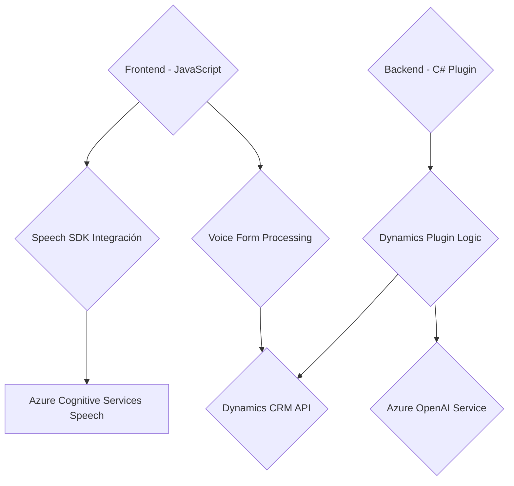

### Breve Resumen Técnico

El repositorio contiene tres archivos que implementan funcionalidades para mejorar la accesibilidad y automatización en una solución basada en Dynamics 365 CRM. Estas funcionalidades están divididas en:

1. **Frontend (JavaScript)**: Integración con Azure Speech SDK para reconocimiento y síntesis de voz. Esto permite que los usuarios interactúen con formularios mediante entrada y salida de voz, mejorar la accesibilidad y transformar comandos hablados en valores aplicables a formularios.
2. **Backend (C# Plugin)**: Extiende Dynamics CRM mediante el procesamiento del texto y la generación de JSON estructurado utilizando Azure OpenAI Service.

Los archivos muestran una microarquitectura conectada con servicios externos (Azure Cognitive Services).

---

### Descripción de Arquitectura

La arquitectura mezcla **modularidad** en el frontend y **plugin architecture** en el backend. Las capas están separadas por funciones claras: 

1. **Frontend:** Compuesto por módulos JavaScript que procesan voz y texto. Utiliza el patrón de integración con SDKs externos y un patrón **Data Mapper** para traducir campos de voz en claves y valores del formulario.
   
2. **Backend:** Funciona como un plugin de Dynamics 365 CRM, siguiendo el patrón *Service Integration*, llamando al servicio Azure OpenAI para procesar datos. Es una arquitectura **n capas** (interfaz-IPlugin, lógica de negocio, interacción con API externas).

La solución demuestra un buen manejo de responsabilidades separadas y es claramente orientada a trabajar en modelos distribuidos.

---

### Tecnologías, Frameworks y Patrones Usados

- **Frontend:**
  - Framework: JavaScript estándar.
  - Integración con un SDK externo: **Azure Speech SDK**.
  - APIs de Dynamics CRM: `Xrm.WebApi`.
  - Patrones aplicados: Modularidad, Data Mapper para formularios, Lazy Loading para SDK dinámico, y llamadas a APIs externas.

- **Backend:**
  - Lenguaje: C#.
  - Frameworks: `Microsoft.Xrm.Sdk`, `Newtonsoft.Json.Linq`, `System.Net.Http`.
  - Servicios externos: **Azure OpenAI Service** para procesamiento natural de lenguaje (NLP).
  - Patrones aplicados: Plugin Architecture (Dynamics CRM), Service Integration, Delegation.

---

### Dependencias o Componentes Externos

1. **Azure Cognitive Services Speech SDK**:
   - Para síntesis de voz y reconocimiento de comandos hablados.
   - Cargado dinámicamente, con dependencias en `SpeechConfig`, `AudioConfig`, `SpeechRecognizer`.

2. **Azure OpenAI Service**:
   - Para transformar texto en JSON basado en reglas proporcionadas por el usuario.
   - Utiliza modelos avanzados de NLP como GPT para procesamiento de texto.

3. **Dynamics CRM API**:
   - `Xrm.WebApi`: Para manipulación de registros dentro de formularios y entidades.

4. **Backend Frameworks**:
   - **Newtonsoft.Json.Linq**: Operaciones con objetos JSON en C#.
   - **System.Net.Http**: Creación y envío de solicitudes HTTP al servicio de OpenAI.

---

### Diagrama Mermaid válido para **GitHub Markdown**

---

### Conclusión Final

El repositorio presenta una solución híbrida con componentes integrados en frontend y backend para mejorar las funcionalidades de Dynamics CRM. Utiliza una arquitectura distribuida con un enfoque modular en el frontend y una plugin-based architecture en el backend. Las dependencias con Azure Cognitive Services y Azure OpenAI destacan un claro uso de **microservicios conectados a APIs externas**, lo que aporta escalabilidad y manejabilidad.

La integración eficiente entre sistemas garantiza accesibilidad y automatización avanzadas, alineadas con las necesidades modernas de interacción hombre-máquina.