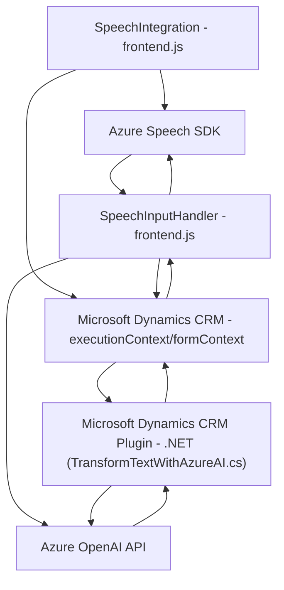

### Breve resumen técnico
Este repositorio representa una solución orientada en gran medida a la integración y el procesamiento de datos de formularios mediante servicios en la nube y una funcionalidad de entrada y síntesis de voz. Se divide principalmente en archivos JavaScript para la parte del frontend, que manejan la interacción con un sistema CRM, y un archivo .NET que funciona como un plugin para Microsoft Dynamics CRM.

---

### Descripción de arquitectura
**Tipo de solución:**  
Se trata de una integración de tres componentes principales:  
1. **Frontend (JavaScript):** funciones que procesan formularios CRM y permiten la interacción mediante síntesis y reconocimiento de voz, utilizando el servicio de Azure Speech SDK.  
2. **Backend (Plugin C#):** lógica de negocio en forma de un plugin que extiende la funcionalidad de Microsoft Dynamics CRM.
3. **Servicios externos:** integración con Azure Speech SDK y Azure OpenAI API, utilizados para sintetizar voz y realizar transformaciones avanzadas en el contenido textual.

**Arquitectura:**  
La solución está diseñada con un enfoque de **inversión de dependencias** con elementos de **arquitectura hexagonal**.  
- El núcleo funcional está dividido entre el procesamiento local (lógica CRM) y la interacción con servicios externos (Azure Speech SDK y OpenAI).  
- Azure Speech y Azure OpenAI actúan como componentes externos que implementan funcionalidad específica, siguiendo el patrón de **external service dependency injection**, permitiendo mantener una separación clara entre el núcleo de negocio y las operaciones externas.  
- Las funciones de frontend adoptan modularización y separación de responsabilidades siguiendo los principios de **Single Responsibility** y **Separation of Concerns**.

En cuanto a la funcionalidad de los plugins .NET para Microsoft Dynamics CRM, implementa claramente el patrón de plugins, siguiendo el modelo descrito por Microsoft para extender la funcionalidad CRM con lógica de negocio y las integraciones necesarias.

---

### Tecnologías utilizadas
- **Frontend:**  
  - **Lenguaje:** JavaScript.  
  - **Servicios:** Azure Speech SDK (manejo de entrada/síntesis de voz).  
  - **Frameworks y APIs del CRM:** Integración con objetos `executionContext` y `formContext` del sistema CRM de Microsoft Dynamics.  
  - **Patrones utilizados:** Modularidad, Service-like structure.

- **Backend:**  
  - **Lenguaje:** C# (.NET Framework).  
  - **Librerías/Core:** `Microsoft.Xrm.Sdk`, `Newtonsoft.Json`, `System.Net.Http`.  
  - **Servicios:** Azure OpenAI API (procesamiento y transformación avanzada de texto).  
  - **Patrones utilizados:** Plugin Architecture, integración con APIs externas.

---

### Dependencias o componentes externos
1. **Azure Speech SDK:** utilizado para reconocimiento y síntesis de voz, cargado dinámicamente en el frontend.  
2. **Azure OpenAI API:** utilizado por el plugin C# para transformar y procesar texto según normas predefinidas.  
3. **Microsoft Dynamics CRM APIs:** manipulación de formularios y datos contextuales (`executionContext`, `formContext`).  
4. **Newtonsoft.Json:** procesamiento de JSON estructurado.  
5. **Xrm.WebApi.online:** utilizado para interactuar con entidades de CRM.  
6. **JavaScript APIs** estándar para manejos de texto, fechas y promesas.

---

### Diagrama Mermaid

---

### Conclusión final
La solución está diseñada para integrar el reconocimiento de voz, la síntesis, y el procesamiento avanzado de texto dentro del ecosistema de Microsoft Dynamics CRM. Utiliza servicios externos como Azure Speech SDK y Azure OpenAI para delegar la lógica avanzada mientras mantiene una separación clara entre las capas de presentación, lógica de negocio y servicios externos. La implementación, especialmente en el backend, se ha realizado siguiendo estándares de arquitectura para garantizar escalabilidad y facilidad de mantenimiento.  

El diagrama Mermaid refleja de manera clara la interacción entre los bloques principales de la solución y su relación con los componentes externos.