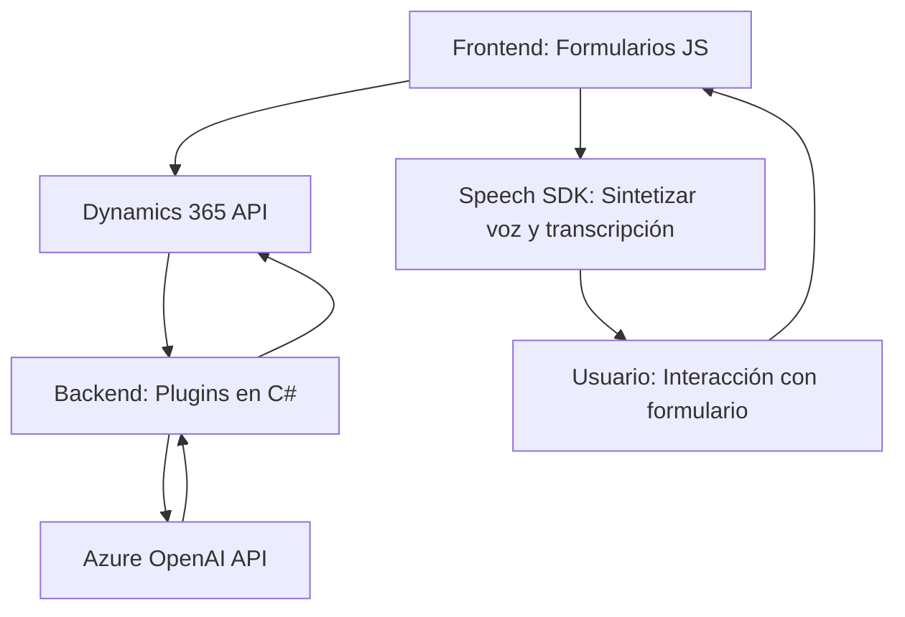

### Breve Resumen Técnico
Este repositorio está orientado a la implementación de funcionalidades relacionadas con la interacción entre Microsoft Dynamics 365 y servicios de Azure (Speech SDK, OpenAI). Contiene tanto componentes frontend (procesamiento de formularios y síntesis/transcripción de voz) como plugins backend que transforman texto utilizando Microsoft OpenAI en Azure.

---

### Descripción de la Arquitectura
La solución tiene múltiples niveles funcionales que se alinean con una arquitectura **"N capas"**. Estas capas cooperan de la siguiente manera:
1. **Frontend (JavaScript):** Procesa datos de formularios en Dynamics 365 y extiende funcionalidades como voz a texto o texto a voz.
2. **Backend (Plugins en C#):** Actúa como un puente de integración entre Dynamics 365 y servicios avanzados de inteligencia artificial (Azure OpenAI API).
3. **Servicios Externos:** La lógica conecta componentes locales con servicios externos de Microsoft Azure.

La arquitectura presenta características típicas de un **monolito distribuido**, pero con integración de APIs externas para ampliar funcionalidades.

---

### Tecnologías Usadas
1. **Frontend (JS):**
   - **Azure Speech SDK:** Sintetización y transcripción de voz.
   - **JavaScript:** Procesamiento de formularios y manipulación asíncrona (promesas).
   - **Dynamics 365 APIs:** Actualización y búsqueda de campos en formularios.
2. **Backend (.NET/C#):**
   - **Microsoft Dynamics CRM SDK:** Plugins basados en la interfaz `IPlugin`.
   - **Azure OpenAI API:** Realiza transformaciones avanzadas de texto.
   - **Librerías de .NET:** Para manejo de solicitudes HTTP, procesamiento JSON (Newtonsoft y System.Text.Json).
3. **Patrones aplicados:**
   - **Facade Pattern:** Simplifica la complejidad de integración entre servicios externos y la plataforma Dynamics.
   - **Delegación Dinámica:** Carga de dependencias (Speech SDK) en tiempo de ejecución.
   - **Procesamiento Basado en Eventos:** Funciones que reaccionan a interacciones del usuario en tiempo real.

---

### Dependencias y Componentes Externos
1. **Azure Speech SDK:** Usado en el frontend para sintetización y reconocimiento de voz.
2. **Azure OpenAI API:** Llamadas en el backend para realizar transformaciones avanzadas de texto.
3. **Microsoft Dynamics SDK:** Para la extensión de funcionalidades del CRM.
4. **HTTP Client Libraries:** Para realizar llamadas REST.

---

### Diagrama Mermaid

 

---

### Conclusión Final
Esta solución representa un ecosistema que extiende las capacidades de Microsoft Dynamics 365 mediante servicios de Azure. Utiliza patrones conocidos en la modularización y delegación para garantizar una integración eficiente con servicios externos. Si bien tiene apariencia de un monolito distribuido, la separación lógica entre frontend y API externas permite robustez en futuras escalas. El diseño actual facilita la evolución hacia una arquitectura más moderna como microservicios, si así se requiere en el futuro.