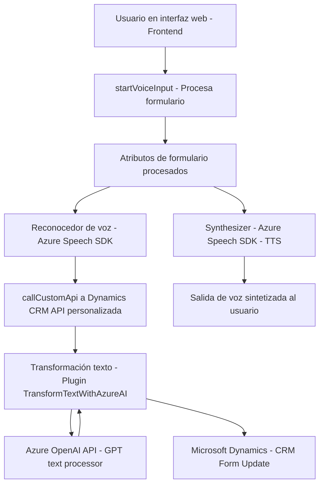

### **Breve resumen técnico**
El repositorio expuesto describe un sistema que parece ser un **frontend** acoplado a un **backend CRM**, probablemente en un entorno como Microsoft Dynamics CRM. Tiene una fuerte integración con servicios externos proporcionados por Microsoft Azure, específicamente el **Speech SDK** y **OpenAI** para síntesis de voz y procesamiento de texto con IA.

---

### **Descripción de la arquitectura**
La solución tiene una arquitectura mixta que combina elementos de **n capas** y de **service-oriented architecture (SOA)**. La capa de presentación está representada por los archivos de JavaScript en el frontend, mientras que el backend maneja la lógica empresarial mediante plugins personalizados en Dynamics CRM. 

El sistema también utiliza servicios externos (Azure Speech SDK y OpenAI) para voz y procesamiento de texto integrado, incorporando una **event-driven architecture** en el frontend y conectándose a **APIs externas** desde el backend.

---

### **Tecnologías usadas**
1. **Frontend (JavaScript):**
   - Azure Speech SDK para reconocimiento de voz y síntesis de texto a voz.
   - Event-driven programming (por las funciones desencadenadas mediante eventos del contexto de formulario).
   - Manejo dinámico de datos formularios en un sistema CRM.

2. **Backend (.NET):**
   - Microsoft Dynamics CRM SDK (via `IPlugin` y otros namespaces relacionados).
   - Azure OpenAI Para procesamiento de texto mediante el modelo GPT-4o.
   - Dependencias como:
     - `Newtonsoft.Json.Linq` para manipulación de JSON.
     - `System.Net.Http` para comunicación HTTP.
     - `System.Text.Json` para serialización JSON.

---

### **Componentes externos y dependencias**
1. **Azure Speech SDK**: Utilizado tanto en el frontend para reconocimiento de voz y síntesis de texto a voz.
2. **Azure OpenAI API**: Usada en el backend para realizar transformaciones de texto basadas en reglas personalizadas con modelos GPT.
3. **Microsoft Dynamics CRM**: Framework sobre el cual gira la funcionalidad del sistema.
4. **Custom APIs de Dynamics CRM**: Para procesar transcripciones y ejecutar lógica avanzada vía IA.

---

### **Diagrama Mermaid**

---

### **Conclusión final**
Este repositorio implementa una solución destinada a un **entorno CRM**, donde se requiere interacción entre un usuario, un formulario web, y servicios basados en inteligencia artificial. Desde la lectura del formulario en el frontend con **JavaScript**, pasando por la integración con el **Azure Speech SDK**, hasta una lógica más compleja de procesamiento en un **plugin de Dynamics CRM**, la solución demuestra un diseño modular y un enfoque de arquitectura orientada a servicios (SOA). Los patrones empleados, como el estándar de plugin en Dynamics y las API externas, garantizan escalabilidad y flexibilidad en el procesamiento de datos para la automatización avanzada basada en voz e inteligencia artificial.