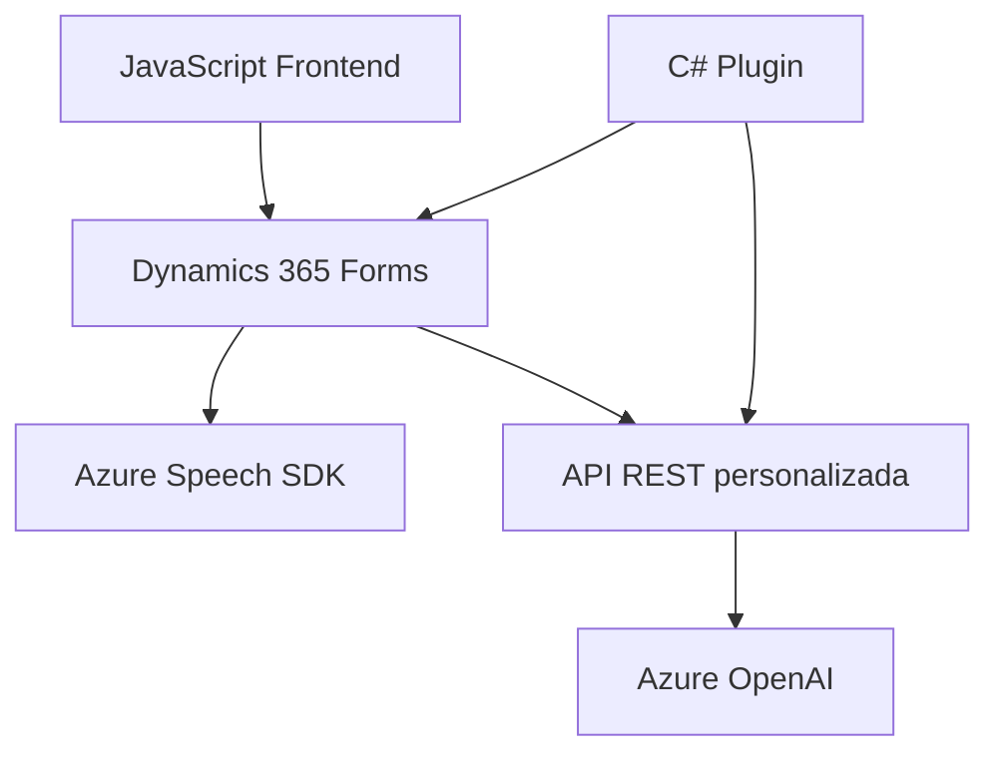

### Resumen técnico

Este repositorio combina diferentes componentes para proporcionar funcionalidades avanzadas en un entorno empresarial basado en Microsoft Dynamics 365. Los archivos de **JavaScript** interactúan con Dynamics 365 para procesar datos mediante voz y texto, mientras que el archivo **C#** define un plugin que utiliza tecnología de Azure OpenAI para realizar transformaciones avanzadas de datos de texto.

---

### Descripción de arquitectura

La arquitectura del sistema sigue un modelo **modular** con separación de responsabilidades:
1. **Frontend**: Scripts escritos en **JavaScript** que interactúan directamente con los formularios de Dynamics 365, manejan input de voz y recuperan datos del DOM.
2. **Backend Plugin**: Código en **C#** que actúa como un servicio personalizado para transformar texto usando una conexión con el servicio Azure OpenAI.
3. **Integración con Azure**: El sistema se integra con servicios externos utilizando SDKs (Azure Speech y Azure OpenAI).

El patrón predominante es de **n capas**, donde tienes:
- **Capa de presentación**: Scripts de JavaScript que interactúan con los datos del formulario.
- **Capa lógica empresarial**: Plugin en C# que interactúa con Dynamics 365.
- **Capa de servicios externos**: Conexión con servicios de Azure para reconocimiento de voz y procesamiento avanzado de IA.

También se observan patrones como **modularización funcional** y **integración asincrónica** en los scripts de JavaScript.

---

### Tecnologías usadas

#### Lenguajes:
- **JavaScript** para el frontend interactivo.
- **C#** para plugins empresariales de Dynamics CRM.

#### Servicios y SDKs:
- **Azure Speech SDK**: Utilizado para la síntesis de texto a voz y reconocimiento de voz.
- **Azure OpenAI**: Proporciona transformaciones avanzadas de texto usando modelos preentrenados como GPT.
- **Dynamics 365 SDK**: Para manipular formularios, atributos y datos en CRM.

#### Frameworks y librerías:
- **Newtonsoft.Json**: Manejo de estructuras JSON en C#.
- **System.Net.Http**: Conexión con APIs REST externas en el plugin C#.

#### Métodos de integración:
- API REST (Azure OpenAI).
- SDK dinámicos cargados en cliente (Azure Speech SDK).

---

### Diagrama **Mermaid**
El siguiente diagrama describe los componentes principales y cómo interactúan entre sí:

—

### Conclusión final

Este repositorio implementa una solución integrada que utiliza tecnologías modernas como Azure Speech SDK y Azure OpenAI para proporcionar funcionalidades robustas en formularios de Dynamics 365. La arquitectura modular y la comunicación asincrónica garantizan escalabilidad y facilidad para modificar o ampliar.

Aunque la integración y el diseño son sólidos, sería conveniente mejorar la separación entre la lógica empresarial (plugins de C#) y la capa de interacción directa con el cliente (frontend en JavaScript). Esto podría lograrse mediante el uso de una arquitectura más avanzada como **hexagonal** o modelos de implementación con microservicios para una escalabilidad aún mayor.