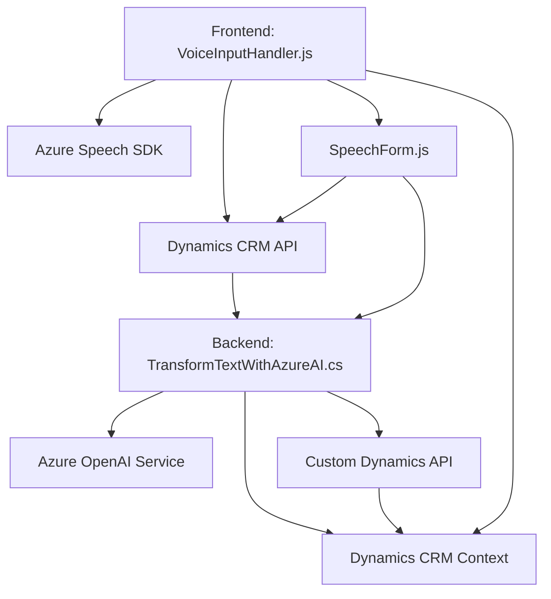

### Breve resumen técnico
El repositorio describe una solución completa integrada principalmente con Microsoft Dynamics CRM, Azure Speech SDK y Azure OpenAI para implementar accesibilidad y procesamiento automatizado de formularios utilizando textos y comandos de voz. La solución combina una interfaz frontend (JavaScript) para interacción con formularios de CRM y procesamiento de voz, junto con un backend basado en un plugin que utiliza un microservicio proporcionado por Azure OpenAI para enriquecer la funcionalidad de reconocimiento y procesamiento de textos hablados.

---

### Descripción de arquitectura
La solución consta de dos componentes primarios:
1. **Frontend (JavaScript)**: Usado para interactuar con el usuario, capturar y hablar los datos de los formularios de Dynamics CRM, cargando el SDK de Azure Speech dinámicamente para operaciones de síntesis y reconocimiento.
2. **Backend (Plugin en C#)**: Implementación como un plugin para la plataforma Dynamics CRM que interactúa con el servicio externo de Azure OpenAI para transformar texto dado en JSON estructurado, siguiendo un paradigma de microservicios.

La arquitectura general tiene un enfoque tipo **microservicio híbrido**, con:
- Integración de servicios externos (Azure Speech, Azure OpenAI).
- Conexión directa entre el frontend y el CRM utilizando Dynamics APIs.
- Separación clara de responsabilidad entre la interfaz de usuario y el procesamiento backend, lo que permite escalabilidad y flexibilidad para futuras actualizaciones.

--- 

### Tecnologías usadas
1. **Frontend**:
   - Linguaje principal: JavaScript.
   - SDK de **Azure Speech** (cargado dinámicamente desde la URL oficial).
   - Platforma CRM: API de Dynamics CRM (`formContext`, `Xrm.WebApi`, etc.).

2. **Backend**:
   - Lenguaje principal: C#.
   - Framework: Dynamics CRM SDK (para plugins).
   - Bibliotecas adicionales: `.NET (System.Net.Http, Newtonsoft.Json.Linq)`.
   - Servicio externo: **Azure OpenAI** (modelo de lenguaje GPT-4) conectado por HTTP requests.

3. **Patrones arquitectónicos**:
   - **Modularización**: Separación clara de funciones individuales y roles de archivos entre frontend y backend.
   - **Integración de microservicios**: Uso de Azure OpenAI como servicio externo para procesamiento intensivo.
   - **Eventos y asincronía**: Uso extensivo de promesas y callbacks en el frontend.

---

### Diagrama Mermaid válido para GitHub

---

### Conclusión Final
Este repositorio implementa una solución moderna y extensible, orientada a mejorar la interacción entre usuarios y la plataforma Dynamics CRM, a través de una interfaz que soporta entrada y salida de voz, y un backend capaz de estructurar datos texto utilizando inteligencia artificial. La arquitectura mixta, basada en servicios de nube como Azure Speech y OpenAI, ofrece escalabilidad y modularidad para futuras iteraciones y mejoras funcionales.