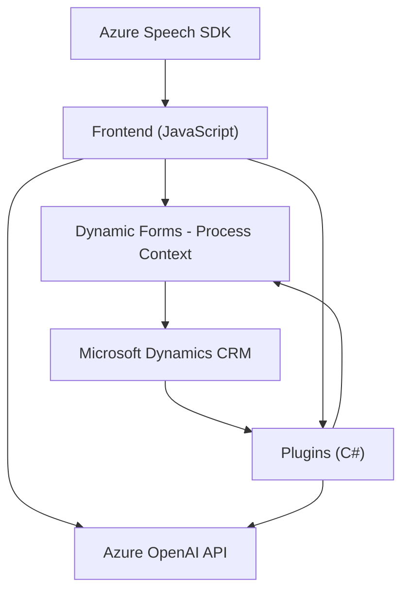

### Resumen técnico

Este repositorio contiene archivos de tres áreas funcionales principales que interactúan para proporcionar una solución basada en inteligencia artificial y servicios de integración. Las funcionalidades se centran en el reconocimiento y síntesis de voz (front-end), la interacción con un sistema CRM de Dynamics 365 (back-end), y la transformación de texto mediante el servicio Azure OpenAI, usando plugins personalizados. Este enfoque combina elementos de procesamiento de voz, integración con APIs externas y manipulación de datos dinámicos del CRM.

---

### Descripción de arquitectura

La solución consta de tres componentes principales:
1. **Frontend interactivo:** Archivos JavaScript en el directorio `FRONTEND/JS` encapsulan la lógica de entrada y salida de voz mediante Azure Speech SDK. Aquí se manejan capacidades de síntesis de voz y reconocimiento, integrando datos dinámicos obtenidos de los formularios del CRM.
2. **Capacidades en el CRM backend:** El archivo en el directorio `Plugins` actúa como un plugin dentro de Microsoft Dynamics 365 para procesar texto con OpenAI.
3. **Interacción con API externas:** La arquitectura depende de APIs de Azure Speech y OpenAI para proporcionar funcionalidades avanzadas de voz y lenguaje.

La arquitectura general podría clasificarse como **n-capas con inclinaciones hacia una arquitectura hexagonal**:
- Frontend: Interfaz de usuario y procesamiento de datos visuales y de voz.
- Backend CRM: Transformación lógica basada en servicios de plugins y conectores.
- Servicios externos: Capa de interacción con servicios de Azure (Speech y OpenAI).

---

### Tecnologías usadas

1. **JavaScript (ES6)**
2. **Azure Speech SDK:** Para procesamiento de voz (síntesis y reconocimiento).
3. **Dynamics 365 Web API:** Para integración con formularios y datos del CRM.
4. **Azure OpenAI API:** Para transformar texto en objetos JSON estructurados mediante modelos GPT.
5. **Microsoft.Xrm.Sdk:** Framework para desarrollo de plugins en Dynamics 365 CRM.
6. **Newtonsoft.Json:** Manejo eficiente de datos JSON.
7. **HttpClient:** Para solicitudes HTTP hacia servicios externos.
8. **Promesas y asincronía:** Extensivamente usado en los servicios basados en JavaScript.

---

### Diagrama Mermaid

---

### Conclusión final

Esta solución presenta una arquitectura **n-capas** optimizada para integraciones modernas, en donde cada capa está diseñada para interactuar con APIs externas y procesar datos dinámicos. El uso de servicios de Azure como Speech y OpenAI API ofrece una experiencia rica y personalizada al usuario, agregando capacidades avanzadas de AI directamente vinculadas con funcionalidades del CRM Dynamics 365. Su modularidad y la separación de roles entre frontend, backend y servicios hacen que esta solución sea escalable y adaptable a sistemas que necesiten procesamiento inteligente de texto y voz.