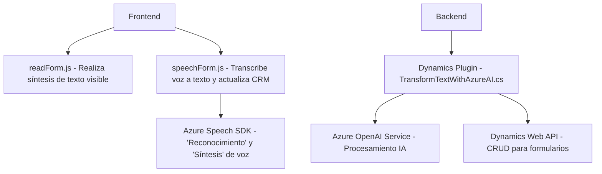

### Breve Resumen Técnico
El repositorio parece relacionado con un sistema que utiliza Azure Speech SDK y Dynamics CRM para la síntesis de voz, transcripción y transformación de datos. Los archivos diseñan funciones del frontend y un plugin de backend. Es una solución híbrida de integración de capas funcionales, conectada a servicios externos (Azure Speech y Azure OpenAI).

---

### Descripción de la Arquitectura
Por los archivos presentados, se observa una **arquitectura orientada a eventos y servicios**. En el frontend se implementan módulos para la síntesis y reconocimiento de voz que interactúan directamente con APIs externas como **Azure Speech SDK**. Paralelamente, el backend tiene una pieza extensible en forma de un plugin para **Dynamics CRM**, que integra el servicio **Azure OpenAI**. Esta arquitectura podría clasificarse como **n capas**, donde se separan responsabilidades (UI, SDK, APIs, servicios externos).

---

### Tecnologías Usadas
- **Frontend**:
  - **JavaScript**: Procesamiento de datos del formulario, integración del Azure Speech SDK.
  - **Azure Speech SDK**: Reconocimiento de voz y lectura de texto.
  - Posible uso de APIs personalizadas en Dynamics 365.
  
- **Backend**:
  - **C#**: Plugin para Dynamics CRM basado en **Microsoft.Xrm.Sdk**.
  - **Azure OpenAI Service**: Procesamiento avanzado y transformación de texto.
  - **Newtonsoft.Json** y **System.Text.Json**: Procesamiento JSON.

---

### Dependencias y Componentes Externos
1. **Azure Speech SDK**: Proporciona las funcionalidades de reconocimiento de voz y síntesis.
2. **Azure OpenAI Service**: Utilizado para transformar texto en JSON estructurado.
3. **Dynamics CRM API**: Facilita la conexión con los formularios y bases de datos de CRM.
4. **Librerías**:
   - Newtonsoft.Json y System.Text.Json: Modularizar el manejo de datos estructurados.
   - System.Net.Http: Conexión a APIs externas.

---

### Diagrama **Mermaid** Compatible con GitHub Markdown

---

### Conclusión Final
Este repositorio representa una solución bien estructurada para aplicaciones que integran voz, procesamiento inteligente de datos y CRM. La arquitectura modular destaca por su separación de responsabilidades, implementación de eventos y servicios externos. Mientras el frontend ejecuta tareas de síntesis y transcripción, el backend aprovecha IA para estructurar datos y mejorar funcionalidades en Dynamics CRM.