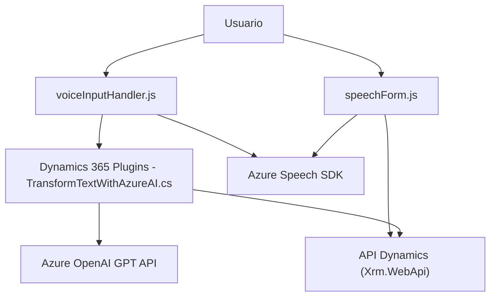

### Breve resumen técnico:
El repositorio contiene múltiples archivos que abordan diferentes aspectos de interacción entre un usuario y un sistema CRM basado en Microsoft Dynamics. Las funcionalidades incluyen procesamiento de voz, transformación de texto mediante IA, y síntesis de voz gracias a Azure Speech SDK y Azure OpenAI. Se destaca un sistema modular y con uso extensivo de servicios externos.

### Descripción de arquitectura:
1. **Tipo de solución:**  
   Este repositorio implementa una solución mixta:  
   - Una **interfaz frontend** que maneja la entrada y síntesis de voz.  
   - Plugins en el backend orientados al procesamiento de texto mediante Azure OpenAI y a la integración con Dynamics CRM para gestión de datos.  

2. **Arquitectura:**  
   La solución parece orientarse hacia una arquitectura de **microservicios/n capas**: Cada archivo tiene una función modular específica (entrada de voz, procesamiento con IA, integración con CRM). Además, utiliza un modelo **service-based design**, donde diferentes servicios externos (Azure Speech SDK y Azure OpenAI) están acoplados de forma lógica.

### Tecnologías usadas:
1. **Frontend:**  
   - JavaScript (Azure Speech SDK) para procesar entrada/salida de voz.  
   - Dinámica de procesamiento interactiva para formularios (mapeo de campos, transformación de valores).  

2. **Backend:**  
   - **Dynamics 365 Plugins:** .NET con soporte de bibliotecas específicas como `Microsoft.Xrm.Sdk`.  
   - **Azure OpenAI:** Para transformar texto a objetos JSON estructurados mediante GPT.  
   - **System.Text.Json / HttpClient:** Para solicitudes síncronas RESTful.

3. **Patrones utilizados:**  
   - **Modularidad funcional:** Funciones de frontend y clases en backend con responsabilidades separadas.
   - **Service Provider:** Mediación entre contexto CRM y APIs externas.  
   - **API REST:** Integración externa con Azure servicios.

### Dependencias o componentes externos:
1. **Azure Speech SDK:** Gestión de síntesis y reconocimiento de voz.  
2. **Azure OpenAI GPT API:** Transformación de texto mediante AI.  
3. **Dynamics 365:**
    - `Xrm.WebApi` para llamadas internas al CRM.
    - Contextos y servicios proporcionados por Dynamics para extender su funcionalidad.  

4. **Bibliotecas .NET:**
    - Newtonsoft.Json.Linq (JSON manipulación).
    - System.Text.Json y HttpClient para solicitudes HTTP.

5. **JavaScript módulos internos/archivos compartidos:** Entre `readForm.js` y `speechForm.js`.

### Diagrama Mermaid:

### Conclusión final:
Este repositorio presenta una solución moderna y flexible para la integración de voz e inteligencia artificial en sistemas CRM. Se entiende que gran parte de la funcionalidad es dependiente de servicios externos avanzados como Azure Speech SDK y Azure OpenAI, lo que garantiza escalabilidad y alto rendimiento. Por su diseño modular y enfoque en servicios externos, el sistema se acerca a una arquitectura de **n capas** con elementos decoupleados funcionalmente y que operan en conjunto.