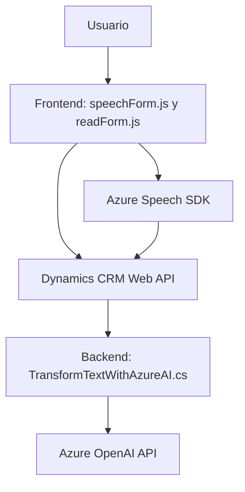

### Breve resumen técnico
El repositorio contiene archivos que implementan funcionalidades basadas en servicios de Azure, como el **Azure Speech SDK** y el **Azure OpenAI API**, junto con extensiones específicas para **Microsoft Dynamics CRM**. Los archivos analizados son parte de una solución que incluye integración con inteligencia artificial y servicios de reconocimiento de voz y síntesis de voz. Las implementaciones están organizadas como funciones o clases con mecanismos de carga dinámica de dependencias y modularidad en sus componentes.

---

### Descripción de la arquitectura
- La arquitectura se clasifica como **Service Oriented Architecture (SOA)** debido al alto nivel de dependencia e interacción con servicios externos, como **Azure Speech SDK** y **Azure OpenAI API**.
- Los archivos `readForm.js` y `speechForm.js` en el frontend presentan una arquitectura orientada a eventos y modularidad, mientras que `TransformTextWithAzureAI.cs` en el backend sigue un patrón de **Plugin dinámico** de Dynamics CRM.
- El diseño es híbrido: el frontend ejecuta procesamiento dinámico con APIs externas y SDKs, mientras el backend gestiona la interacción con Dynamics CRM y realiza la transformación del texto en estructuras JSON mediante Azure OpenAI.

---

### Tecnologías usadas
1. **Frontend**:
   - Lenguaje: JavaScript.
   - Frameworks/Librerías: 
     - **Azure Speech SDK** para reconocimiento y síntesis de voz.
   - Principios aplicados:
     - Modularidad.
     - Separación de preocupaciones.
     - Dependency Injection.
     - Programación asíncrona/Promesas.

2. **Backend**:
   - Lenguaje: C#.
   - Framework: Dynamics CRM SDK `IPlugin` para extensiones.
   - Frameworks adicionales: 
     - **Newtonsoft.Json.Linq** para manipulación de JSON.
     - **Azure OpenAI API** para procesamiento de lenguaje natural.
   - Principios aplicados:
     - Plugin Pattern (Dynamics CRM).
     - Encapsulación.

---

### Dependencias o componentes externos
1. **Azure Speech SDK**:
   - SDK para reconocimiento y síntesis de voz en el frontend.
   - Dinámicamente cargado desde `https://aka.ms/csspeech/jsbrowserpackageraw`.

2. **Azure OpenAI API**:
   - Usada en el backend para la transformación de texto en estructuras JSON mediante el servicio OpenAI.

3. **Dynamics CRM Web API**:
   - API para interactuar con datos y procesos internos de Dynamics CRM, como actualización de campos de formulario.

4. **Newtonsoft.Json**:
   - Librería externa en el backend para manejar manipulación de JSON en C#.

---

### Diagrama Mermaid válido para GitHub

---

### Conclusión final
Este repositorio implementa una solución de **procesamiento de voz y texto** integrada con servicios empresariales como Dynamics CRM y servicios en la nube de Azure. La arquitectura es modular, orientada a eventos en el frontend, mientras que el backend adopta un enfoque basado en plugins y servicios externalizados. Si bien la solución está bien estructurada, podría mejorar la seguridad de las configuraciones sensibles mediante herramientas como **Azure Key Vault**. Además, implementar una capa más robusta para manejo de excepciones y validaciones en la interacción con APIs externas sería ideal para garantizar estabilidad y escalabilidad.