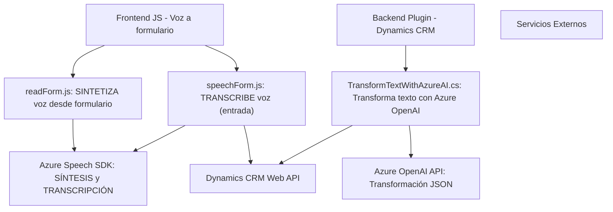

### Breve resumen técnico

El repositorio contiene tres archivos: dos destinados al frontend para interacción dinámica con formularios y voz (usando Azure Speech SDK) y uno para un plugin backend que integra Dynamics CRM con Azure OpenAI API. La solución aprovecha servicios de nube (Azure), desarrolla funcionalidades de tiempo real mediante programación orientada a eventos, y satisface necesidades específicas como síntesis de voz, transcripción e integración con inteligencia artificial.

---

### Descripción de arquitectura

La arquitectura de la solución está dividida en enfoque **n-capas**, donde:

1. **Frontend/Cliente** (archivos en JS): Gestiona la interacción de usuarios con formularios mediante voz, permitiendo síntesis y entrada mediante Azure Speech SDK y lógica para procesar campos. Usa una modularización funcional y APIs del navegador para integrar el SDK y tratar datos.
   
2. **Backend/Servidor** (C# plugin): Implementa lógica complementaria que transforma texto de entrada a un formato específico utilizando la servicio de Azure OpenAI API. Se alinea con patrón de interacción plugin de Dynamics CRM y delega procesamiento al servicio externo.

En conjunto, la arquitectura tiene una estructura híbrida: un cliente dinámico basado en tareas y un servidor extensible mediante plugins, presentando una separación clara.

---

### Tecnologías usadas

1. **Frontend (JavaScript)**:
   - **Framework**: Sin frameworks, solución con JavaScript nativo y modularización.
   - **APIs externas**: Azure Speech SDK.
   - **APIs del navegador**: `document.createElement`, `appendChild`, y eventos de interacción real.

2. **Backend (C#)**:
   - **Framework de servidor**: Dynamics CRM.
   - **Paquetes**: Microsoft.Xrm.Sdk, Newtonsoft.Json, System.Net.Http.
   - **APIs externas**: Azure OpenAI API.
   - **Normas REST**: Uso de HTTP para invocar servicios.

3. **Patrones de diseño**:
   - Modularización, callbacks, integración vía API, delegación a servicios externos.

---

### Diagrama Mermaid válido para GitHub

---

### Conclusión final

La solución plantea una arquitectura híbrida dividida entre capas de cliente y servidor con una implementación modular enfocada en la interacción dinámica con formularios y servicios de nube. Se identifican patrones de diseño sólidos (callbacks y modularización) y una alineación tecnológica adecuada para su propósito. Además, representa un ejemplo de integración profunda con Azure, utilizando tanto su SDK para voz como su API de IA, lo que favorece la escalabilidad y extensibilidad del sistema.

Podría adaptarse la solución agregando microservicios si fuera necesario escalar alguna capa específica (por ejemplo, IA o procesamiento de formulario). Sin embargo, para entornos actuales como Dynamics 365, la arquitectura n-capas con plugins resulta suficiente.