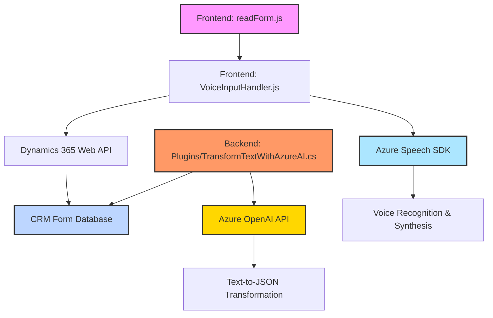

### Breve resumen técnico

Este repositorio presenta una solución implementada mediante tecnologías de frontend en **JavaScript** (integración con Azure Speech SDK) y backend/archivos de servidor en **C#** (Microsoft Dynamics CRM SDK), junto con una integración en **Dynamics 365** para procesar formularios. La solución combina reconocimiento de voz, procesamiento de transcripciones y transformación de texto mediante servicios de IA en Azure OpenAI, utilizando una arquitectura modular en ambos lados del stack.

---

### Descripción de arquitectura
1. **Tipo de solución**:
   - La solución integra un **Dynamic 365 plugin** en backend con lógica avanzada (en C#) y un **frontend basado en JavaScript**.
   - Incluye funcionalidades tanto de **REST API** como de manejo de UI, orientada a sistemas CRM.

2. **Arquitectura**:
   - En el plugin del backend, se usa una arquitectura tipo **n capas** (servicios, lógica de negocio y entidades).
   - En el frontend, se apuesta por un diseño modular y reactivo, facilitando la carga dinámica y la integración con servicios externos como el **Azure Speech SDK** y APIs personalizadas.

3. **Patrones de diseño**:
   - **Modularización**: Cada archivo es altamente modular y orientado a responsabilidades específicas.
   - **Callbacks y carga dinámica**: El archivo `readForm.js` incluye un manejo asíncrono mediante callbacks para cargar SDKs con soporte para eventos. Alternativamente, el código del plugin sigue el patrón de arquitectura de plugins de Dynamics.
   - **Integración REST API**: Se integra con datos del SDK de OpenAI de Azure en el backend, y la conexión al Speech SDK se realiza dinámicamente en el frontend mediante carga de bibliotecas.

---

### Tecnologías, frameworks y librerías usadas
1. **Frontend**:
   - **JavaScript (ES6)** (core language): Manejo de funcionalidades de UI y entrada de voz.
   - **Azure Speech SDK**: Para reconocimiento de voz y síntesis de voz desde texto.
   - **Dynamics CRM Web API**: Actualización de datos en el sistema CRM.

2. **Backend**:
   - **Microsoft Dynamics CRM SDK [.NET Framework]**: Para acceder y modificar datos en Dynamics usando clases como `IPluginExecutionContext`, `IOrganizationServiceFactory`, etc.
   - **Azure OpenAI API**: Para llamar al modelo de lenguaje desde un plugin.
   - **Newtonsoft.Json**: Procesamiento JSON en C#.

3. **Dependencias generales**:
   - **HTML DOM interaction**: El frontend manipula formularios en una UI (supuestamente en Dynamics CRM).
   - Utilización de servicios cloud como **Microsoft Azure**.

---

### Diagrama Mermaid válido para GitHub

---

### Conclusión final

La solución es un **sistema híbrido** (interacción entre frontend and backend) que integra componentes de **Microsoft Dynamics 365**, **Azure Services** como el Speech SDK y el modelo OpenAI, y APIs personalizados. La arquitectura está orientada a n capas, donde cada módulo tiene una responsabilidad específica y se comunica con otros componentes mediante interfaces está definidas (API REST y plugins).

**Sugerencias para mejora:**
1. **Seguridad**: Implementar una gestión segura de claves API (por ejemplo, utilizando almacenes) en lugar de valores estáticos en el código.
2. **Estructura moderna**: En el lado del frontend se podría optimizar el flujo con Promesas o `async/await` para tener un enfoque más escalable.
3. **Arquitectura hexagonal**: En el plugin backend, se podría considerar implementar una arquitectura hexagonal para mejorar la independencia del núcleo del negocio respecto de las APIs externas.