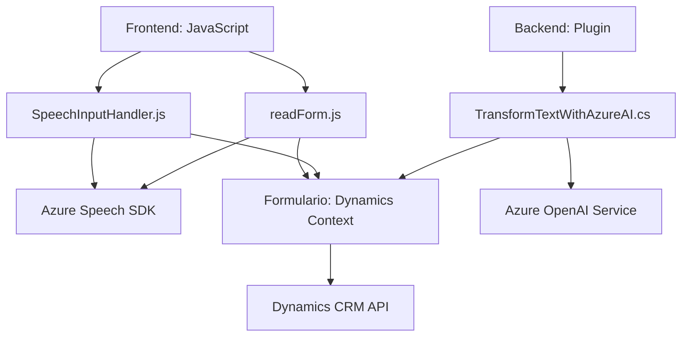

### Breve resumen técnico
El repositorio analiza diversos archivos que interactúan con frameworks y servicios externos como Azure Speech SDK, Dynamics 365 CRM y Azure OpenAI. Los archivos están enfocados en la captura, procesamiento y síntesis de voz, transformación de texto, e integración con formularios dinámicos empresariales.

### Descripción de arquitectura
La solución general parece estar estructurada sobre una arquitectura de **n capas**, donde cada componente tiene un propósito bien definido: 
- La capa de **presentación** (archivos del FRONTEND) se encarga de interactuar dinámicamente con formularios y servicios externos como Azure Speech SDK.
- La capa de **lógica de negocio** (archivo `TransformTextWithAzureAI.cs`) aplica reglas de transformación sobre datos en un sistema interno utilizando Azure OpenAI, siguiendo un patrón de plugins.
- Existe una capa **integradora** que conecta con servicios externos (Azure Speech SDK y OpenAI), cumpliendo roles de externalización de microservicios.

### Tecnologías usadas
1. **Frontend:** 
   - `JavaScript` con integración directa a SDKs externos.
   - Uso de Microsoft Dynamics 365 para la lógica central de formularios.
   - Interacción dinámica mediante APIs.

2. **Backend (plugin):**
   - `C#` para implementar Dynamics 365 CRM plugins.
   - Microsoft OpenAI Service para procesamiento de texto mediante inteligencia artificial.
   - `Newtonsoft.Json` y `System.Net.Http` para manejo de JSON y comunicación HTTP.

3. **Servicios externos:** 
   - Azure Speech SDK para integrar síntesis y entrada de voz.
   - Azure OpenAI Service para la generación de texto basado en prompts.

4. **Patrones reconocibles:**
   - **Plugin Pattern:** Común en Dynamics CRM.
   - **Cargador dinámico de dependencias:** Se utiliza en los componentes JavaScript para cargar SDK externos.
   - **Facade HTTP:** En el componente plugin para manejar las interacciones con Azure OpenAI.

### Dependencias o componentes externos
1. **Azure Speech SDK:** Para procesamiento de voz (captura, reconocimiento y síntesis).
2. **Azure OpenAI Service:** Para transformación de datos usando inteligencia artificial.
3. **Dynamics 365 CRM Framework:** Para manipular datos de formularios en aplicaciones empresariales personalizadas.
4. **Newtonsoft.Json y System.Text.Json:** Para manipulación y serialización de objetos JSON en los plugins.
5. **Network APIs:** Para realizar solicitudes HTTP con encabezados personalizados desde el plugin.

### Diagrama Mermaid válido para GitHub

### Conclusión final
La solución detallada en este repositorio está diseñada para abordar la interacción de formularios dinámicos empresariales con capacidades avanzadas de procesamiento de voz y texto, así como integración con APIs externas. La mezcla de tecnologías en el frontend y backend, junto con patrones como el Plugin y el cargador dinámico de dependencias, sugiere una arquitectura de **n capas** altamente dependiente de servicios externos. Su enfoque modular permite escalabilidad y adaptabilidad a entornos empresariales modernos basados en Microsoft Dynamics y Azure.