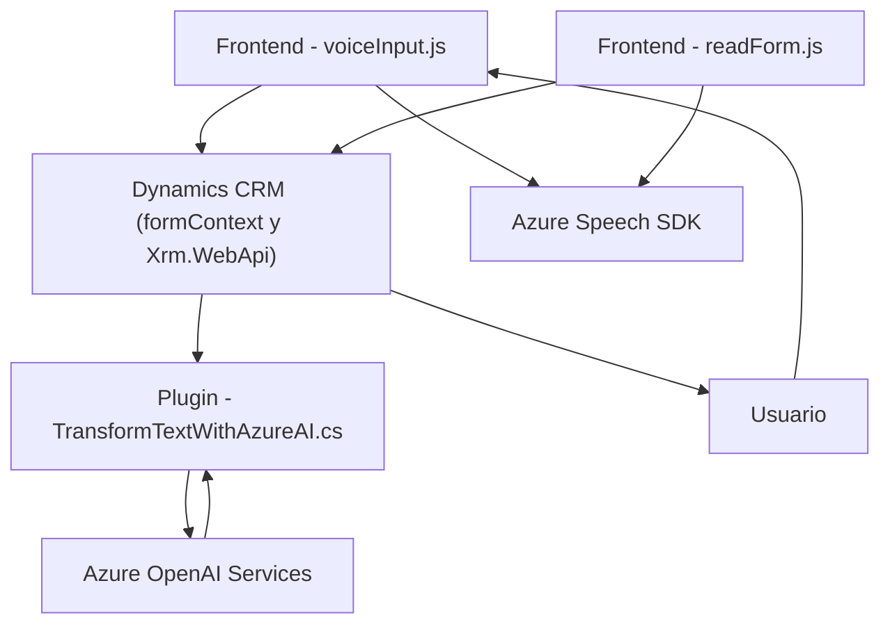

# Resumen técnico
El repositorio analizado está compuesto por archivos que implementan diversas funcionalidades que integran **servicios externos de Microsoft Azure** y **Dynamics CRM APIs** en un ecosistema orientado hacia la automatización de tareas mediante procesamiento de voz y texto. Los archivos utilizan tecnologías modernas para reconocimiento de voz, síntesis de voz y procesamiento de texto estructurado, orientados al manejo de formularios y datos en un CRM.

---

## Descripción de la arquitectura
1. **Tipo de solución**: La solución es una combinación de frontend especializado con complementos para administración de datos en formularios basados en Dynamics CRM. Además, incluye un plugin que actúa como interfaz entre Dynamics y Azure OpenAI, siendo parte de una arquitectura orientada a servicios.
2. **Tipo de arquitectura**: La arquitectura sigue un modelo **n capas** con una integración hacia servicios externos mediante APIs, representando una transición hacia principios básicos de microservicios (Azure Speech SDK y Azure OpenAI). Se utiliza modularidad en componentes por funcionalidades:
   - **Frontend**: Captura y procesamiento de voz con Azure Speech SDK.
   - **Logic Plugins**: Extensión dinámica de CRM mediante eventos y lógica específica.
   - **APIs externas**: Manejo con Azure Speech y Azure OpenAI, posicionando al sistema como dependiente de servicios externos en la nube.

---

## Tecnologías usadas
1. **Frontend**:
   - **JavaScript**: Lenguaje principal para la captura de datos y procesamiento en el navegador.
   - **Azure Speech SDK**: Reconocimiento de voz y síntesis de texto en voz mediante APIs de Azure.
   - **Dynamics CRM WebApi**: Manejo de datos (lectura, escritura y actualización) en hojas de formulario.
   - **DOM Manipulation**: Uso de documentos DOM para interactuar dinámicamente con formularios.

2. **Backend (Plugins)**:
   - **Microsoft Dynamics SDK**: Para manipulación de eventos y lógica empresarial de CRM.
   - **Azure OpenAI API**: Procesamiento de texto mediante IA y servicios de cloud computing.
   - **System.Net.Http y JSON Serialization Frameworks**: Comunicación y manipulación de datos estructurados entre el sistema CRM y Azure.
   - **C#**: Lenguaje utilizado en los plugins para Dynamics.

3. **Arquitectura de integración**:
   - **APIs externas basadas en servicios REST (API Gateway)**.
   - **Servicios desacoplados (Speech/AI microservicios)**.
   - **Modularidad**: Código segmentado en funciones individuales según responsabilidades específicas en el frontend y plugins.

---

## Dependencias o componentes externos
1. **Azure Speech Services**:
   - Reconocimiento de voz y síntesis en el frontend.
   - Dependencias cargadas dinámicamente desde el CDN especificado.
2. **Azure OpenAI Services**:
   - Procesamiento de lenguaje natural para estructurar texto en formato JSON.
3. **Microsoft Dynamics SDK WebApi**:
   - Para integraciones directas con la base de datos y lógica de formulario de Dynamics CRM.
4. **Sistema cliente y frontend**:
   - Navegadores soportados para ejecución de scripts y conexión al SDK.

---

## Diagrama Mermaid 100 % compatible con GitHub Markdown

---

## Conclusión final
Este repositorio representa una solución tecnológica que optimiza la experiencia de usuario en Dynamics CRM mediante un procesamiento avanzado de entrada y salida de datos. Implementa integración directa con los servicios de Azure Speech SDK para reconocimiento de voz, así como Azure OpenAI para procesamiento de texto, reflejando principios de **arquitectura modular y desacoplamiento**. Además, la estructura sugiere un enfoque basado en **n capas**, asegurando una comunicación fluida entre frontend, plugins y servicios en la nube.