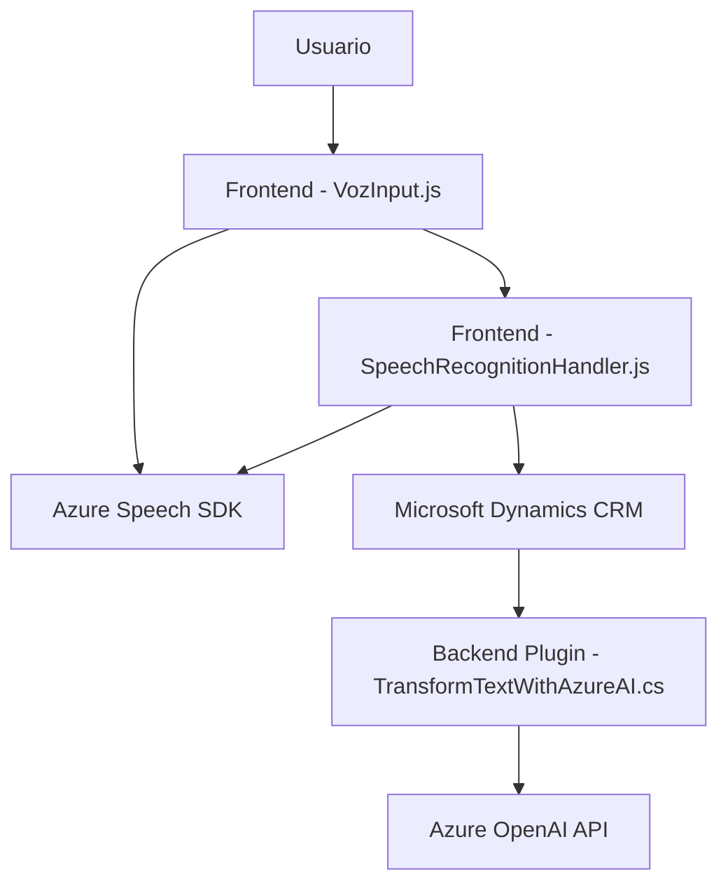

### Breve Resumen Técnico

Este repositorio parece ser parte de una solución que utiliza integración dinámica de servicios **Azure Cognitive Services** (reconocimiento y síntesis de voz) y **Azure OpenAI** junto con **Microsoft Dynamics CRM**. Los archivos representan funcionalidad distribuida entre el frontend (JavaScript) para interacción del usuario y manipulación de formularios, así como plugins backend en C# para procesamiento de datos y transformación inteligente con OpenAI. El sistema se utiliza para automatizar tareas dentro de Dynamics CRM, como procesamiento de voz y asignación dinámica de datos en formularios.

---

### Descripción de Arquitectura

La arquitectura es híbrida, con un módulo **frontend client-side** basado en JavaScript interactuando con **Azure Speech SDK** para reconocimiento de voz y síntesis de texto hablado desde formularios, junto con un módulo **backend** en forma de **plugin** de Dynamics CRM (C#) integrado con **Azure OpenAI API**. Esto combina aspectos de una arquitectura **n-capas** con conceptos de **microfrontend** y servicios desacoplados gracias a las dependencias de API externas.

- **Frontend**: Asíncrono y dependiente de Azure Speech SDK para reconocimiento y síntesis, utiliza eventos y callbacks para reaccionar dinámicamente a cambios en formularios.
- **Backend**: Plugin diseñado bajo un modelo de **command pattern** para extender la lógica de Dynamics CRM, con procesamiento de datos externos vía Azure OpenAI API.

---

### Tecnologías Usadas

#### Frontend (JavaScript):
1. **Azure Cognitive Services Speech SDK**:
   - Reconocimiento y síntesis de voz (text-to-speech, speech-to-text).
   - Dependencia externa cargada de forma dinámica en el navegador.

2. **Microsoft Dynamics CRM SDK (Xrm)**:
   - Gestiona el contexto de formularios y asignación de datos dinámicos.

3. **JavaScript Modular**:
   - Usa funciones y callbacks independientes para garantizar escalabilidad y legibilidad del código.

#### Backend (C#):
1. **Azure OpenAI API**:
   - Modelo GPT-4 para transformación avanzada de texto.

2. **Microsoft Dynamics CRM SDK** (para el plugin):
   - Maneja eventos del CRM y la interacción con los datos del sistema.

3. **HTTP Requests**:
   - Solicitudes basadas en `System.Net.Http` para integración con API externas.

---

### Diagrama Mermaid Compatible con GitHub Markdown

---

### Conclusión Final

El repositorio implementa una solución **híbrida cliente-servidor** que utiliza capacidades avanzadas de reconocimiento y síntesis de voz mediante **Azure Speech SDK**, junto con procesamiento inteligente de datos vía **Azure OpenAI API**, integrándose en el contexto de **Dynamics CRM** a través de su sistema de plugins. Los patrones de diseño reflejan modularidad y uso de servicios externos desacoplados para extender el uso de CRM de Microsoft hacia aplicaciones más inteligentes y automáticas. Sin embargo, habría optimizaciones recomendadas, como el manejo seguro de credenciales y mejor división entre lógica de negocio y lógica de integración.