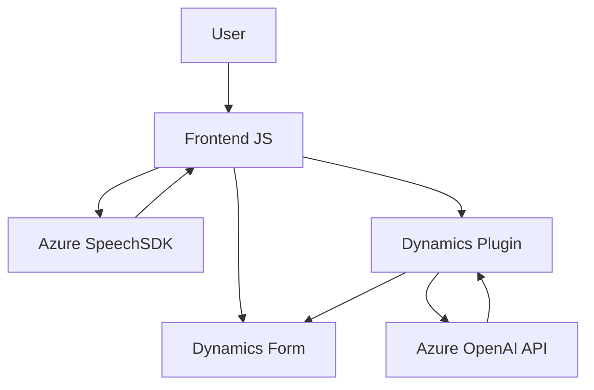

### Breve Resumen Técnico
El repositorio está centrado en funcionalidad que integra servicios externos (Azure Speech SDK, Dynamics 365, y Azure OpenAI API) para interactuar mediante voz y texto en un sistema CRM (Dynamics 365). Específicamente, se trata de una solución híbrida para la captura y procesamiento de voz, transcripción, y asignación automática de valores en formularios.

### Descripción de Arquitectura
La solución sigue una arquitectura **modular con integración de servicios externos**, con componentes segmentados en tres capas principales:
1. **Frontend (JavaScript)**: 
   - Se encarga de capturar entradas de voz, transcribir texto usando el SDK de Azure Speech, y procesar datos visibles en formularios.
2. **API y lógica personalizada (Plugins)**:
   - Plugins de Dynamics CRM que interactúan con la API de Azure OpenAI para transformar texto usando normas predefinidas y devolver un JSON estructurado.
3. **Servicios externos**:
   - Azure Speech SDK para procesamiento de voz a texto.
   - Azure OpenAI API para transformación de texto avanzado basado en reglas.
   - Dynamics 365 API para realizar operaciones en los formularios y entidades CRM.

### Tecnologías Usadas
1. **Frontend**:
   - Lenguaje: JavaScript.
   - SDK: Azure Speech SDK.
   - Framework: No se observa uno explícito, aunque el enfoque de componentes funcionales se alinea con Single Page Applications (SPA).

2. **Backend**:
   - Lenguaje: C#.
   - Framework: Dynamics CRM Plugin Development.
   - HTTP Client: `System.Net.Http` para consumir la API de Azure OpenAI.

3. **Servicios Externos**:
   - **Azure Speech SDK**: Procesar reconocimiento de voz y síntesis TTS.
   - **Azure OpenAI API**: Consumir un modelo generativo de AI.
   - **Dynamics CRM Web API**: Interactuar con formularios, entidades y datos estructurados del sistema.

### Diagrama Mermaid
El siguiente diagrama representa la interacción entre los componentes:

### Conclusión Final
La solución presenta una **arquitectura modular híbrida**, con el frontend orientado a funciones específicas como captura de voz y asignación de valores en un formulario CRM, mientras que el backend implementa lógica avanzada para interpretación y transformación de texto mediante Azure servicios de AI. El enfoque es escalable y extensible, y hace un uso efectivo de los SDKs y APIs externos para lograr una interacción fluida entre usuario, datos, y servicios.