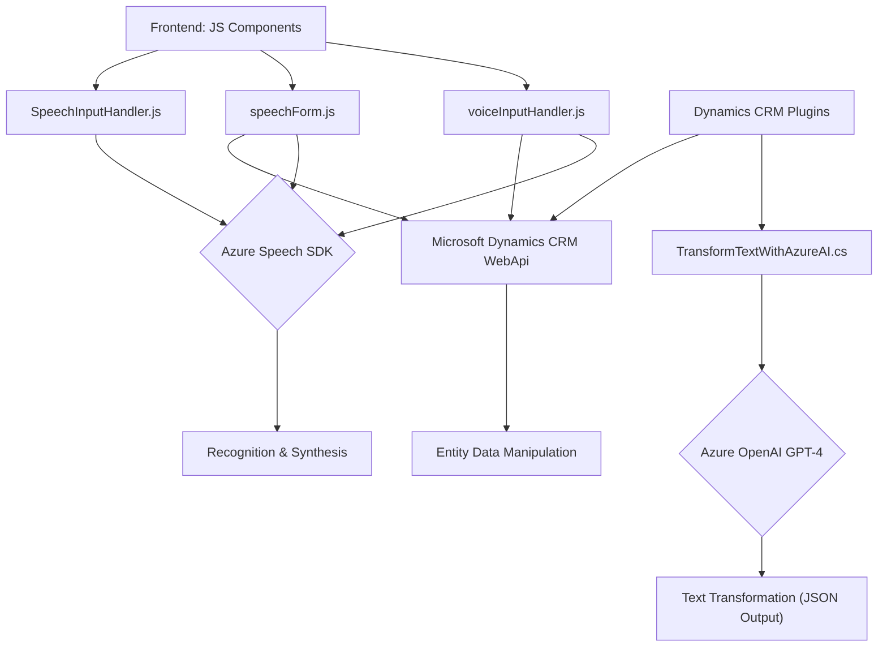

### Resumen técnico:
El repositorio consiste en una solución que integra reconocimiento y síntesis de voz, procesamiento de datos en formularios de Dynamics 365 y transformación avanzada de texto utilizando Azure OpenAI GPT-4. Es adaptable a contextos empresariales donde la interacción por voz y la automatización de procesos son prioridad.

### Descripción de arquitectura:
La solución se estructura como una **arquitectura de capas**:
1. **Frontend orientado a cliente:**
   - Archivos JavaScript que manejan la interacción directa con el usuario y manipulan formularios en Dynamics 365. Utilizan Azure Speech SDK para sintetizar voz y reconocimiento de comandos.
2. **Integración externa (API):**
   - Plugins como `TransformTextWithAzureAI.cs` extienden Dynamics CRM con lógica específica para texto y transformación basada en IA.
3. **Servicios distribuidos externos:**
   - Integración directa con Azure AI (OpenAI y Speech) mediante HTTPS.

### Tecnologías y patrones usados:
**Tecnologías:**
- **Microsoft Dynamics CRM/365:** Usado como base para formularios y lógica de negocios.
- **Azure Speech SDK:** Para proporcionar síntesis y reconocimiento de voz.
- **Azure OpenAI GPT-4:** Transformación avanzada de mensajes de texto mediante IA.
- **JavaScript (browser APIs):** Gestión dinámica del SDK Azure Speech y DOM.
- **C#:** Para la extensión del CRM mediante plugins.

**Patrones:**
1. **Modularidad:** Funciones organizadas por objetivo; facilita mantenimiento.
2. **Event-driven:** Uso de callbacks para procesos asíncronos (carga de SDK).
3. **Integración con APIs externas:** Dinámicas con Azure Speech SDK y Azure OpenAI.
4. **Command Pattern:** Interpretación de comandos de voz en formularios.
5. **Plugin Architecture:** Extensión encapsulada de Dynamics CRM en C#.

### Dependencias o componentes externos:
1. **Azure Speech SDK:** Dependencia crítica para la síntesis y reconocimiento de voz.
2. **Azure OpenAI GPT-4:** Utilizado via plugin en Dynamics CRM para transformación avanzada de texto.
3. **Microsoft Dynamics 365 Web API:** Manipulación de formularios y entidades CRM.
4. **Browsers con DOM APIs:** Para carga dinámica de scripts como el SDK Speech.
5. **HTTP client libraries:** (como `System.Net.Http`) Necesarias en el plugin C# para solicitudes API REST.

### Diagrama Mermaid de la arquitectura:

### Conclusión final:
La solución presentada implementa una arquitectura **de capas altamente modular**, combinando frontend con lógica de negocio y servicios de IA en la nube. Está orientada específicamente al ecosistema Dynamics 365, donde la integración con Azure Speech SDK y OpenAI GPT-4 provee herramientas sofisticadas de voz e IA. Es técnicamente robusta, pero podría beneficiarse de mayor seguridad (e.g., externalización de claves). Además, la estructura permite escalabilidad futura para agregar nuevas funcionalidades basadas en la interacción entre voz, texto y datos.