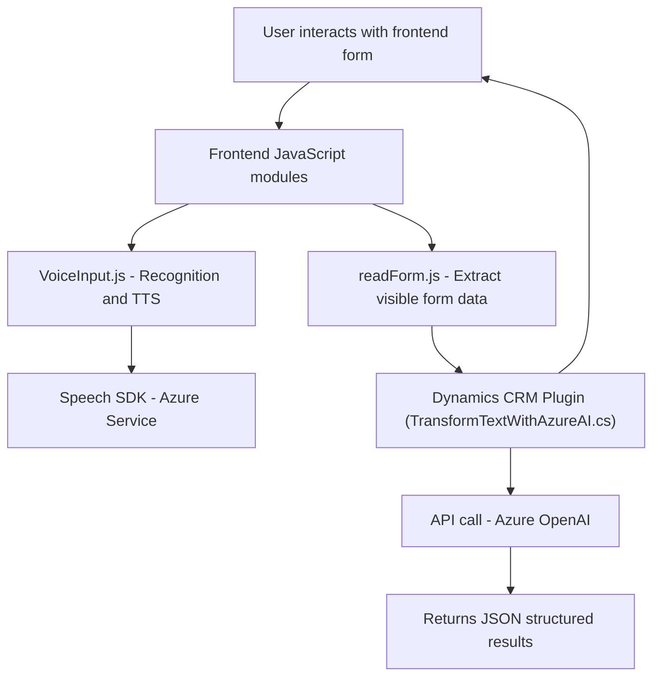

### Breve Resumen Técnico
El repositorio descrito implementa funcionalidades para procesamiento de texto y voz en formularios asociados principalmente con Microsoft Dynamics CRM. La solución utiliza **Azure Speech SDK** y la **API de Azure OpenAI** para ofrecer reconocimiento de voz, síntesis de texto a voz (TTS) y transformación de texto estructurado vía normas predefinidas en Dynamics CRM.

---

### Descripción de Arquitectura
El repositorio presenta una combinación de arquitectura **n-capas** donde:
- **Frontend**: Encargado de la interacción con los usuarios vía formularios y del reconocimiento/síntesis de voz usando Azure Speech SDK.
- **Backend (Plugins)**: Extensiones que interactúan directamente con Dynamics CRM y la API de Azure OpenAI para realizar transformaciones específicas.
  
Adicionalmente, algunos componentes reflejan patrones propios de **event-driven programming** en el reconocimiento de voz, pero globalmente el sistema mantiene una estructura basada en capas.

Este diseño sugiere integración de microservices (API de Azure OpenAI) dentro de una arquitectura que aún considera Dynamics CRM como monolito.

---

### Tecnologías y Frameworks Usados
#### Frontend:
1. **JavaScript**:
   - Interactividad cliente, modularización.
   - Lógica para TTS y reconocimiento de voz.
2. **Azure Speech SDK**:
   - Procesamiento de voz a texto (STT) y síntesis de voz (TTS).

#### Backend:
1. **C#: .NET Framework/Dynamics SDK**:
   - Plugins específicos para extender la funcionalidad en Dynamics CRM.
2. **API de Azure OpenAI**:
   - Para transformación de texto según reglas predefinidas.
3. **System.Net.Http y Newtonsoft.Json**:
   - Manipulación de datos y consumo de servicios REST.
4. **Dynamics CRM SDK**:
   - `IPlugin` para trabajar con registros y flujos en CRM.

#### Patrones utilizados:
1. **Single Responsibility Principle** (SRP):
   - Modularización de cada función para mantener propósito único.
2. **Service Consumption**:
   - Integración directa con servicios de Azure (Speech SDK y OpenAI).
3. **Plugin Architecture**:
   - Extensiones en Dynamics CRM a través de clases que implementan `IPlugin`.

---

### Dependencias o Componentes Externos
- **Azure Speech SDK**: Para procesamiento de voz y lenguaje natural.
- **Azure OpenAI API**: Para transformación avanzada de texto en formato estructurado.
- **Microsoft Dynamics CRM SDK**:
   - Extensiones estándar para manipular entidades y atributos.
- **APIs personalizadas de Dynamics CRM**:
   - Desarrolladas para tareas específicas como integración con modelos IA.
- **Key Dependency Libraries**:
   - `Newtonsoft.Json`: Manipulación JSON.
   - `System.Net.Http`: Consumo de REST APIs.
   - `System.Text.Json`: Situaciones específicas de serialización.

---

### Diagram Mermaid Compatible

---

### Conclusión Final
El repositorio describe un sistema bien modularizado para procesamiento de texto y voz en casos asociados con formularios en Dynamics CRM. Utiliza una arquitectura basada en capas con interacción directa entre módulos frontend y backend, mientras aprovecha servicios externos provistos por Azure (Speech SDK y OpenAI). Aunque Dynamics CRM tiene una arquitectura monolítica, los plugins y APIs personalizadas también permiten modernización e integración mediante patrones de diseño y consumo de servicios REST.

El diagrama proyecta la relación entre frontend, backend y servicios externos, mostrando una solución coherente y extensible que favorece la interoperabilidad en entornos empresariales.