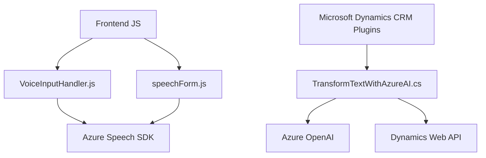

### Breve resumen técnico
El repositorio contiene una solución híbrida centrada en la integración de servicios de voz y texto entre un frontend dinámico basado en formularios y un sistema CRM de Microsoft Dynamics. Emplea servicios de Azure Speech SDK y Azure OpenAI para proporcionar accesibilidad por voz y procesamiento de texto avanzado mediante Inteligencia Artificial.

### Descripción de arquitectura
La solución tiene una arquitectura basada en tres capas principales:
1. **Frontend modular**: Incluye archivos JavaScript (`readForm.js` y `speechForm.js`) que interactúan con formularios en el navegador. Estas capas son altamente dependientes de los servicios de Azure para reconocimiento y síntesis de voz.
2. **Backend en Microsoft Dynamics CRM**:
   - Los plugins como `TransformTextWithAzureAI.cs` se ejecutan dentro del ecosistema CRM siguiendo un patrón de plugin. Estos conectan Dynamics con Azure OpenAI para transformar datos de texto.
3. **Servicios externos**: Integra APIs de Azure (Speech y OpenAI) como elementos clave para la funcionalidad del sistema.

La solución sigue un modelo **Service-Oriented Architecture (SOA)**, donde componentes del frontend y el backend delegan responsabilidades a servicios externos.

### Tecnologías usadas
1. **Frontend**:
   - **Lenguaje**: JavaScript.
   - **Servicios**: Azure Speech SDK.
   - **Interacción con navegador**: Manipulación de DOM y contexto de ejecución (`executionContext`).
2. **Backend**:
   - **Lenguaje**: .NET/C#.
   - **Servicios**: Azure OpenAI (GPT-4), Dynamics Web API.
   - **Framework**: Microsoft Dynamics CRM Plugin Framework.
   - **Librerías**: Newtonsoft.Json para manejo de JSON, System.Net.Http para solicitudes HTTP.
3. **Patrones empleados**:
   - Modularidad: Separación clara de responsabilidades en el código.
   - Delegación: Uso de callbacks y flujos asincrónicos para la carga y procesamiento.

### Diagrama **Mermaid** válido para GitHub

### Conclusión final
La solución es un sistema híbrido compuesto por un frontend dinámico y un backend de Microsoft Dynamics CRM, ambos potenciados por servicios de Azure. Su principal fortaleza radica en integrar capacidades avanzadas de accesibilidad (sistema de voz) y procesamiento de datos mediante IA. La arquitectura SOA proporciona modularidad y flexibilidad, aunque algunas prácticas de seguridad, como el almacenamiento de API keys en texto plano, requieren mejoras. Esta solución es adecuada para proyectos con alta dependencia de servicios cloud y entornos corporativos.

