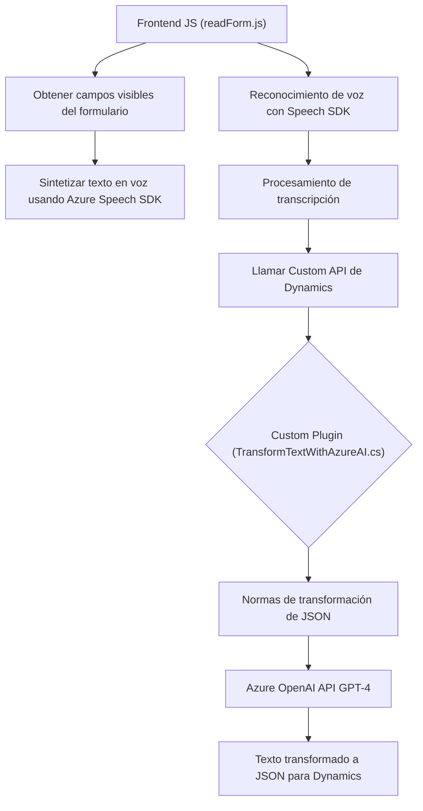

## Breve Resumen Técnico

El repositorio contiene tres archivos que se integran entre aplicaciones de Microsoft Dynamics 365, Azure Speech SDK y una Custom API basada en Azure OpenAI. Los archivos muestran una clara segmentación de responsabilidades:
1. **Frontend/JS/readForm.js**: Extrae datos de formularios, realiza síntesis de voz con Azure Speech SDK.
2. **Frontend/JS/speechForm.js**: Captura transcripciones de voz, aplica un procesado avanzado con la ayuda de Dynamic Forms y Custom API de Azure.
3. **Plugins/TransformTextWithAzureAI.cs**: Implementa un plugin para Dynamics CRM, accesando la API de Azure OpenAI para transformar texto según reglas predefinidas en JSON.

---

## Descripción de Arquitectura

La solución parece estar construida siguiendo una **arquitectura orientada a servicios (SOA)**. Los componentes que trabajan con formularios y reconocimiento de voz están desacoplados mediante APIs externas (Azure Speech SDK). También existe integración directa con servicios SaaS (Software as a Service), como Azure OpenAI y Dynamics CRM. El plugin implementado en C# sigue el patrón de **plugin dinámico** de Dynamics CRM, ofreciendo un ejemplo de arquitectura **basada en eventos**.

---

## Tecnologías Usadas

**Frontend**:
- **JavaScript** para implementar la interacción con los formularios.
- **Azure Speech SDK**: Prestación de servicios de síntesis y reconocimiento de voz.

**Backend Plugin (C#)**:
- **Microsoft Dynamics CRM SDK**: Conexión y manipulación de datos en la plataforma CRM.
- **Newtonsoft.Json** y **System.Text.Json**: Manejo y procesamiento de JSON.
- **Azure OpenAI API** (GPT-4): Servicio de transformación de texto en la nube.

**Arquitectura**:
- **Servicio distribuido**: Uso de diferentes componentes que acceden a servicios externos (Azure Speech SDK, Azure OpenAI, Dynamics API).
- **Event-driven design**: Uso de eventos y callbacks para control de flujo asincrónico en reconocimiento de voz.
- **Modular Design**: Fragmentación de funciones con responsabilidades bien definidas.
- **Service-Oriented Architecture (SOA)**: Integración con APIs y servicios externos.

---

## Diagrama Mermaid

---

## Conclusión Final

La solución está enfocada en proporcionar servicios inteligentes para formularios dinámicos en Microsoft Dynamics utilizando capacidades avanzadas de inteligencia artificial y reconocimiento de voz de Azure. La arquitectura adoptada, orientada a servicios (SOA), permite un alto grado de modularidad, escalabilidad y la capacidad de adaptarse a futuros requerimientos sin dependencia fuerte entre los componentes internos. Aunque la integración de APIs externas puede generar ciertos retos en latencia y manejo de errores, esta estrategia es adecuada para empresas que buscan incorporar soluciones basadas en IA y computación en la nube.