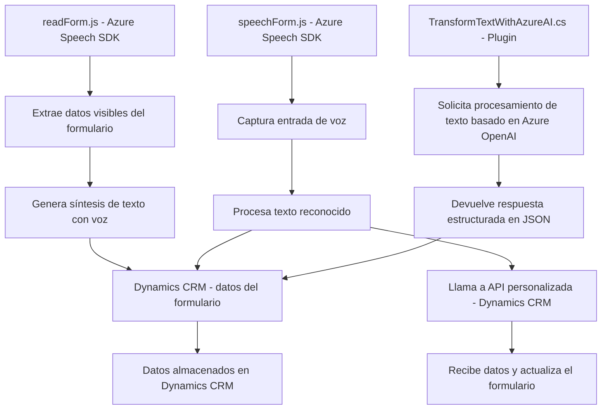

# Breve resumen técnico

El repositorio contiene tres archivos principales que implementan funcionalidades relacionadas con el procesamiento de entrada y salida de voz, la integración con servicios externos como Azure OpenAI y Azure Speech SDK, y el manejo de datos en Microsoft Dynamics CRM. 

- **`readForm.js`:** Realiza la síntesis de voz de los datos visibles en formularios integrados con Dynamics CRM.
- **`speechForm.js`:** Habilita el reconocimiento de voz, interacción con APIs externas y procesamiento automático de los datos reconocidos para aplicarlos a formularios.
- **`TransformTextWithAzureAI.cs`:** Plugin basado en Microsoft Dynamics CRM que utiliza Azure OpenAI para transformar texto y devolver respuestas estructuradas.

---

# Descripción de arquitectura

La solución sigue una **arquitectura de integración basada en eventos** y combina patrones de servicio con separación de responsabilidades:
1. **Modularidad:** Las funciones y métodos están diseñados para un propósito específico, facilitando el mantenimiento y la reutilización del código.
2. **Integración con servicios externos:** Realiza interacciones con APIs externas, principalmente Azure Speech SDK y OpenAI.
3. **Multi-capas:** Se distingue una clara separación de capas:
    - **Presentación (Frontend):** Archivos de JavaScript (`readForm.js`, `speechForm.js`) para manejar el frontend y la comunicación con el formulario de Dynamics CRM.
    - **Lógica de negocio:** Implementada tanto en los archivos JavaScript como en el plugin C# (`TransformTextWithAzureAI.cs`), procesando datos e interactuando con servicios externos.
    - **Datos:** Se apoyan en datos obtenidos desde el formulario de Dynamics CRM y respuesta de APIs.
4. **Eventos:** Uso de callbacks y funciones disparadas por eventos en el ciclo de vida del SDK (como la carga de Azure Speech SDK o la ejecución del reconocimiento de voz).

---

# Tecnologías usadas

1. **Frontend (JavaScript):**
   - Azure Speech SDK para síntesis y reconocimiento de voz.
   - Dynamic loading (carga dinámica) de scripts.
   - Promesas para control asincrónico de APIs.
   - Microsoft Dynamics CRM Form Integration.
   
2. **Backend (C# Plugin):**
   - **Microsoft Dynamics CRM SDK:** Para integración y ejecución en el contexto de negocios.
   - **Azure OpenAI API:** Procesamiento avanzado de texto con IA.
   - **Newtonsoft.Json:** Manipulación de JSON.
   - **HttpClient:** Comunicación con APIs externas.

3. **Patrones utilizados:**
   - Modularidad orientada a funciones específicas.
   - Event-driven architecture.
   - Service-Oriented Architecture (SOA), dado el alto uso de servicios externos y APIs.
   - Plugin Pattern (Dynamics CRM).
   - Helper Pattern, especialmente en la lógica backend.

---

# Diagrama en formato **Mermaid** compatible con GitHub

---

# Conclusión final

La solución es una **integración avanzada entre Dynamics CRM y servicios en la nube de Azure (Speech SDK y OpenAI)**. Utiliza una arquitectura modular y eventos para coordinar la interacción entre estos sistemas. Además, emplea patrones como SOA y Plugin Pattern para desacoplar la lógica empresarial del frontend y backend.

### Puntos clave:
- **Flexible y extensible:** Las funciones y los métodos están altamente desacoplados, facilitando el mantenimiento, pruebas y expansión del código.
- **Dependencia en servicios externos:** Una dependencia significativa hacia Azure Speech SDK y Azure OpenAI puede requerir monitoreo de estos servicios.
- **Escalabilidad:** La arquitectura puede escalar añadiendo nuevos módulos y servicios, mostrando adaptabilidad.

Este diseño prioriza la modularidad y una fuerte integración entre Microsoft Dynamics CRM y APIs de Azure.