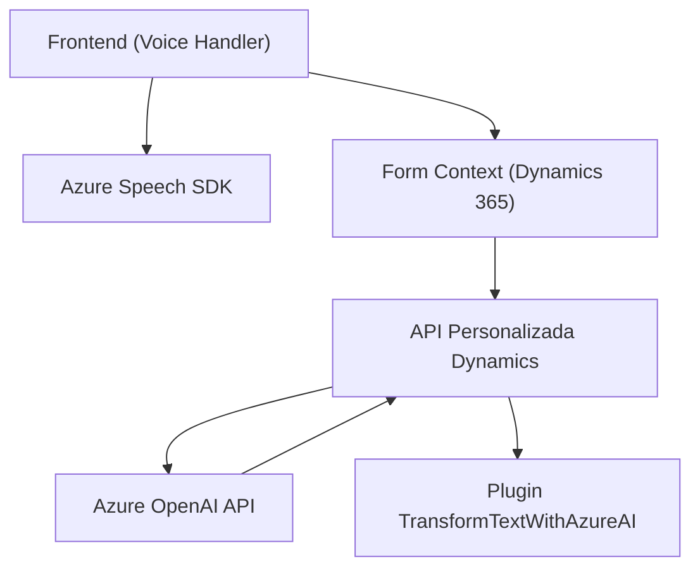

## Resumen técnico

El repositorio contiene una arquitectura orientada a integrar la interacción basada en voz y la inteligencia artificial con un sistema CRM (Dynamics 365). Utiliza el **Azure Speech SDK** para el reconocimiento y síntesis de voz y el **Azure OpenAI API** para transformar texto mediante IA, todo esto dentro de un contexto de formularios dinámicos en Dynamics. Además, incluye un plugin creado para Dynamics, que extiende las funcionalidades predeterminadas del CRM mediante procesamiento avanzado de texto.

---

## Descripción de arquitectura

### Tipo de solución:
La solución combina tres niveles de integración:
1. **Frontend:** Funcionalidad basada en JavaScript para manejar eventos, realizar síntesis/reconocimiento de voz y interactuar con la API del CRM.
2. **API personalizada:** Extensión integrada dentro de Dynamics 365 (Web API y plugin) que conecta con la OpenAI API para transformar texto con normas específicas.
3. **Servicios externos:** Uso de Azure Speech SDK para voz y Azure OpenAI API para IA.

### Tipo de arquitectura:
La solución opera en un **modelo híbrido**:
- **N capas:** Existen niveles marcados. El frontend interactúa con los formularios de Dynamics y llama a una API personalizada que delega responsabilidad a servicios externos (Azure).
- **Integración orientada a servicios:** Tanto el Azure Speech SDK como el OpenAI API forman parte de la lógica de negocio externa.
- **Plugin para Dynamics:** Usa el modelo rígido de extensibilidad recomendado por Microsoft CRM.

### Patrones identificados:
1. **Patrón de integración con SDK:** Uso de Azure Speech SDK como dependencia para operaciones de síntesis y análisis de voz.
2. **Patrón REST/API-first:** Comunicación entre el sistema y el Azure OpenAI API.
3. **Microinteracciones/Delegación:** Llamadas específicas a la API del CRM y transformación de datos mediante IA.

---

## Tecnologías utilizadas:
1. **Frontend:**
   - JavaScript.
   - Dynamics 365 Context (formContext y Web API).
   - Azure Speech SDK.
2. **Backend/API:**
   - Dynamics CRM Plugins (C#, .NET Framework).
   - Azure OpenAI API (con HTTPClient).
3. **Dependencias externas:**
   - System.Net.Http (para plugins).
   - Newtonsoft.Json o System.Text.Json (serialización/deserialización).

---

## Diagrama **Mermaid**

El siguiente diagrama describe la interacción entre componentes:

**Funcionamiento:**
1. El frontend (`Voice Handler`) maneja eventos de voz y contexto del formulario.
2. Azure Speech SDK reconoce y sintetiza voz.
3. El frontend interactúa con el contexto del formulario para recuperar datos y asignar valores.
4. La API personalizada en Dynamics llama a Azure OpenAI API para transformar texto.
5. El plugin `TransformTextWithAzureAI` extiende el CRM para manejar transformaciones específicas.

---

## Conclusión final

La solución implementa una arquitectura bien diseñada para integrar la funcionalidad de voz e inteligencia artificial en un entorno Dynamics CRM. Utiliza un enfoque modular que aprovecha Azure Speech SDK y OpenAI API a través de capas de integración REST y SDK. La solución balancea la carga entre el frontend, el backend del CRM y servicios externos, logrando una experiencia enriquecida para los usuarios de Dynamics CRM. Sin embargo, puede beneficiarse de una revisión para mejorar la gestión de dependencias externas y agregar mecanismos robustos de autenticación y trazabilidad.