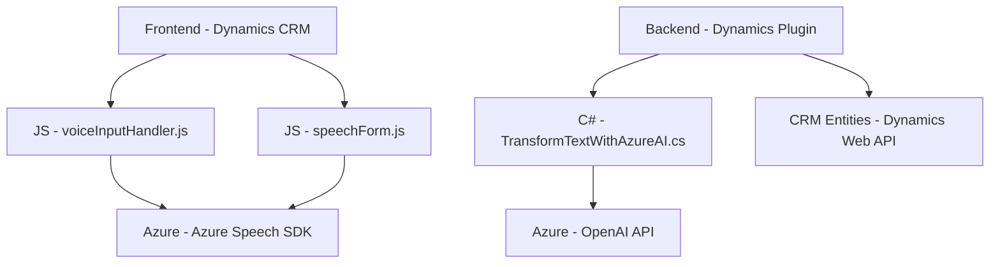

### Breve resumen técnico
El repositorio contiene múltiples componentes de software (frontend y backend) diseñados para integrarse con formularios de Dynamics 365 y mejorar la interacción mediante reconocimiento de voz, síntesis de texto y procesamiento avanzado con Azure AI. Podemos detectar una arquitectura basada en servicios externos (Azure Speech SDK y Azure OpenAI) que habilitan capacidades como la lectura, transcripción, síntesis de audio y análisis enriquecido de datos.

---

### Descripción de la arquitectura
El repositorio tiene dos capas principales:
1. **Frontend**:
   - Consiste en scripts JavaScript para interactuar con formularios de Dynamics 365.
   - Proporciona funcionalidad al usuario para agregar accesibilidad mediante comandos de voz y conversión de texto a voz.
   - Utiliza Azure Speech SDK integrado mediante carga dinámica.
   - Podría ser parte de un cliente dinámico de n capas en el navegador (con lógica embebida).

2. **Backend**:
   - Implementa un plugin alojado en Dynamics 365 que interactúa con Azure OpenAI para transformar datos de texto.
   - Funcionamiento basado en la arquitectura de plugins de Dynamics CRM.
   - Utiliza integración con APIs REST externas y patrones de manipulación asincrónica.

Estos componentes se diseñan bajo una **arquitectura orientada a servicios** que delega el procesamiento de voz, análisis de texto y síntesis a APIs de Azure, mientras que proporciona una integración directa con formularios de Dynamics CRM.

---

### Tecnologías usadas
1. **Frontend**:
   - **JavaScript**: Principal lenguaje usado en scripts como `readForm.js` y `speechForm.js`.
   - **Azure Speech SDK**: Usado para reconocimiento de voz y síntesis de texto a audio.
   - **Dynamics CRM SDK**: Provee un entorno específico para interacción con formularios y la estructura de datos dinámica de Dynamics 365.

2. **Backend**:
   - **C#** con .NET: Lenguaje usado en el plugin `TransformTextWithAzureAI.cs`.
   - **Azure OpenAI API**: Servicio REST para transformar texto mediante inteligencia artificial.
   - **Newtonsoft.Json**: Librería para manejar JSON en C# (serialización/desserialización).
   - **Dynamics CRM Plugin Model**: Usa `Microsoft.Xrm.Sdk` para extender funcionalidad dentro de la plataforma Dynamics 365.

---

### Diagrama Mermaid

---

### Conclusión final
El repositorio presenta una solución híbrida orientada a enriquecer la interacción con formularios de Dynamics CRM mediante capacidades avanzadas de reconocimiento y procesamiento de voz, así como análisis de texto con modelos de inteligencia artificial de Azure. La integración con servicios externos mediante el **Azure Speech SDK** y **Azure OpenAI API** indica un diseño orientado a servicios en la nube con componentes distribuidos. La arquitectura es modular, diseñada para aprovechar herramientas en tiempo real y habilitar interacción fluida para los usuarios. Se considera una solución con una arquitectura de **n capas** extensible, basada en servicios externos y accesible para modernizar entornos empresariales de Dynamics CRM.