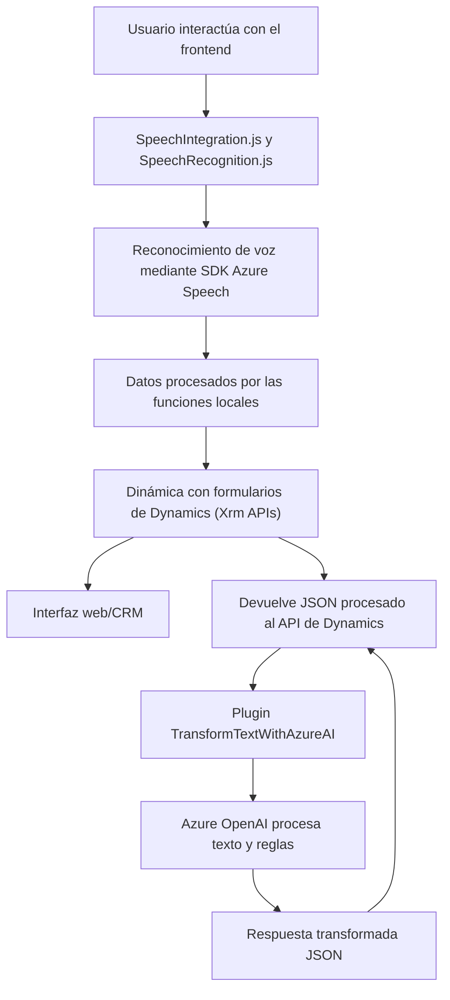

### Breve descripción técnica  
Este repositorio está orientado a la integración entre Microsoft Dynamics 365 y Azure mediante módulos distribuidos que ejecutan procesamiento de voz y texto en tiempo real. Se observan componentes frontend en JavaScript con llamadas a SDK de Azure y un plugin en C# para procesamiento avanzado mediante Azure OpenAI.

---

### Descripción de arquitectura  
La solución implementada utiliza una **arquitectura n-capas** en el contexto de Dynamics 365, donde las capas funcionan de forma acoplada. El frontend maneja la interacción del usuario, la capa de servicios interactúa con Dynamics CRM, y la capa de backend (plugin en C#) sirve como orquestador para delegar operaciones a Azure OpenAI.

El sistema no tiene características de microservicios ni distribuciones desacopladas, aunque se apoya en servicios externos como el CDN del Azure Speech SDK y Azure OpenAI. Otros patrones presentes incluyen el proceso modular y la carga dinámica de dependencias del frontend.

---

### Tecnologías utilizadas  
1. **Frontend (JavaScript)**  
   - Principalmente desarrollado para formularios de Dynamics 365.  
   - Dependencia del **Azure Speech SDK** para síntesis y reconocimiento de voz.  
   - Uso de funciones modernas como `async/await` y carga dinámica de scripts.  

2. **Backend (C#)**  
   - Plugin basado en la **IPlugin API** de Microsoft Dynamics CRM.  
   - Uso de **Azure OpenAI** mediante solicitudes REST para transformación de texto según reglas definidas tanto en el código como en el CRM.  

3. **Dependencias externas**  
   - `Newtonsoft.Json.Linq` para manipulación de JSON.  
   - `.Net SDK` para Dynamics CRM (`Microsoft.Xrm.Sdk`).  
   - **Azure Speech y OpenAI** como servicios externos fundamentales.    

---

### Diagrama **Mermaid** válido para **GitHub**  
Representa la interacción general entre los componentes del sistema y las dependencias externas.

---

### Conclusión final  
Este repositorio presenta una solución perfectamente acoplada a Dynamics 365, diseñada para complementar formularios dinámicos con reconocimiento de voz y procesamiento de texto avanzado. Utiliza una **arquitectura n-capas** que permite la interacción directa entre usuarios, APIs de Dynamics y servicios avanzados como Azure Speech SDK y Azure OpenAI. Adicionalmente, se implementan patrones como modularidad, plugins y servicios externos. Sin embargo, podría beneficiarse de desacoplar más sus componentes para adoptar conceptos de microservicios o arquitectura hexagonal que favorezca la escalabilidad.